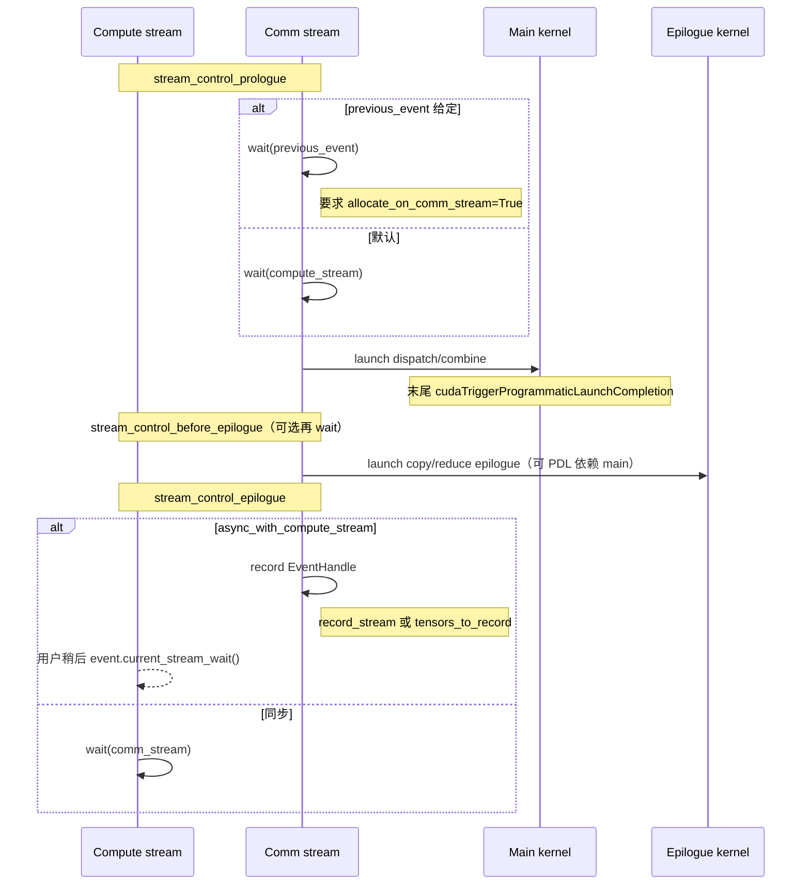
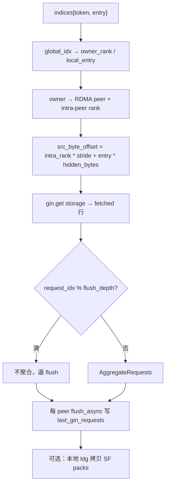
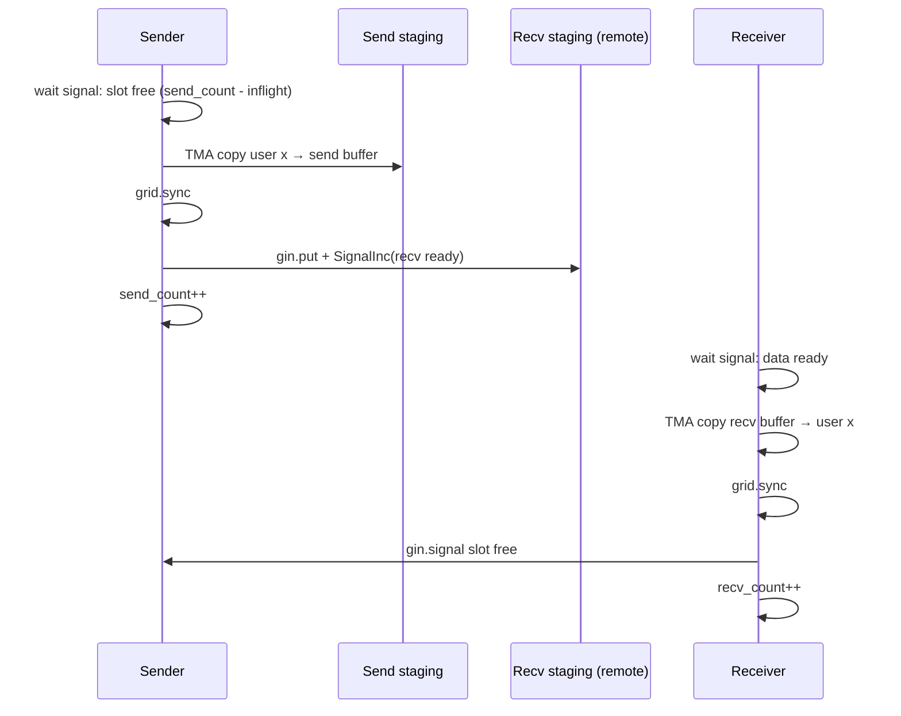
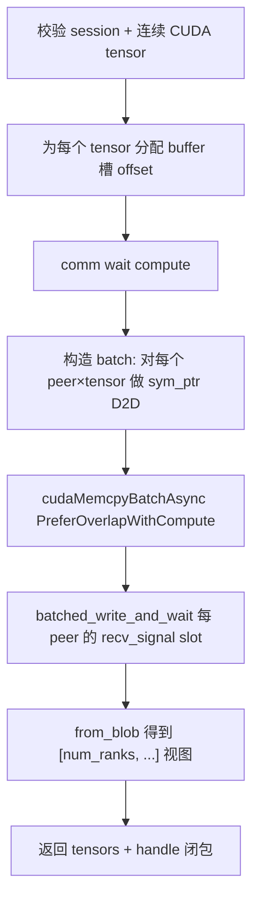

# DeepEP 运行时与实验性机制：JIT、重叠、Engram、PP、AGRS

> 文档版本：基于 DeepEP V2（`ElasticBuffer` + NCCL Gin + 全 JIT）。
> 阅读对象：已读过 [deep_ep_explained.md](deep_ep_explained.md) / [deep_ep_transport.md](deep_ep_transport.md)，希望补齐 **运行时编译管线、通信-计算重叠、实验性 0-SM 原语** 的工程师。
>
> 与既有 notes 的分工：
>
> | 文档 | 覆盖范围 |
> |---|---|
> | `deep_ep_explained.md` | MoE dispatch / combine 语义与 kernel 流程 |
> | `deep_ep_transport.md` | Gin 原语、对称内存、QP/channel、barrier |
> | `nccl_gin_internals.md` | NCCL GIN 三层后端内部 |
> | **本文** | **JIT 系统、流/Event/PDL 重叠、Engram、PP、AGRS** |

---

## 1. 为什么需要这篇文档

既有 notes 把 **EP 主路径**（dispatch/combine）和 **传输底座**（Gin / symmetric memory）写得很完整，但对以下“贯穿全局或实验性”的机制只停留在一句话或表格：

1. **全 JIT 编译**：V2 宣称安装无需预编译 CUDA kernel，但 `csrc/jit/` 的缓存哈希、原子目录 rename、include 依赖哈希、`LaunchRuntime` 代码生成等细节此前未展开。
2. **通信-计算重叠**：README 示例大量使用 `EventOverlap` 与 `async_with_compute_stream`，主文档只点到 PDL 与 epilogue，未说明双流控制与安全约束。
3. **Engram / PP / AGRS**：README 标为 experimental / 0-SM 能力，代码路径已完整存在，但没有端到端机制说明。

本文按 **从运行时底座 → 重叠 → 三类实验原语** 的顺序补齐。

---

## 2. 全 JIT 编译系统

### 2.1 设计目标

| 目标 | 实现要点 |
|---|---|
| 安装包不带预编译 cubin | 性能关键路径在 `deep_ep/include/` 的 header-only kernel，首次调用时 `nvcc -cubin` |
| 模板参数全特化 | `num_ranks`、`num_sms`、`num_qps`、`team_t` 等写进生成代码，编译期消分支 |
| 多 rank 共享缓存 | 磁盘缓存按 hash 目录；`rename` 原子提交；分布式文件系统上 `fsync` 保证可见性 |
| 可调试 | `EP_JIT_*` 环境变量控制 dump PTX/SASS、打印命令、检查 local memory |

Legacy V1 的部分 kernel 仍在 `setup.py` 的 `CUDAExtension` 里预编译；**V2 elastic 路径**（dispatch/combine/barrier/engram/pp 等）一律走 JIT。

### 2.2 组件与调用链

```text
Python import deep_ep
    └─ init_jit() → C++ jit::api::init(library_root, cuda_home, nccl_root)
         ├─ IncludeParser::prepare_init   # deep_ep/include 根路径
         ├─ KernelRuntime::prepare_init   # cuobjdump 所在 CUDA home
         └─ Compiler::prepare_init        # 头文件、NCCL include 等

首次 launch_xxx(...)
    ├─ XxxRuntime::generate(args)         # LaunchRuntime CRTP：拼出 kernel.cu 源码
    │     └─ 在源码头注入 “Includes' hash value”
    ├─ compiler->build(name, code)        # 查内存缓存 → 磁盘缓存 → NVCC 编译
    └─ XxxRuntime::launch(runtime, args)  # cuLaunchKernel + 可选 PDL / cooperative
```

核心文件：

| 文件 | 职责 |
|---|---|
| `csrc/jit/compiler.hpp` | `Compiler` / `NVCCCompiler`：flags、缓存目录、`build()` |
| `csrc/jit/cache.hpp` | 进程内 `KernelRuntimeCache`（path → loaded cubin） |
| `csrc/jit/kernel_runtime.hpp` | 用 `cuobjdump -symbols` 找唯一 `STO_ENTRY`，`cuModuleLoad` |
| `csrc/jit/launch_runtime.hpp` | CRTP `LaunchRuntime`：`generate` / `launch` |
| `csrc/jit/include_parser.hpp` | 递归哈希 `#include <deep_ep/...>` 依赖树 |
| `csrc/jit/handle.hpp` | CUDA driver 统一封装（load / launch config） |
| `csrc/jit/device_runtime.hpp` | 当前 GPU arch、SM 数等 |
| `csrc/kernels/elastic/*.hpp` | 各算子的 `generate_impl` + `launch_impl` |

### 2.3 代码生成（`LaunchRuntime` CRTP）

每个 elastic 算子定义一个 `XxxRuntime : LaunchRuntime<XxxRuntime>`，例如 `PPSendRuntime`、`EngramFetchRuntime`、`DispatchRuntime`。模式固定：

```cpp
// 1) generate_impl：用 fmt 拼出一段 .cu，强制实例化模板 kernel
static std::string generate_impl(const Args& args) {
    return fmt::format(R"(
#include <deep_ep/impls/pp_send_recv.cuh>
using namespace deep_ep::elastic;
static void __instantiate_kernel() {{
    auto ptr = reinterpret_cast<void*>(&pp_send_impl<{}, {}, {}, {}>);
}}
)", /* template args from Args */);
}

// 2) launch_impl：按固定参数顺序调 launch_kernel
static void launch_impl(const KernelHandle& kernel, const LaunchConfigHandle& config, Args args);
```

`LaunchRuntime::generate` 还会：

1. 调用 `include_parser->get_hash_value(code)`，把 **include 树哈希** 写到源码第一行注释；
2. 若 `EP_JIT_DEBUG=1`，打印完整生成代码。

**为何要 include 哈希？**  
磁盘缓存 key 主要来自 `name + compiler signature + flags + code`。`code` 本身是短生成片段，真正的算法在 `#include <deep_ep/impls/...>` 里。若不把头文件内容纳入指纹，改 `.cuh` 后可能命中旧 cubin。include 哈希写进源码后，改头文件 → code 变化 → cache miss。

### 2.4 编译与磁盘缓存

`Compiler::build(name, code)` 流程：

```mermaid
flowchart TD
    A["kernel_signature = name $$ signature $$ flags $$ code"] --> B["dir = cache/kernel.name.hexdigest"]
    B --> C{"内存 KernelRuntimeCache 命中?"}
    C -->|是| Z["返回 KernelRuntime"]
    C -->|否| D{"磁盘 dir 合法且含 kernel.cu + kernel.cubin?"}
    D -->|是| E["加载 cubin → 放入内存缓存"] --> Z
    D -->|否| F["tmp/uuid 目录写 kernel.cu"]
    F --> G["nvcc -cubin（可选 -ptx）"]
    G --> H{"EP_JIT_DUMP_SASS?"}
    H -->|是| I["cuobjdump --dump-sass"]
    H -->|否| J["fsync 整个 tmp 目录"]
    I --> J
    J --> K["rename tmp → dir（原子）"]
    K --> L{"rename 失败（他 rank 已写好）?"}
    L -->|是| M["safe_remove_all(tmp) 后加载已有 dir"]
    L -->|否| E
    M --> E
```

要点：

- **缓存根目录**：默认 `$HOME/.deep_ep`，可用 `EP_JIT_CACHE_DIR` 覆盖（亦可在 build 时写入 persistent env）。
- **NVCC 版本进 signature**：`NVCC{major}.{minor}`，换编译器不会误用旧 cubin。
- **Arch**：`device_runtime->get_arch()`；NVCC ≥ 12.9 可用 arch family suffix。
- **原子性**：先写 tmp 再 `rename` 整个目录，避免半截 cubin；多 rank 竞态时输家删除自己的 tmp。
- **分布式文件系统**：文件与目录都 `fsync`，避免 NFS/Lustre 上 `close()` 后其他节点仍读到空洞。
- **加载侧校验**：`KernelRuntime` 要求 `cuobjdump` 恰好解析出 **1 个** kernel 入口符号；否则提示 `rm -rf` 损坏 cache 目录。

### 2.5 Launch 配置

`LaunchArgs` 字段：

| 字段 | 含义 |
|---|---|
| `grid_dim` / `num_threads` | 网格与 block 大小 |
| `smem_size` | 动态 shared memory |
| `cluster_dim` | Thread block cluster（Hopper） |
| `cooperative` | 是否 cooperative launch（PP 的 grid sync 需要） |
| `pdl_enabled` | 是否启用 Programmatic Dependent Launch |

`construct_launch_config` 据此设置 `cudaLaunchAttributeProgrammaticStreamSerialization` 等属性，使 main kernel 末尾的 `cudaTriggerProgrammaticLaunchCompletion()` 能立刻“解锁”已 enqueue 的 epilogue kernel。

### 2.6 调试环境变量（JIT 专表）

| 变量 | 作用 |
|---|---|
| `EP_JIT_DEBUG` | 打印生成代码、加载路径、launch 参数 |
| `EP_JIT_CACHE_DIR` | 缓存根目录 |
| `EP_JIT_NVCC_COMPILER` | 指定 nvcc 路径 |
| `EP_JIT_CPP_STANDARD` | 默认 20 |
| `EP_JIT_PRINT_COMPILER_COMMAND` | 打印完整 nvcc 命令 |
| `EP_JIT_PTXAS_VERBOSE` | ptxas verbose |
| `EP_JIT_PTXAS_CHECK` | 若出现 Local memory used 则 assert |
| `EP_JIT_WITH_LINEINFO` | `-lineinfo` 便于 nsight |
| `EP_JIT_DUMP_PTX` / `EP_JIT_DUMP_SASS` / `EP_JIT_DUMP_ASM` | 落盘反汇编产物 |
| `EP_NUM_TOPK_IDX_BITS` | 编译期覆盖 top-k 索引位宽（persistent） |

---

## 3. 通信-计算重叠

### 3.1 双流模型

`ElasticBuffer` 内部持有独立的 **`comm_stream`**（通信流），用户当前流视为 **compute stream**。

```text
compute stream:  GEMM / Attention / gate ...
comm stream:     dispatch / combine / barrier / engram / pp / agrs ...
```

同步边界由 `EventHandle` / `EventOverlap` 表达，而不是隐式 `cudaDeviceSynchronize`。

### 3.2 `stream_control_*` 三阶段

`csrc/elastic/buffer.hpp` 中 dispatch/combine 前后的流控制可抽象为：



关键约束（源码注释直译）：

- 若传入 `previous_event`，表示 **计算先启动、通信后启动**；此时输出张量必须 `allocate_on_comm_stream=True`，否则通信可能踩到仍在 compute stream 上的内存生命周期。
- `async_with_compute_stream=True` 时返回 `EventOverlap`，由用户决定何时 `current_stream_wait()`。
- `EP_AVOID_RECORD_STREAM=1` 时改用 `event->tensors_to_record` 模拟 `record_stream`，以兼容 CUDA Graph 等场景。

### 3.3 `EventOverlap`（Python）

`deep_ep/utils/event.py` 提供易用包装：

```python
recv_x, ..., handle, event = buffer.dispatch(..., async_with_compute_stream=True)

# 写法 1：显式 wait
# ... 与通信无关的计算 ...
event.current_stream_wait()

# 写法 2：with 语法（退出时自动 wait）
with event:
    do_something_on_current_stream()

# 写法 3：wait 后钩子（deterministic dispatch 排序等）
event.register_hook_after_wait(lambda: handle.deterministic_sort(...))
```

`release_handle=True` 可在 wait 后丢掉底层 `EventHandle`，释放其持有的 tensor 引用（多流 wait 时需用户自行管理）。

### 3.4 PDL 与双 kernel 切分

Dispatch / combine 故意拆成 **main + epilogue** 两个 JIT kernel：

| 主 kernel | Epilogue | 职责切分 |
|---|---|---|
| `dispatch_impl` / `hybrid_dispatch_impl` | `dispatch_copy_epilogue` | main 完成 notify + 数据搬入 symmetric buffer；epilogue 再 copy 到用户 `recv_x`、处理 expand/padding |
| `combine_impl` / `hybrid_combine_impl` | `combine_reduce_epilogue` | main 完成反向搬运与 partial reduce；epilogue 做最终加权/规约到 `combined_x` |

好处：

1. Main 末尾 `cudaTriggerProgrammaticLaunchCompletion()` 后，**无需 CPU 再 launch 一轮**即可启动 epilogue（PDL）。
2. Epilogue 的 SM 占用、寄存器压力与通信主循环解耦。
3. 中间 buffer 布局可在 main 内用原子/前缀和写好，epilogue 只做规则内存搬运。

PDL 相关细节亦见 `deep_ep_explained.md` 第 4/5 章；本文强调的是它与 **双流 + EventOverlap** 的组合：PDL 解决 **同流 kernel 链式依赖**，Event 解决 **跨流与用户计算** 的依赖。

### 3.5 重叠使用建议

| 场景 | 推荐参数 |
|---|---|
| 训练 prefilling / 大 batch | `async_with_compute_stream=True`，dispatch 后立刻启动无关 GEMM，再 `event.wait` 后用 `recv_x` |
| 解码 handle 缓存 | 首次 `dispatch` 建 `EPHandle`，后续 `dispatch(handle=cached)` 跳过 notify/CPU sync |
| 与上一层通信串流水 | 传入 `previous_event` + `allocate_on_comm_stream=True` |
| 调试正确性 | 先关 async，确认数值，再打开重叠 |

`prefer_overlap_with_compute=True`（默认）还会影响 `get_theoretical_num_sms`：倾向 **更少 SM**，把 SM 留给计算；设为 `False` 时可能抬高到 64 SM 以追带宽峰值。

---

## 4. Engram：远程 KV / 表项拉取

### 4.1 定位

**Engram** 是实验性 **远程 memory fetch** 原语：把一张大表（如 KV / embedding 式条目）放在各 rank 的 **CPU 对称段**，推理或训练时按 index 从 **owner rank** 经 RDMA `gin.get` 拉到本地 GPU。

与 EP dispatch 的差异：

| | Dispatch | Engram |
|---|---|---|
| 路由 | gate top-k → expert rank | 全局 entry index → owner rank |
| 方向 | 多为 PUT（推） | **GET（拉）** |
| 数据驻留 | GPU buffer | **CPU segment**（NIC 可直读 host） |
| 同步 | notify all-to-all + barrier | fetch + 可选独立 wait kernel |

### 4.2 存储布局与 `engram_write`

`ElasticBuffer` 对称内存布局回顾：

```text
[Workspace | GPU buffer | CPU buffer]
```

`engram_write(storage, sf=None)`（`csrc/elastic/buffer.hpp`）：

1. `barrier` 确保此前 fetch 已结束。
2. 校验 `storage` 为 BF16 或 FP8，连续、CUDA。
3. 若 hybrid：每个 scale-up rank 写到 CPU 段内 **本 rank 偏移**  
   `offset = scaleup_rank_idx * num_cpu_buffer_bytes`；  
   非 hybrid 则写偏移 0。
4. `cudaMemcpyAsync` DeviceToDevice 写入 CPU 映射段（统一 VA，底层是 host memory）。
5. 再 `barrier`，保证全集群可见。

容量提示：`ElasticBuffer.get_engram_storage_size_hint(num_entries, hidden, ...)` → 对齐后的 `num_cpu_bytes`。

FP8 模式下，`sf` 表全局复制到各 rank GPU（fetch 时本地 gather scale，避免再 RDMA 拉 scale）。

### 4.3 `engram_fetch` 设备端流程

`deep_ep/include/deep_ep/impls/engram_fetch.cuh`：



实现要点：

- Grid 维度 = `num_qps`；每 block 一个 Gin context（`NCCL_GIN_RESOURCE_SHARING_CTA`）。
- 每个 warp 的 elect lane 按步长遍历 `num_tokens * num_entries_per_token`。
- `team_t` 与 hybrid/direct 拓扑一致（World 或 Rail）。
- 队列深度有限：对同一 peer 的 get 每 `kGinQPFlushDepth` 条强制不聚合，避免 QP 溢出。
- 返回 Python hook：内部可再 launch `engram_fetch_wait`，对 `last_gin_requests` 做完成等待（把 wait 与 issue 拆开，便于与计算重叠）。

### 4.4 0-SM 等待路径

传输层 notes 提到的 “0 SM wait” 指：在硬件/驱动允许时，完成等待可走 **不占 SM 的 stream 操作**（或极轻量 wait kernel）。当前主路径仍以 Gin `flush_async` + wait kernel 为主；copy-engine / batch memop 更多用于 AGRS。Engram 的“0 SM”是 **产品方向**：数据面尽量只发 RDMA get，把 SM 留给 Attention/GEMM。

### 4.5 API 小结

```python
num_cpu = ElasticBuffer.get_engram_storage_size_hint(num_entries, hidden, ...)
buf = ElasticBuffer(group, num_bytes=..., num_cpu_bytes=num_cpu, ...)

buf.engram_write(storage)                      # [E, H] → CPU segment
hook = buf.engram_fetch(indices, num_qps=...)  # indices: 全局 entry id
data, sf = hook()                              # wait 后取回 GPU tensor
```

---

## 5. PP：流水线相邻 rank 的 send/recv

### 5.1 定位

Pipeline Parallel 只需要 **环上邻居**（prev/next）之间的张量传递，不需要 MoE 式不规则路由。DeepEP 提供：

- `pp_set_config(num_max_tensor_bytes, num_max_inflight_tensors)`
- `pp_send(t, dst_rank_idx, num_sms=0)`
- `pp_recv(t, src_rank_idx, num_sms=0)`

`dst`/`src` 必须是环上相邻 rank（实现用 `get_buffer_offset` 把方向映射到 0/1 两个逻辑槽）。

### 5.2 环形缓冲与信号

每个方向维护：

- **inflight 环形 slot**：最多 `num_max_inflight_tensors` 个未完成传输。
- **send_count / recv_count**（workspace）。
- **Gin signal**：
  - 发送侧在 PUT 完成时 `SignalInc` 通知接收侧“数据已到”；
  - 接收侧在 copy 出用户 tensor 后 `signal` 通知发送侧“slot 已释放”。



对应代码：`pp_send_impl` / `pp_recv_impl`（`pp_send_recv.cuh`）。

### 5.3 TMA 流水线拷贝

`tma_copy` 在 PP 中承担用户 tensor ↔ staging buffer 的搬运：

- 多 stage（默认 2）+ mbarrier；
- 按 SM 切分 1D TMA block；
- load/store 流水重叠。

PP kernel 使用 **cooperative launch**（`LaunchArgs(..., cooperative=true)`）以便 `cooperative_groups::this_grid().sync()` 在 TMA 与 RDMA put 之间做全 grid 同步。

### 5.4 与 “0-SM PP” 的关系

README 写 0-SM PP（RDMA）。当前树中的 PP 实现 **仍占用少量 SM** 做 TMA + 发 put/signal（`__launch_bounds__(32,1)`，grid=`num_sms`）。  
传输 notes 中的 `cuStreamBatchMemOp` 0-SM 路径主要落地在 **AGRS**；PP 的极致 0-SM 属于演进方向（完全用 copy engine + batch memop 替代 TMA kernel）。使用上仍应按实验 API 对待，并预留足够 inflight 与 buffer 尺寸。

### 5.5 容量

`get_pp_buffer_size_hint(num_max_tensor_bytes, num_max_inflight_tensors, ...)` 估算 GPU buffer 需求：双向 × inflight × max tensor（另加 workspace 信号区）。

---

## 6. AGRS：All-Gather（Reduce-Scatter 会话框架）

### 6.1 定位

**AGRS**（All-Gather / Reduce-Scatter）面向上下文并行（CP）或需要 **NVLink 域内** 大块对称 gather 的场景。V2 当前实现重点是 **session 内 all-gather**；session 生命周期为 reduce-scatter 类算子预留了信号与缓冲槽位。

特点：

- **不跑通信 SM kernel**：数据面用 `cudaMemcpyBatchAsync`（Copy Engine），同步面用 `cuStreamBatchMemOp`（`batched_write_and_wait`）。
- 绑定 **comm_stream**，通过返回的 `handle()` 与 compute stream 握手。
- 必须在 session 内使用。

### 6.2 Session 生命周期

```python
buf.agrs_set_config(num_max_session_bytes, num_max_all_gathers_per_session)

with buf.agrs_new_session():
    # 可选：in-place 占位，避免多余 copy
    t = buf.agrs_get_inplace_tensor(shape, dtype)
    t.copy_(local_data)

    gathered, handle = buf.all_gather(t)   # or 多个 tensor
    # ... 在 compute stream 上做与 gather 无关的事 ...
    handle()                               # compute stream wait comm 完成
    # 使用 gathered: [num_ranks, ...]
# destroy_agrs_session: wait compute，并向 peers 写 session 完成信号
```

`create_agrs_session`：重置 `agrs_buffer_offset` / `slot_idx`，`agrs_session_idx++`。  
`destroy_agrs_session`：

1. `comm_stream` wait compute stream（确保用户不再写 session buffer）；
2. 对每个 peer：`WRITE_VALUE` 本 rank 的 session signal，并 `WAIT_VALUE_GEQ` 对方 signal；
3. 全程 **0 通信 SM**。

### 6.3 `all_gather` 内部



细节：

- **In-place**：若输入已是 `agrs_get_inplace_tensor` 给出的本 rank 槽位，则跳过对自己的 memcpy（`num_copies` 减少）。
- **对称地址**：`get_sym_ptr(local_slot, dst_rank)` 把“我的份额”写到 **对端视角下的同一逻辑槽**，形成 classic all-gather 布局：  
  `buffer[offset + rank_i * nbytes]` 在所有 rank 上最终一致。
- **完成信号**：slot 级 `agrs_recv_signal[slot][rank]`，值为当前 `agrs_session_idx`，支持多 inflight gather（受 `num_max_all_gathers_per_session` 限制）。
- **Handle 闭包**捕获 `EventHandle(comm_stream)`；调用时要求仍在同一 session 且 compute stream 未切换错。

### 6.4 0-SM 同步原语：`cuStreamBatchMemOp`

`csrc/kernels/backend/cuda_driver.cu`：

| API | 语义 |
|---|---|
| `batched_write` | 多个 `WRITE_VALUE_32` |
| `batched_wait` | 多个 `WAIT_VALUE_GEQ` |
| `batched_write_and_wait` | 先全部 write 再全部 wait（同一 batch） |

这些操作挂在 CUDA stream 上由硬件/驱动执行，**不启动 grid**，因此是 AGRS “0 SM” 的核心。与 Gin barrier（kernel 内 signal）形成对照：

| | Gin barrier | AGRS session 同步 |
|---|---|---|
| 执行者 | GPU kernel + Gin | CUDA stream batch memop |
| SM | 占用（或极轻量） | **0** |
| 典型场景 | EP dispatch 前后 | NVLink all-gather session |

### 6.5 容量规划

- `get_agrs_num_max_session_bytes` / `get_agrs_buffer_size_hint`：按 gather 张量总字节与 rank 数估算。
- Workspace 内有 `kNumMaxInflightAGRS` 上限；`agrs_set_config` 会 assert 不超过该常量。

---

## 7. 机制对照总表

| 机制 | 主实现路径 | 是否 JIT | SM 占用 | 传输原语 | 文档状态 |
|---|---|---|---|---|---|
| Dispatch / Combine | `impls/*dispatch*.cuh` 等 | 是 | 解析式 SM | Gin put / NVLink TMA | explained + transport |
| Barrier | `impls/barrier.cuh` | 是 | 很少 | signal / red_add | transport |
| **JIT runtime** | `csrc/jit/*` | （自身） | Host + nvcc | — | **本文 §2** |
| **Comm/Compute overlap** | `EventOverlap` + stream_control + PDL | — | — | — | **本文 §3** |
| **Engram** | `engram_fetch.cuh` | 是 | fetch 用少量 SM | Gin **get** | **本文 §4** |
| **PP** | `pp_send_recv.cuh` | 是 | 少量 SM + coop | Gin put + signal + TMA | **本文 §5** |
| **AGRS** | `ElasticBuffer::all_gather` | 否（driver API） | **0** | MemcpyBatch + BatchMemOp | **本文 §6** |
| NCCL GIN 后端 | NCCL 源码 | — | — | GDAKI/GPI/Proxy | nccl_gin_internals |

---

## 8. 源码索引

| 主题 | 路径 |
|---|---|
| JIT 编译/缓存 | `csrc/jit/compiler.hpp`, `cache.hpp`, `kernel_runtime.hpp` |
| JIT 生成/启动 | `csrc/jit/launch_runtime.hpp`, `include_parser.hpp` |
| 流控制 / dispatch 编排 | `csrc/elastic/buffer.hpp` (`stream_control_*`, `dispatch`, `combine`) |
| EventOverlap | `deep_ep/utils/event.py` |
| Engram | `csrc/kernels/elastic/engram.hpp`, `impls/engram_fetch*.cuh` |
| PP | `csrc/kernels/elastic/pp_send_recv.hpp`, `impls/pp_send_recv.cuh` |
| AGRS | `csrc/elastic/buffer.hpp` (`all_gather`, `create_agrs_session`, …) |
| 0-SM memop | `csrc/kernels/backend/cuda_driver.cu`, `api.cuh` |
| Python API | `deep_ep/buffers/elastic.py` |
| 测试 | `tests/elastic/test_engram.py`, `test_pp.py`, `test_agrs.py` |

---

## 9. 总结

1. **JIT** 是 V2 的安装与性能特化底座：CRTP 代码生成 + include 哈希 + 原子磁盘缓存 + NVCC，使 elastic kernel 无需进 wheel。
2. **重叠** 靠 **comm_stream × EventOverlap × PDL epilogue** 三层配合；错误使用 `previous_event` / 分配流会导致隐蔽的数据竞争。
3. **Engram** 用 CPU 对称段 + RDMA get 做远程表项拉取；write 需双 barrier，fetch 可拆 issue/wait。
4. **PP** 是邻居环形 inflight 缓冲 + TMA staging + Gin put/signal；面向流水线，不是全连接 all-to-all。
5. **AGRS** 是真正落地的 **0-SM NVLink all-gather**：Copy Engine 搬数据，BatchMemOp 做 session/slot 同步。

后续若实现 reduce-scatter 补全、PP 纯 memop 路径、或 Engram 的完全 0-SM wait，建议在本文件对应章节追加 diff，而不是再拆碎片文档。
