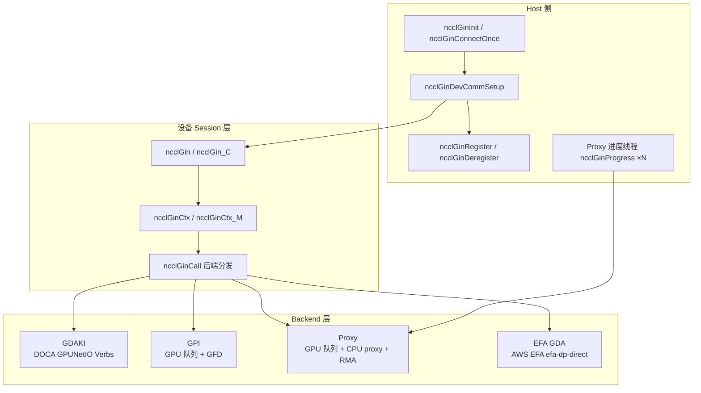
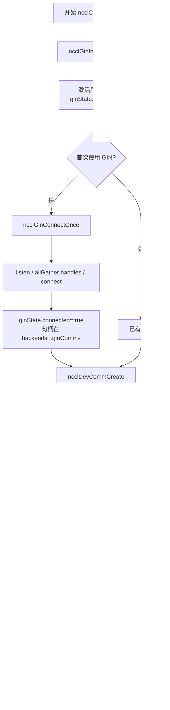
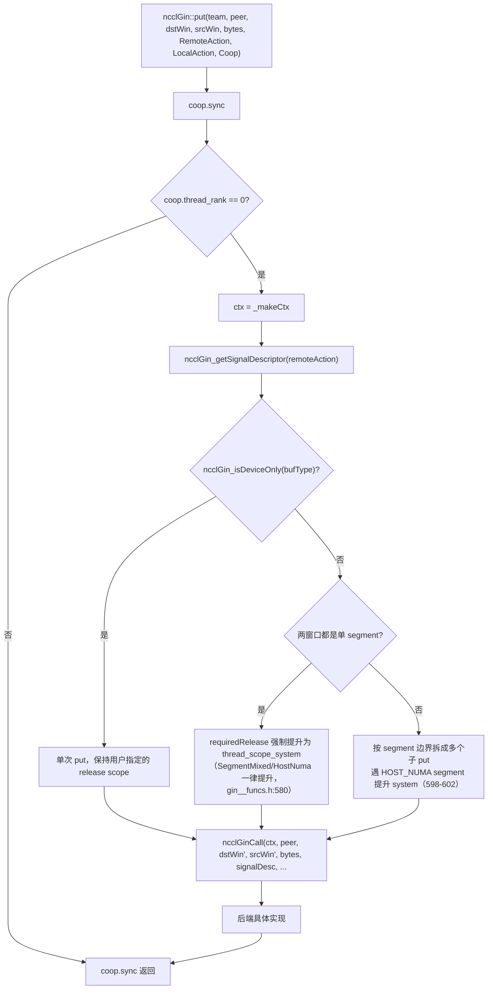
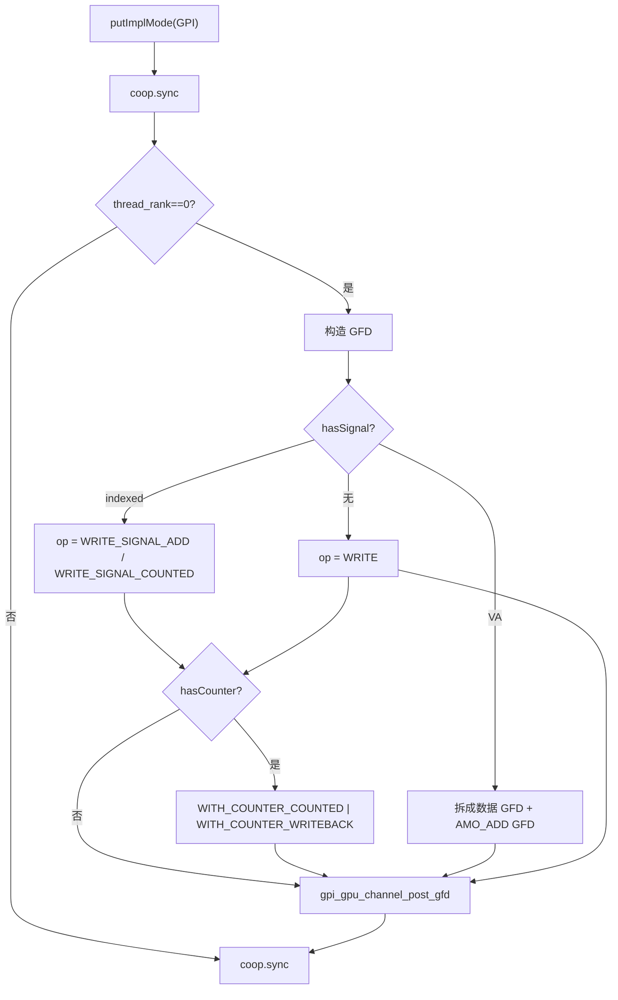
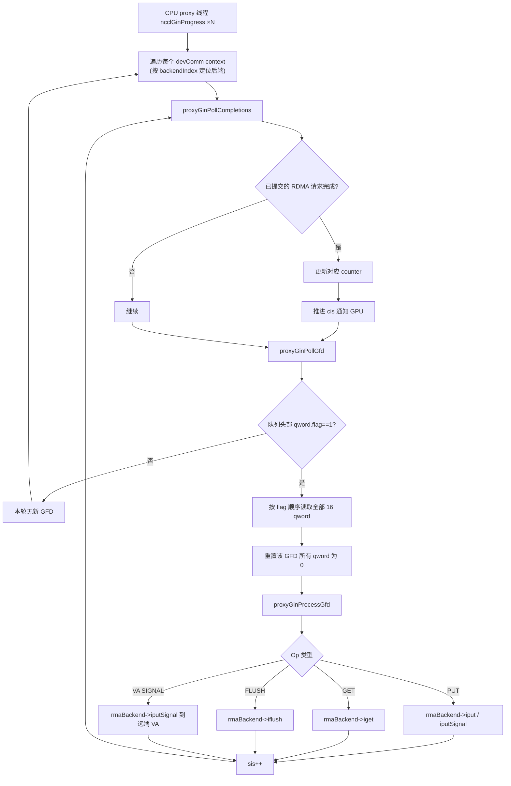
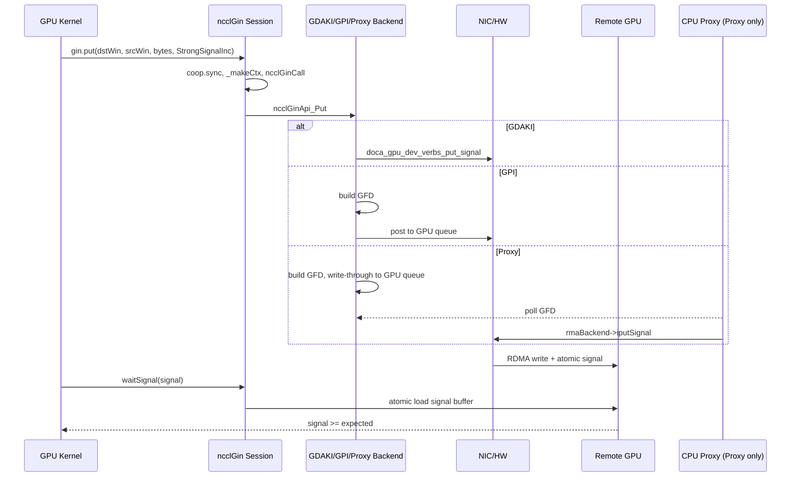

# NCCL GIN 内部实现解析：机制、流程与原理

> 文档版本：基于 NCCL 2.31.2（commit 96e44d34）源码，重点分析 `src/include/nccl_device/gin*.h`、`src/include/nccl_device/impl/gin__funcs.h`、`src/gin/gin_host.cc`、`src/gin/gin_host_proxy.cc` 及 GDAKI/GPI/Proxy/EFA GDA 四个后端头文件。文中行号均对应该 commit。
>
> 相关 notes：[EP 主路径](deep_ep_explained.md) · [传输层](deep_ep_transport.md) · [JIT / 重叠 / Engram·PP·AGRS](deep_ep_runtime_and_experimental.md)

---

## 1. 什么是 NCCL GIN

**GIN（GPU-Initiated Networking）** 是 NCCL 从 2.28 开始引入的设备端网络抽象。它让 GPU 线程在 kernel 内直接发起跨节点 RDMA 操作，而不需要每次通信都退回到 CPU 做 `cudaMemcpy`、host 同步或额外的 kernel launch。

与 NCCL 传统的 host-driven `NET`/`RMA` 插件相比：

| 维度 | Host-driven NET/RMA | NCCL GIN |
|---|---|---|
| 控制面 | CPU 选择通道、调度 proxy | CPU 只负责初始化与注册；kernel 内 GPU 线程直接发请求 |
| 数据面 | 通过 proxy 线程或 host 提交 WQE | GPU 线程写 doorbell / 队列项 |
| 同步原语 | `ncclNet` send/recv tag | `put` / `get` / `signal` / `counter` / `flush` |
| 适用场景 | 大消息、常规集合通信 | 细粒度、kernel-fusion、EP dispatch/combine |

DeepEP V2 的 `ElasticBuffer` 全部 RDMA 路径即通过 `handle::NCCLGin`（封装 `ncclGin`）完成。

---

## 2. 整体架构：三层抽象

NCCL GIN 的代码组织可以概括为三层：

1. **Host Plugin 层**：加载/选择外部或内部 GIN 插件，建立连接，注册内存，创建 device context。
2. **Device Session 层**：`ncclGin` / `ncclGin_C` 对象把用户调用翻译成 `ncclGinCtx`，并通过模板分发到具体后端。
3. **Backend 实现层**：`GDAKI`、`GPI`、`Proxy`、`EFA GDA` 四套设备端后端，分别对应 DOCA GPUNetIO Verbs、GPU-Initiated 队列、CPU proxy、AWS EFA efa-dp-direct 四种执行模型。



### 2.1 关键数据结构速览

| 结构/类型 | 位置 | 作用 |
|---|---|---|
| `ncclGin_v14_t` | `src/include/plugin/gin/gin_v14.h` | GIN 插件 host API（init/devices/listen/connect/createContext/regMrSym/...） |
| `ncclGinState` | `src/include/gin/gin_host.h:40-59` | 每个 `ncclComm` 共享的 GIN 状态：`numActiveBackends` + `backends[]` 后端数组、devComms 链表、`devCommRwMutex`/`writePending` 读写互斥、最多 4 个进度线程（`thread[NCCL_GIN_MAX_CONNECTIONS]`） |
| `ncclGinBackendState` | `src/include/gin/gin_host.h:28-37` | 单个活跃后端的状态：`ginType`、插件指针、`ginComms[NCCL_GIN_MAX_CONNECTIONS]` 连接句柄、`supportsStrongSignals/supportsVASignals` |
| `ncclGinStateDevComm` | `src/include/gin/gin_host.h:20-25` | 每个 `ncclDevComm` 对应的 GIN context 数组与 device handle 数组，附 `backendIndex` 指明所属后端 |
| `ncclDevComm` | `src/include/nccl_device/impl/comm__types.h` | 设备端 comm，含 `backendIndex`、`ginConnectionStride/ginConnectionStride_rcp32`、`ginContextStride`、`ginHandles[]`、`ginSignalShadows`、`railGinBarrier/worldGinBarrier` 等 |
| `ncclWindow_vidmem` | `src/include/nccl_device/impl/core__types.h:38-40` | 对称内存窗口描述符，含 `ginWinsDefaultBackend[]`、`ginMultiSegmentWins` + `numSegments`、`ginOffset4K` |
| `ncclGin_BackendMask<beMask>` | `src/include/nccl_device/gin.h` | 设备端用户可见对象，封装 `ncclDevComm` + context 索引 |
| `ncclGinCtx` / `ncclGinCtx_M` | `src/include/nccl_device/gin/gin_device_common.h` | 单次调用时的后端上下文（handle、rank、nRanks、contextId、resourceSharingMode） |
| `ncclGinDescriptorSmem` | `src/include/nccl_device/gin/gin_device_common.h` | 可选的 shared-memory 描述符空间，用于避免寄存器/栈占用 |

### 2.2 四套设备端后端一览

| 后端 | `ncclNetDeviceType` | 执行模型 | 设备头文件 |
|---|---|---|---|
| GDAKI | 3 | DOCA GPUNetIO Verbs，kernel 内写 QP doorbell | `gin/gdaki/gin_gdaki.h` |
| GPI | 4 | GPU 队列 + GFD（硬件/固件执行） | `gin/gpi/gin_gpi.h` |
| Proxy | 2 | GPU 队列 + CPU proxy 线程 + RMA 插件 | `gin/proxy/gin_proxy.h` |
| EFA GDA | 5 | AWS EFA，基于 efa-dp-direct 的 CQ-less RDMA 写路径 | `gin/efa_gda/gin_efa_gda.h` |

**EFA GDA** 是 2.31 新增的第四个后端（`NCCL_NET_DEVICE_GIN_EFA_GDA = 5`，`src/include/nccl_device/net_device.h:24`），实现于 `src/include/nccl_device/gin/efa_gda/gin_efa_gda.h`（966 行，Amazon 2026，基于 efa-dp-direct）。头文件注释明确列出实现状态：已实现 Put（数据 + signal/counter，signal-only 经 scratch buffer）、PutValue（值经 per-endpoint slot pool 暂存）、Flush、GetSignalPtr、GetCounterPtr、ResetSignal、ResetCounter；**Get、FlushAsync、Wait 目前为 stub**；`SupportsStrongSignal` 返回 false（gin_efa_gda.h:908-912）。单次 RDMA 写受硬件上限 1 GiB 约束（`EFA_GDA_MAX_WRITE_SIZE`），更大的 put 在 `putImplMode` 中自动拆分；硬件完成计数器按 2^31 回绕，比较必须经 `EFA_CNTR_MASK` 折算。编译期由 `NCCL_GIN_EFA_GDA_ENABLE` 宏控制（CUDA>=12.2 且 `__CUDA_ARCH__>=700` 时为 1，`gin_device_common.h:40-46`）；host 侧要求最低 NCCL 2.31.0（`gin_host.cc:25`）。

### 2.3 多后端并存机制

单一 `ginType` 的模型已被"多后端数组"取代：

- `ncclGinState` 不再有 `ginType` 字段，实际是 `int numActiveBackends` + `ncclGinBackendState backends[NCCL_GIN_MAX_ACTIVE_BACKENDS]`（`gin_host.h:58-59`；上限 4，`core.h:213`）。插件 assign 时依次写入 `ginState->backends[numActiveBackends++]`（`plugin/gin.cc:187-191`）。
- 跨 rank 收敛：`ncclGinSetDefaultBackend(comm, globalBitmask)`（`plugin/gin.cc:359-381`）把任一 rank 不支持的类型从数组中剔除，再按优先级 `GDAKI > Proxy > EFA_GDA/GPI` 排序（`ncclGetBackendPriority`，`gin.cc:327-343`）。
- 每个 `ncclDevComm` 绑定一个后端：`ncclGinStateDevComm.backendIndex` / `devComm.backendIndex`（`gin_host.h:22`；`comm__types.h:50`）。`ncclGinDevCommSetup` 按 `reqs->ginType` 或 `NCCL_GIN_TYPE` 环境变量在 `backends[]` 中选第一个满足 signal 能力要求的后端（`gin_host.cc:408-439`）。
- 内存注册与窗口寻址按后端展平：`ncclGinRegister` 的 host/dev 窗口数组尺寸为 `NCCL_GIN_MAX_CONNECTIONS * NCCL_GIN_MAX_ACTIVE_BACKENDS`（`gin_host.h:75-78`），槽位 `slot = backendIdx * NCCL_GIN_MAX_CONNECTIONS + commIdx`（`gin_host.cc:522`）。设备端 `getGinWindow(win, backendIndex, connectionId)`（`gin__funcs.h:24-31`）：`backendIndex == 0` 走 `win->ginWinsDefaultBackend[connectionId]`，否则按 `backendIndex * numSegments (+seg)` 索引 `ginMultiSegmentWins`（`gin__funcs.h:33-41`）。

---

## 3. Host 侧初始化与连接流程

Host 侧核心入口在 `src/plugin/gin.cc` 与 `src/gin/gin_host.cc`。

### 3.1 插件发现与加载

`ncclGinInit` 在 `ncclCommInitRank` 流程中被调用（`src/init.cc:500`，位于 `commAlloc`（init.cc:464 起）内）：

```
ncclGinInit(comm)
  └─ initPluginLibsOnceFunc()
       ├─ NCCL_GIN_PLUGIN 环境变量列出的 so（无则默认 libnccl-gin.so，plugin/gin.cc:199,239）
       ├─ NET 插件若自带 GIN 支持
       ├─ 内部 ib GDAKI 插件 (&ncclGinIbGdaki)
       └─ 内部 gin proxy 插件 (&ncclGinProxy)
  └─ 依次 load → init → getProperties → assignToComm
```

插件清单的容量与筛选规则：

- 最多 `NCCL_GIN_MAX_PLUGINS = 16` 个插件（`src/include/plugin/nccl_gin.h:21`）；外部插件引用计数由 `NCCL_GIN_PLUGIN_REF_COUNT` 控制（默认 0，`plugin/gin.cc:23`）。
- `NCCL_GIN_TYPE` 环境变量非 -1 时，类型不匹配的插件直接跳过（`gin.cc:140-145`）。
- 同一 `netDeviceType` 只保留先到的插件，后来的重复类型跳过（`gin.cc:150-162`）。
- 外部 proxy 插件一律跳过，强制使用内部 proxy + RMA 后端（`gin.cc:164-170`）。

`ncclGinPluginAssignToComm` 把每个入选插件登记为一个后端：写入 `ginState->backends[numActiveBackends++]`（`gin.cc:187-191`），并查询 `supportsStrongSignals`、`supportsVASignals`（存于 `ncclGinBackendState`，`gin_host.h:36-37`）。类型枚举为 `NCCL_GIN_TYPE_{PROXY=2, GDAKI=3, GPI=4, EFA_GDA=5}`（`core.h:85-92`，数值刻意与 `NCCL_NET_DEVICE_GIN_*` 对齐）。之后 `ncclGinSetDefaultBackend` 做跨 rank 收敛与优先级排序（见 §2.3）。

### 3.2 建立连接：`ncclGinConnectOnce`

在第一次创建需要 GIN 资源的 `ncclDevComm` 时调用（`src/dev_runtime.cc:1312`）：

```
ncclGinConnectOnce(comm)
  ├─ ginConnectionType = comm->globalGinSupport（FULL 或非 FULL，gin_host.cc:109）
  ├─ 取本节点 GIN 设备列表（ncclTopoGetLocalGinDevs，gin_host.cc:118）
  ├─ 构造 gin 团队（gin_host.cc:134-141）：
  │    FULL：ncclTeamWorld（nGinRanks = comm->nRanks，myGinRank = comm->rank）
  │    非 FULL：host 级代表团队
  │      {nRanks = comm->nRanks/contiguousRanksPerHost,
  │       rank  = comm->rank/contiguousRanksPerHost,
  │       stride = contiguousRanksPerHost}
  │      （每 host 一个 rank 出面建连，其余 rank 通过 stride 间接可达）
  ├─ 对每个活跃后端 backend（gin_host.cc:151 起）：
  │    ├─ backend->ginCommCount = nLocalGinDevs
  │    ├─ 解析进度线程数 proxyNthreads（默认 1，上限 NCCL_GIN_MAX_CONNECTIONS=4，
  │    │   并保证 ginCommCount >= proxyNthreads，gin_host.cc:159-170）
  │    ├─ NCCL_GIN_NCONNECTIONS 环境变量可在 allGather 前覆盖连接数（gin_host.cc:164）
  │    ├─ allGather 各 rank 的连接数，取最小值（gin_host.cc:171-176）
  │    └─ 对每个连接 commIdx：
  │         listen → getProperties → allGather handles → connect → closeListen
  │         连接句柄存入 backend->ginComms[commIdx]（gin_host.cc:191-194）
```

注意两点：

1. **这里的 gin 团队不是 `ncclTeamRail`**。`ncclTeamRail` 的 stride 是 `lsaSize`（`core__funcs.h:67-74`），而建连用的非 FULL 团队是 host 级代表团队（stride = `contiguousRanksPerHost`）。RAIL / CUSTOM_STRIDE 的语义在 devComm setup 阶段以 stride 形式生效（§3.3、§3.5）。
2. 连接类型全集是 `NCCL_GIN_CONNECTION_{NONE, FULL, RAIL, CUSTOM_STRIDE}`（`core.h:79-84`），但**建连阶段**只区分 FULL 与非 FULL；"本 devComm 实际使用哪种 rank stride"由每个 devComm 单独请求（§3.5）。

### 3.3 创建设备上下文：`ncclGinDevCommSetup`

`ncclDevCommCreate` 流程中（`src/dev_runtime.cc:1449`），根据 `ncclDevCommRequirements` 调用 4 参签名：

```
ncclGinDevCommSetup(comm, reqs, devComm, uint32_t deviceCodeVersion)   // gin_host.h:72-73
```

前置判断 `ncclGinResourcesRequested(reqs)`（`dev_runtime.cc:1150-1163`）：`ginSignalCount/ginCounterCount/barrierCount/railGinBarrierCount/worldGinBarrierCount` 任一非零即需要 GIN。

```
ncclGinDevCommSetup（gin_host.cc:408-439）
  ├─ 后端选择：reqGinType = reqs->ginType，NCCL_GIN_TYPE 环境变量可覆盖；
  │   遍历 ginState->backends[]，取第一个满足 strong/VA signal 要求的后端
  └─ ginDevCommSetupWithBackend（gin_host.cc:244 起）：
       ├─ devComm->backendIndex；ginStrongLegacySignals = reqs->ginStrongSignalsRequired
       │   （gin_host.cc:247-251）
       ├─ nContextsTotal = ROUNDUP(reqs->ginContextCount, ginCommCount)（254-266）
       ├─ 版本协商：按后端类型选"后端版本 → 最低 NCCL 版本"表
       │   （proxy/gdaki: 2.30.3 / 2.30.5；gpi: 2.30.5；efa: 2.31.0，gin_host.cc:22-25），
       │   由 deviceCodeVersion 推出 backendVersion 写入 ncclGinConfig（272-300）
       ├─ stride 泛化（305-337，详见 §3.5）：
       │   connectedStride = FULL ? 1 : contiguousRanksPerHost
       │   requestedStride = reqs->ginCustomStride（CUSTOM_STRIDE）
       │                      | ncclTeamRail().stride（RAIL）| 1（其他）
       │   校验非 0、≤ rail stride、为 connectedStride 的倍数
       │   devComm->ginConnectionStride(_rcp32) = connectedStride
       │   devComm->ginContextStride = requestedStride（可大于连接 stride）
       ├─ 构造 ncclGinConfig_t：nSignals/nCounters/nContexts/queueDepth/trafficClass/
       │   backendVersion/rankStride = requestedStride/connectedStride（338-346）
       ├─ 对每个连接 commIdx 调用 ncclGin->createContext()（349-355）
       │   返回 ginCtx[commIdx] 与 devHandles[commIdx]
       ├─ devComm->ginNetDeviceTypes[commIdx] = devHandles[commIdx]->netDeviceType
       │   devComm->ginHandles[commIdx] = devHandles[commIdx]->handle（361-362）
       └─ 若 needsProxyProgress，把 devComm 挂入 ginState->devComms 链表并按需拉起
           proxyNthreads 个 ncclGinProgress 线程（366-390）
```

`devComm` 随后被复制到 GPU，`ginHandles` 等指针可直接被 kernel 使用。资源需求侧还有 `reqs->ginMinStride`（`core.h:233`）与 `props->ginMinStride` 上报（`dev_runtime.cc:1745`），以及 GIN barrier 家族：`ncclDevCommRequirements.{barrierCount, railGinBarrierCount, worldGinBarrierCount}` 在 `ncclDevCommCreate` 中生成 `devComm->railGinBarrier / worldGinBarrier / hybridDenseGinBarrier / hybridRailGinBarrier` 句柄（`dev_runtime.cc:1384-1408`；`comm__types.h:43-47,64-67`）。

### 3.4 内存注册：`ncclGinRegister`

对称内存分配（`ncclMemAlloc`）使用 cuMem VMM，可在 rank 之间 import/export 形成统一 VA。每个物理 segment 调用一次 `ncclGinRegister`：

```
ncclGinRegister(comm, address, size, ginHostWins, ginDevWins, winFlags, multiSegment, memType)
  ├─ mrFlags = winFlags 含 NCCL_WIN_STRICT_ORDERING ? NCCL_NET_MR_FLAG_FORCE_SO : 0
  │   （gin_host.cc:505；NCCL_WIN_STRICT_ORDERING 定义于 src/nccl.h.in:66）
  ├─ 若 multiSegment 检查所有连接的 DMABUF 支持
  └─ 对每个活跃后端 backendIdx、每个连接 commIdx：
       slot = backendIdx * NCCL_GIN_MAX_CONNECTIONS + commIdx（gin_host.cc:522）
       ncclGin->regMrSym(backend->ginComms[commIdx], address, size, memType, mrFlags,
                         &ginHostWins[slot], &ginDevWins[slot])
```

`ginHostWins/ginDevWins` 数组尺寸为 `NCCL_GIN_MAX_CONNECTIONS * NCCL_GIN_MAX_ACTIVE_BACKENDS`（`gin_host.h:75-78`），以容纳多后端并存（§2.3）。

`devWin` 是 backend 特定的设备句柄，三种形态并存：

- **GDAKI**：`ncclGinGdakiMemHandle*`（含 per-peer `rkeys` 与 `lkey`）。
- **GPI**：把 handle 编码为 16 位 ID（`gpiSrcHandle/gpiDstHandle` 的 `uint16_t` 截断，`gin_gpi.h:347-348`）。
- **Proxy**：GFD 以 63 位 `srcHandle/dstHandle` 字段携带完整指针（`gin_proxy_device_host_common.h:52-87`），`regMrSym` 返回的 `ginHandle` 即底层 RMA 插件的 mhandle 指针（`*ginHandle = *mhandle`，`gin_host_proxy.cc:403-439`）。

注册后，窗口的 `ncclWindow_vidmem` 记录结果：`ginWinsDefaultBackend[NCCL_GIN_MAX_CONNECTIONS]` 保存默认后端（`backendIndex == 0`）每连接的 `devWin`；多后端时写入 `ginMultiSegmentWins`（指针 + `numSegments`，按后端展平）（`core__types.h:38-40`）；设备端统一经 `getGinWindow(win, backendIndex, connectionId)` 取用（`gin__funcs.h:24-41`）。`ginOffset4K` 保存窗口在 segment 内的 4K 页偏移，仍然存在。

### 3.5 连接 stride 泛化：FULL / RAIL / CUSTOM_STRIDE

建连粒度是 host 级的（§3.2），而每个 devComm 通过 `reqs->ginConnectionType` 声明自己的 rank 视角（`core.h:79-84`）：

- **FULL**：`ginConnectionStride = 1`，每个 GPU 与所有 rank 直连，`teamRankToGinRank` 恒等映射。
- **RAIL**：请求 stride 取 `ncclTeamRail(comm).stride`（即 `lsaSize`）。
- **CUSTOM_STRIDE**：请求 stride 取 `reqs->ginCustomStride`（`core.h:144-145`）。

最终 `connectedStride = (FULL ? 1 : comm->contiguousRanksPerHost)`，`requestedStride` 按上述取值并校验：非 0、不超过 rail stride（分层 barrier 假设 GIN 至少 RAIL 连通）、是 `connectedStride` 的倍数（`gin_host.cc:305-337`）。`devComm->ginConnectionStride` 记录连接 stride，`devComm->ginContextStride` 记录请求 stride——后者可以大于前者（例如连接 stride 为 host 粒度，而请求 RAIL 粒度寻址）（`gin_host.cc:335-337`；`comm__types.h:57-58`）。

设备端 `teamRankToGinRank`（`gin__funcs.h:43-49`）据此把 `ncclTeam` rank 转成 GIN 后端使用的 peer 索引：

```cpp
NCCL_DEVICE_INLINE int teamRankToGinRank(ncclDevComm const& comm, ncclTeam team, int teamRank) {
  int worldRank = ncclTeamRankToWorld(comm, team, teamRank);
  if (comm.ginConnectionStride == 1) {
    return worldRank;
  }
  return nccl::utility::idivFast32(worldRank, comm.ginConnectionStride, comm.ginConnectionStride_rcp32);
}
```

`_makeCtx` 对 `comm.rank/comm.nRanks` 做同样的 `idivFast32` 除法（§4.2）。旧的布尔字段 `ginConnectionsRailed` 仅存于 ABI 兼容层 `src/devcomm/devcomm_v23000.cc`，由 `ginConnectionStride > 1` 推导（`devcomm_v23000.cc:142`）。

### 3.6 初始化流程图



### 3.7 相关环境变量

| 环境变量 | 默认 | 作用与出处 |
|---|---|---|
| `NCCL_GIN_ENABLE` | 1 | GIN 总开关（`gin_host.cc:19`；关闭时 `ncclGinConnectOnce` 报错） |
| `NCCL_GIN_TYPE` | -1 | 只保留/选择指定类型后端（`src/transport/net_ib/gin.cc:46`；插件筛选 gin.cc:140-145、devComm 选择 gin_host.cc:411-415） |
| `NCCL_GIN_NCONNECTIONS` | -2（未设置） | 覆盖每后端连接数（allGather 前，`gin_host.cc:89,164`） |
| `NCCL_GIN_PROXY_NTHREADS` | 1 | GIN 进度线程数，上限 4（`gin_host.cc:90,159-170`） |
| `NCCL_GIN_PROXY_QUEUE_SIZE` | -1 | Proxy 队列深度，-1 表示 `NCCL_NET_MAX_REQUESTS * maxRecvs`（`gin_host_proxy.cc:20,478-486`） |
| `NCCL_GIN_PROXY_POLL_BATCH` | 32 | Proxy 批量轮询 GFD 数（`gin_host_proxy.cc:21,474-476`） |
| `NCCL_GIN_PLUGIN_REF_COUNT` | 0 | 外部 GIN 插件引用计数（`plugin/gin.cc:23`） |
| `NCCL_WIN_ENABLE` | 1 | 对称窗口总开关（`init.cc:65`） |
| `NCCL_WIN_STRIDE` | -1 | 窗口 stride 配置（`dev_runtime.cc:32`） |
| `NCCL_WIN_STRICT_ORDERING` | 窗口 winFlags 位（`nccl.h.in:66`） | 注册时映射为 `NCCL_NET_MR_FLAG_FORCE_SO`（`gin_host.cc:505`） |

---

## 4. 设备端 Session 层：`ncclGin` 到后端调用

### 4.1 对象构造

`ncclGin` 是 `ncclGin_BackendMask<NCCL_GIN_BACKEND_MASK_ALL>` 的别名（`gin.h:120`；掩码按四个后端的使能宏逐位展开，`gin_device_common.h:54-58`）。构造时传入 `ncclDevComm`、`contextIndex` 与可选的 `resourceSharingMode`（默认 `NCCL_GIN_RESOURCE_SHARING_GPU`，`gin.h:218-220`；实现于 `gin__funcs.h:133-137`）。`ncclGin_C` 是等价的 extern-C 风格对象，另提供 `ncclGin_C_init / ncclGin_C_initWithResourceSharingMode`（`gin.h:127-146`）。

公共初始化 `ncclGinInitCommon`（`gin__funcs.h:113-125`）——注意源码中 `%`、`/` 的整除形式是被注释掉的示意，实际是位运算取模 hack（`static_assert(NCCL_GIN_MAX_CONNECTIONS == 4)`）：

```cpp
template <typename GinType>
NCCL_DEVICE_INLINE void ncclGinInitCommon(GinType* gin, ncclDevComm const& comm, int contextIndex) {
  gin->nConnections = comm.ginConnectionCount;
  static_assert(NCCL_GIN_MAX_CONNECTIONS == 4, "Required for following modulo hack to work.");
  // this->connectionId = contextIndex % comm.ginConnectionCount;
  gin->connectionId = comm.ginConnectionCount == 3 ? uint32_t(contextIndex) % 3 // 3 is only non power of 2
                                                   : contextIndex & (comm.ginConnectionCount - 1); // powers of 2
  // gin->contextId = contextIndex / comm.ginConnectionCount;
  gin->contextId = comm.ginConnectionCount == 3 ? uint32_t(contextIndex) / 3 // 3 is only non power of 2
                                                : contextIndex >> (comm.ginConnectionCount == 4 ? 2 : comm.ginConnectionCount - 1);
  gin->_ginBackend = comm.ginNetDeviceTypes[gin->connectionId];
  gin->_ginHandle  = comm.ginHandles[gin->connectionId];
  gin->_signalShadows = comm.ginSignalShadows + contextIndex * comm.ginSignalCount;
}
```

一个 `contextIndex` 唯一对应（connectionId, contextId）二元组；多个 context 可共享同一个底层连接的不同 `contextId`，从而增加并发度。

### 4.2 `_makeCtx` 与后端分发

每次 API 调用先由 `_makeCtx()` 生成 `ncclGinCtx`，rank/nRanks 按 `ginConnectionStride` 做快速除法（`gin__funcs.h:159-173`）：

```cpp
ncclGinCtx_M<beMask> _makeCtx() const {
  ncclGinCtx_M<beMask> ans;
  ans.backend = (ncclNetDeviceType)_ginBackend;
  if (comm.ginConnectionStride == 1) {
    ans.rank = comm.rank;
    ans.nRanks = comm.nRanks;
  } else {
    ans.rank   = idivFast32(comm.rank,  comm.ginConnectionStride, comm.ginConnectionStride_rcp32);
    ans.nRanks = idivFast32(comm.nRanks, comm.ginConnectionStride, comm.ginConnectionStride_rcp32);
  }
  ans.handle = _ginHandle;
  ans.contextId = contextId;
  ans.resourceSharingMode = (uint8_t)this->resourceSharingMode;
  return ans;
}
```

`ncclGinCall<ApiFn>(ctx, ...)`（两个重载位于 `gin_device_common.h:231` 与 `236`；switch 展开在 `ncclGinCallImpl`，202-228）根据 `ctx.backendMask` 或 `ctx.backend` 在编译期展开 switch，把调用路由到 `ncclGinApi_Put<NCCL_NET_DEVICE_GIN_GDAKI/GPI/PROXY/EFA_GDA>` 等特化结构。

### 4.3 `put` 调用流程

`ncclGin::put` 的模板参数允许指定：

- `RemoteAction`：无信号、`Strong/Weak Signal Inc/Add`、`Strong/Weak VA Signal Inc/Add`（无前缀的 legacy 形式已 Deprecated，见 §4.4）。
- `LocalAction`：无或 `WeakCounterInc`。
- `Coop`：参与协作的线程集合（`ncclCoopThread`、`ncclCoopWarp`、`ncclCoopBlock` 等）。
- `DescriptorSmem`：可选 shared-memory 描述符。
- `SegmentType`：`SegmentDevice` / `SegmentMixed` / `SegmentHostNuma`。
- `optFlags`：`ncclGinOptFlags`（§4.6）。

执行流程（`gin__funcs.h:555-602`）：



对于多 segment 窗口，`put` 会在 `src` 与 `dst` 的 segment 边界处把一次请求拆成多个子 put，只有最后一个子 put 才携带 `RemoteAction`/`LocalAction`。

### 4.4 信号与 counter 语义

- **Indexed Signal**：由 `ncclGinSignal_t` 索引，后端维护一个信号表（GDAKI 的 `signals_table`，GPI 的 `gpu_signal_ptr_`（`gin_gpi_device_host_common.h:155`），Proxy 的 `signals` 数组）。`Strong` 表示该信号可见时，所有此前发往同一 peer 的 put 都已落盘；`Weak` 只保证本次 bundled put。
- **VA Signal**：信号位于某个 `ncclWindow` 的指定偏移，远端通过 RDMA 原子写通知。`Strong/Weak` 语义同上。
- **Counter**：本地完成计数器。`WeakCounterInc` 在源 buffer 可被本地复用时递增，用于本地流控或回收 buffer，不保证远端可见。
- **Strong/Weak 的显式化**：无前缀的 `ncclGin_SignalInc / SignalAdd / VASignal*` 等已标 Deprecated（`gin.h:33-95`），强/弱由 `devComm.ginStrongLegacySignals`（源自 `reqs->ginStrongSignalsRequired`，`gin_host.cc:251`）统一决定——`ncclGin_getSignalDescriptor` 把 `desc.isStrong` 设为该值（`gin__funcs.h:237-243`）。新代码应显式使用 `ncclGin_Strong*/Weak*` 变体。
- **shadow / reset**：`resetSignal/resetCounter` 不再把底层值清零，而是返回/推进 `ncclGinOffsetPtr{ptr, offset}`，等待方通过"读取值相对 offset 平移"的 rolling 比较判断完成（`gin_device_common.h:156-159`；`waitRollingLessEq`，`gin__funcs.h:84-103`）。配套的 shadow 家族：`getSignalShadowPtr / increaseSignalShadow / waitSignalMeetShadow / waitSignalFollowShadow`（`gin.h:356-399`）。Proxy host 侧为每个 signal 维护 `signalOffsets` 数组，并支持 `NCCL_NET_MR_FLAG_SIGNAL_NEVER_RESET` 让远端信号 MR 永不重置（`gin_host_proxy.cc:515-528`）。

设备端等待使用 rolling 比较避免 64/56 位溢出：

```cpp
bool rollingLessEq(uint64_t a, uint64_t b, int bits) {
  uint64_t m = uint64_t(-1) >> (64 - bits);
  return ((b - a) & m) <= (m >> 1);
}
```

### 4.5 `flush` 与 `wait`

- `flush(Coop)`：保证本 coop 此前所有 `get` 的 payload 在本地可见（即本地 load 能读到），**不**保证远端 put 落盘。
- `flushAsync` / `wait`：先异步拿到一个 `ncclGinRequest_t`，再 `wait` 完成。
- `waitSignal` / `waitCounter`：自旋读取信号/计数器直到达到目标值。
- **超时与 abort**：`wait / flush / waitSignal / waitCounter` 均有带 `timeoutCycles` 的重载，超时返回 `ncclTimeout`（`gin.h:236,329,354`）；无超时版本则轮询 `devComm.abortFlag`（`comm__types.h:62`），经 `testAbort` 提前退出（`waitRollingLessEq`，`gin__funcs.h:84-103`）。

### 4.6 extern-C 设备 API 族与 optFlags

`ncclGin_C` 一族 `NCCL_IR_EXTERN_C` 设备 API（`gin.h:150-207`）：`ncclGinPut / ncclGinGet / ncclGinSignal / ncclGinPutValue / ncclGinFlush / ncclGinReadCounter / ncclGinWaitCounter / ncclGinReadSignal / ncclGinWaitSignal / ncclGinResetCounter / ncclGinResetSignal / ncclGinGetSignalShadowPtr`，以及带 `optFlags` 的 `_v2` 变体（`ncclGinPut_v2 / ncclGinSignal_v2 / ncclGinPutValue_v2`）。

`optFlags` 的类型 `ncclGinOptFlags { Default, MaySkipCreditCheck, AggregateRequests }`（`gin_device_common.h:48-52`）贯穿四个后端：GDAKI 映射为 DOCA 的 `SKIP_AVAILABILITY_CHECK` / `SKIP_DB_RINGING`（§5.2）；GPI 用于跳过队列 credit 检查（§6.2）；Proxy 在 host 侧映射为 `ncclRmaOptFlagsAggregateRequests` 做请求批聚合（`gin_host_proxy.cc:249-252`）。

---

## 5. 后端实现一：GDAKI（DOCA GPUNetIO Verbs）

GDAKI 是 NVIDIA DOCA GPUNetIO 的设备端 Verbs 接口，kernel 内直接写 QP doorbell。

### 5.1 关键结构

```cpp
struct ncclGinGdakiGPUContext {
  struct doca_gpu_dev_verbs_qp* gdqp;          // 每个 peer 一个 QP
  struct doca_gpu_dev_verbs_qp* companion_gdqp; // 用于 counter 的伴随 QP
  ncclGinGdakiGlobalGPUBufferTable<uint64_t> counters_table;
  ncclGinGdakiGlobalGPUBufferTable<uint64_t> signals_table;
  __be32 sink_buffer_lkey;
  uint64_t* last_issued_get;   // per-peer
  uint64_t* last_visible_get;  // per-peer
};

struct ncclGinGdakiMemHandle {
  __be32* rkeys;  // per-peer rkey
  __be32  lkey;
};
```

### 5.2 `put` 执行路径

`ncclGinApi_Put<NCCL_NET_DEVICE_GIN_GDAKI>`（`gin_gdaki.h:546`）先把 indexed/VA signal 翻译成 `signalOffset` + `signalKey`，再进入 `putImpl`：

```mermaid
flowchart TD
    A["putImpl(GDAKI)"] --> B["coop.sync"]
    B --> C{"thread_rank==0?"}
    C -->|否| D["coop.sync"]
    C -->|是| E["gdaki = handle[contextId]"]
    E --> F["qp = gdqp + peer"]
    F --> G["dstAddr = dstOff, dstKey = dstMh->rkeys[peer]"]
    F --> H["srcAddr = srcOff, srcKey = srcMh->lkey"]
    G --> I{"required==system && given>required?"}
    H --> I
    I -->|是| J["doca_gpu_dev_verbs_fence_release(SCOPE_SYS)"]
    I -->|否| K["无需额外 fence"]
    J --> L{"hasWins/hasSignal/hasCounter 组合"}
    K --> L
    L -->|put only| M["doca_gpu_dev_verbs_put(qp, raddr, laddr, bytes, opt)"]
    L -->|put+signal| N["doca_gpu_dev_verbs_put_signal(qp, ..., sig_raddr, signalOpArg, opt)"]
    L -->|put+counter| O["doca_gpu_dev_verbs_put_counter(qp, ..., companion_qp, counter_raddr, 1, opt)"]
    L -->|put+signal+counter| P["doca_gpu_dev_verbs_put_signal_counter(...)"]
    L -->|signal only| Q["doca_gpu_dev_verbs_signal(...)"]
    L -->|signal+counter(无 put)| R["doca_gpu_dev_verbs_signal_counter(...)<br/>gin_gdaki.h:113-115"]
    M --> D
    N --> D
    O --> D
    P --> D
    Q --> D
    R --> D
```

`opt` 由 `docaOptFlagsFromGinOptFlags` 映射：

- `ncclGinOptFlagsMaySkipCreditCheck` → `DOCA_GPUNETIO_VERBS_GPU_CODE_OPT_SKIP_AVAILABILITY_CHECK`
- `ncclGinOptFlagsAggregateRequests` → `DOCA_GPUNETIO_VERBS_GPU_CODE_OPT_SKIP_DB_RINGING`

### 5.3 `get` 与 `flush`

`getImpl` 提交一个 RDMA read，返回 `out_ticket`，并原子更新 `last_issued_get[peer]`。

`flushAsyncImpl` 检查 `last_issued_get > last_visible_get`：若存在未完成的 get，则向 sink buffer 发一个 `doca_gpu_dev_verbs_mcst`（multicast store / memory consistency store），把该 ticket 之前的 get 结果刷到本地可见域，并更新 `last_visible_get`。

`waitImpl` 在 `qp->cq_sq` 上 poll 直到目标 ticket 完成。

---

## 6. 后端实现二：GPI（GPU Packet Interface / Generic Packet Interface）

GPI 不直接走 IB Verbs，而是把操作编码成 **GFD（GPU Frame Descriptor）**，投递到 GPU 通道的环形队列，由硬件或固件执行 RDMA。

### 6.1 关键结构

```cpp
typedef struct {
  gpi_counter_t* gpu_counter_ptr_;
  gpi_signal_t*  gpu_signal_ptr_;
  Queue_t        queue_;        // PI/CI + gpu_memic_ptr
} gpi_gpu_channel_t;

typedef struct {
  uintptr_t* gpu_memic_ptr;     // 队列内存地址
  uint64_t   pi_;
  gpi_ci_t*  ci_;
  uint64_t   ci_value_;
  uint32_t   log_depth;
} Queue_t;
```

`gpi_gfd_t` 由 8 个 64-bit segment 组成（共 64 字节），每个 segment 有 1-bit owner flag 用于 CPU/GPU 同步。

### 6.2 投递 GFD

`gpi_gpu_channel_get_pi` 原子增加 `pi_` 申请 slot；若未设置 `MaySkipCreditCheck`，则用 shadow CI 与硬件 CI 检查队列余量。

写入队列有两种方式：

- **Thread post**：单线程用 PTX `st.relaxed.sys.global.v2.b64` / `b128` 写 segment。
- **TMA post**（sm90+）：用 `cp.async.bulk.global.shared::cta.bulk_group` 把 shared-memory 中的 GFD 拷贝到队列内存。

### 6.3 `put` 执行路径

`putImplMode` 把请求编码成一个或多个 GFD：



数据 GFD 包含 `src_handle/dst_handle/offset/size`；counter 与 signal 通过 header 中的字段指定。VA signal 因为 handle 编码只有 16 位（`gin_gpi.h:347-348`），无法同时携带 put handle 与 signal window handle，所以必须拆成两次投递。

### 6.4 `flush` 与 `wait`

`flushImplMode` 对每个 peer 投递一个 `PE_FLUSH` GFD，带 `WITH_COUNTER_COUNTED|WITH_COUNTER_WRITEBACK`，然后在对应的 `gpu_counter_ptr_[flush_counter_peer_idx]` 上自旋等待其值超过 ticket。

`ncclGinApi_Wait<NCCL_NET_DEVICE_GIN_GPI>` 同样等待 `req->flushCounterPtr[0] > req->waitValue`，最后执行 `cuda::atomic_thread_fence(..., thread_scope_system)`。

---

## 7. 后端实现三：Proxy（GPU 队列 + CPU 代理）

Proxy 后端是软件实现的兜底方案：GPU 把 GFD 写到 GPU 内存队列，CPU proxy 线程读取并调用底层 RMA（ibgda）插件完成实际 RDMA。

### 7.1 设备端队列结构

```cpp
typedef struct {
  int nranks;
  uint32_t queueSize;
  ncclGinProxyGfd_t* queues;  // per-peer ring buffer
  uint32_t* pis;              // per-peer producer index（GPU 写）
  uint32_t* cis;              // per-peer consumer index（CPU 写）
  uint64_t* counters;
  uint64_t* signals;
  uint64_t* signalOffsets;
  uint32_t* lastIssuedGet;
  uint32_t* lastVisibleGet;
} ncclGinProxyGpuCtx_t;
```

`ncclGinProxyGfd_t` 是 128 字节、16 个 qword 的结构（`gin_proxy_device_host_common.h`），每个 qword 第一位是 flag，用于 CPU 检测该字段是否已被 GPU 写入。GFD 携带 63 位 `srcHandle/dstHandle`（即 RMA mhandle 指针，`gin_proxy_device_host_common.h:52-87`）；header qword 含 4 位版本号，当前 `NCCL_GIN_PROXY_GFD_VERSION = 2`（`gin_proxy_device_host_common.h:14`）；signal qword 中有 `isStrongSignal` 位（`gin_proxy_device_host_common.h:101`，host 侧在 `gin_host_proxy.cc:168-172` 读取）。

### 7.2 设备端 `put`

`ncclGinApi_Put<NCCL_NET_DEVICE_GIN_PROXY>`（`gin_proxy.h:486`；`gin_proxy.h:396` 现为 `ncclGinApi_Wait` 的 timeout 重载）调用 `proxy::put`：

1. 大于 1GB 的消息先拆成多个无信号的 put GFD。
2. 剩余部分（≤1GB）构造一个带 signal/counter/inline 的 put GFD。
3. 若 signal 类型是 VA，再追加一个单独的 VA signal GFD。

`postGfd` 使用 `pi.fetch_add` 申请 slot，等待 `queueSize <= pi - ci` 的 credit，然后用 `__stwt`（write-through）把 128 字节 GFD 以 `uint4` 向量写方式存到队列。

### 7.3 CPU proxy 线程消费 GFD

Host 侧 `ncclGinProgress`（`gin_host.cc:56-87`）是**多线程**的：`NCCL_GIN_PROXY_NTHREADS`（默认 1，≤4）个线程，线程 `t` 负责所有 devComm 中编号为 `t, t+N, t+2N, ...` 的连接（`gin_host.cc:54-55,72`）。循环遍历所有 `ncclGinStateDevComm`（按 `dc->backendIndex` 找到所属后端），调用 `backend->ncclGin->ginProgress`。在 `gin_host_proxy.cc` 中：

```
ncclGinProxyProgress(ginCtx)
  ├─ proxyGinPollCompletions
  │   └─ 对每个 targetRank：
  │        从 cisShadow 遍历到 sis-1
  │        test(rmaBackend, request) 完成则更新 counter
  │        连续完成的 GFD 推进 cis
  └─ proxyGinPollGfd / proxyGinProcessGfd
       └─ 读取下一个 GFD 的所有 qword（按 flag 等待，单轮最多
          NCCL_GIN_PROXY_POLL_BATCH=32 个，gin_host_proxy.cc:21,474-476）
          解析 op，调用 rmaBackend->iput / iputSignal / iget / iflush
          （AggregateRequests optFlags 映射为 ncclRmaOptFlagsAggregateRequests 批聚合，
            gin_host_proxy.cc:249-252）
```

### 7.4 Proxy GFD 消费流程图



Proxy 依赖 RMA 插件的 `iput`/`iget`/`iflush`/`iputSignal`，与 NCCL 的 ibgda RMA 后端共用同一份verbs 代码。这也是 DeepEP V1 legacy 路径直接使用的底层，而 DeepEP V2 通过 GIN Proxy 把调度交给 CPU proxy。

---

## 8. 资源共享模式

`ncclGin` 构造时可指定 `ncclGinResourceSharingMode`（第 3 参，默认 GPU，§4.1）：

| 模式 | 含义 | 后端映射 |
|---|---|---|
| `NCCL_GIN_RESOURCE_SHARING_GPU` | 整个 GPU 的线程共享 QP/通道 | GDAKI: `GPU`；GPI: `GPU`；EFA GDA: `thread_scope_device` |
| `NCCL_GIN_RESOURCE_SHARING_CTA` | 仅同 CTA 内的线程共享 | GDAKI: `CTA`；GPI: `CTA`；EFA GDA: `thread_scope_block` |
| `NCCL_GIN_RESOURCE_SHARING_THREAD` | 每个线程独占资源 | GDAKI: `EXCLUSIVE`；GPI: `EXCLUSIVE` |

不同模式影响原子操作的作用域（`thread_scope_device` / `thread_scope_block` / plain load-store）以及队列信用/CI 的维护方式。

---

## 9. 多 Segment 窗口

当一块对称内存由多个不连续的 cuMem physical segment 组成（例如 HOST_NUMA + device memory 混合），`ncclWindow_vidmem` 使用 `ginMultiSegmentWins` 指针 + `numSegments` 计数（`core__types.h:39-40`；多后端时按 `backendIndex * numSegments + seg` 展平，`gin__funcs.h:33-41`）：

```cpp
struct ncclSegmentWindow {
  ncclGinWindow_t ginWins[NCCL_GIN_MAX_CONNECTIONS];
  size_t segmentSize;
  CUmemLocationType memType;
};
```

`put`/`get` 在 `gin__funcs.h` 中按 segment 边界拆段：

```cpp
while (remaining > 0) {
  putSize = min(srcRemaining, dstRemaining, remaining);
  ncclGinCall<ncclGinApi_Put>(..., putSize,
      isLastPut ? remoteAction : ncclGin_None{},
      isLastPut ? localAction   : ncclGin_None{},
      ...);
  advanceSegmentCursor(...);
}
```

release scope 的提升**只发生在 put 路径**，且分两种情形：`bufType` 判据是 `!ncclGin_isDeviceOnly(bufType)`——即 `SegmentMixed`/`SegmentHostNuma` 的单 segment 窗口一律把 `requiredRelease` 提升为 `thread_scope_system`（`gin__funcs.h:576-580`）；多 segment put 则在遍历中遇到 `memType == CU_MEM_LOCATION_TYPE_HOST_NUMA` 的 segment 时提升（`gin__funcs.h:598-602`），确保系统级可见。**get 的多 segment 路径没有任何 release-scope 逻辑**（`gin__funcs.h:1013-1039`）。

---

## 10. 关键原语映射表

| NCCL GIN 原语 | 设备 API | GDAKI | GPI | Proxy | EFA GDA |
|---|---|---|---|---|---|
| RDMA Put | `ncclGin::put` | `doca_gpu_dev_verbs_put(_signal/_counter)` | `WRITE/WRITE_SIGNAL_*` GFD | `iput` / `iputSignal` via RMA | `putImplMode`（efa-dp-direct RDMA write，>1GiB 拆分） |
| RDMA Get | `ncclGin::get` | `doca_gpu_dev_verbs_get` | `READ` GFD | `iget` via RMA | **stub**（TODO: `efa_cuda_init_rdma_read_wr`） |
| Inline Put | `ncclGin::putValue` | `doca_gpu_dev_verbs_p(_signal)` | `WRITE_INLINE_*` GFD | inline GFD + `iputSignal` | `PutValue`（值经 per-endpoint slot pool 暂存） |
| Signal | `ncclGin::signal` | `doca_gpu_dev_verbs_signal` | `AMO_ADD` / `WRITE_SIGNAL_*` GFD | `iputSignal` | signal-only 经 scratch buffer 写远端 |
| Local counter | `WeakCounterInc` | `companion_qp` counter | `WITH_COUNTER_*` | `WITH_COUNTER_*` | FI_WRITE/FI_REMOTE_WRITE HW counter（2^31 回绕，`EFA_CNTR_MASK` 比较） |
| Flush(get可见性) | `ncclGin::flush` | `doca_gpu_dev_verbs_mcst` + CQ poll | `PE_FLUSH` + counter wait | `iflush` / 本地 flush GFD | `flushImpl`（HW counter 轮询）；`FlushAsync` 为 stub |
| Wait async req | `ncclGin::wait` | CQ ticket poll | counter wait | counter / CI wait | **stub** |
| Reset signal | `resetSignal` | 写本地信号 buffer | 发 control GFD / 写本地 | 写本地 signals / offset | 已实现（写本地 cntr/offset，`GetSignalPtr` 返回 `ncclGinOffsetPtr`） |
| Reset counter | `resetCounter` | 写本地 counter buffer | 发 control GFD + 写本地 | 写本地 counters | 已实现（同上） |

---

## 11. 总结：从 DeepEP 调用到硬件的一条 put

以 DeepEP V2 的 `gin.put(..., remoteAction=StrongSignalInc{})` 为例：

1. **Host 初始化**：`ncclGinInit` 激活 GDAKI/GPI/Proxy/EFA GDA 中的一个或多个后端，`ncclGinConnectOnce` 建立 QP/通道，`ncclGinRegister` 把 `ElasticBuffer` 注册为 `devWin`。
2. **Kernel 调用**：线程构造 `ncclGin gin(comm, contextIndex)`，调用 `gin.put(...)`。
3. **Session 层**：`_makeCtx` 生成 `ncclGinCtx`，`coop` 同步后由 leader 线程调用 `ncclGinCall<ncclGinApi_Put>`。
4. **后端分发**：根据 `ctx.backend` 进入对应后端（GDAKI/GPI/Proxy/EFA GDA）的 `ncclGinApi_Put` 特化。
5. **后端执行**：
   - GDAKI：写 QP WQE（put + signal_add），doorbell，返回。
   - GPI：构造 GFD，申请 queue slot，写入 GPU 队列，返回。
   - Proxy：构造 GFD，写入 GPU 内存队列，CPU proxy 随后取走并用 ibgda 发 RDMA。
6. **远端可见**：对端收到 RDMA write + atomic signal；本端后续 `waitSignal` 在信号 buffer 上自旋直到值达到预期。



---

## 12. 源码参考索引

- `src/plugin/gin.cc`：GIN 插件加载、多后端 assign、跨 rank 收敛与优先级排序、版本选择、引用计数。
- `src/gin/gin_host.cc`：`ncclGinConnectOnce`、`ncclGinDevCommSetup`（含 stride 泛化与版本协商）、`ncclGinRegister`、多进度线程。
- `src/gin/gin_host_proxy.cc`：Proxy 后端 host 侧 GFD 消费与 RMA 调用。
- `src/include/plugin/gin/gin_v14.h`：GIN 插件 API 结构定义。
- `src/include/gin.h` / `src/include/gin/gin_host.h`：host 侧 GIN 状态与注册接口。
- `src/include/nccl_device/gin.h`：设备端 `ncclGin` / `ncclGin_C` API（含 extern-C 族与 shadow 家族）。
- `src/include/nccl_device/impl/gin__funcs.h`：Session 层 `put`/`get`/`flush`/`wait` 的实现、stride 映射与多 segment 拆分。
- `src/include/nccl_device/gin/gin_device_common.h`：`ncclGinCtx`、后端分发 `ncclGinCall`、`ncclGinOptFlags`。
- `src/include/nccl_device/gin/gdaki/gin_gdaki.h`：GDAKI 后端。
- `src/include/nccl_device/gin/gpi/gin_gpi.h` + `gin_gpi_device_host_common.h`：GPI 后端。
- `src/include/nccl_device/gin/proxy/gin_proxy.h` + `gin_proxy_device_host_common.h`：Proxy 后端。
- `src/include/nccl_device/gin/efa_gda/gin_efa_gda.h`：EFA GDA 后端（efa-dp-direct）。
- `src/include/nccl_device/gin_win_stub.h` / `src/include/gin/gin_host_win_stub.h`：无 GIN 支持平台（Windows）的空实现桩。
- `src/include/nccl_device/impl/core__types.h`：`ncclWindow_vidmem`、`ncclSegmentWindow`。
- `src/include/nccl_device/core.h`：`ncclDevCommRequirements`、GIN 类型/连接类型枚举、`NCCL_GIN_MAX_ACTIVE_BACKENDS`。
