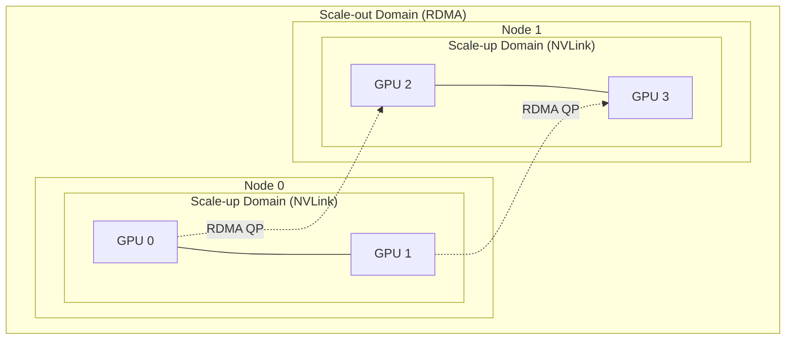
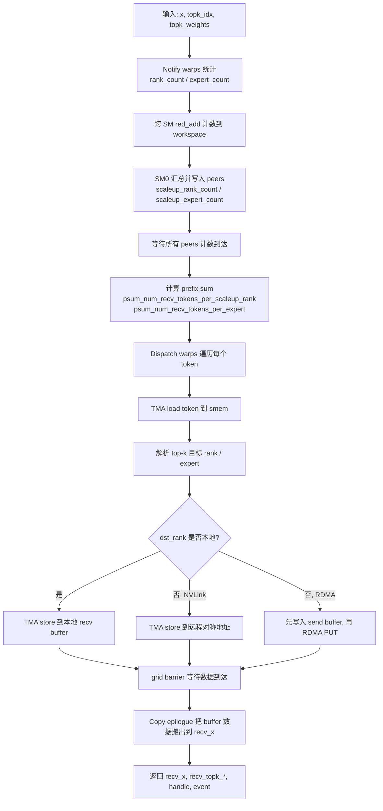
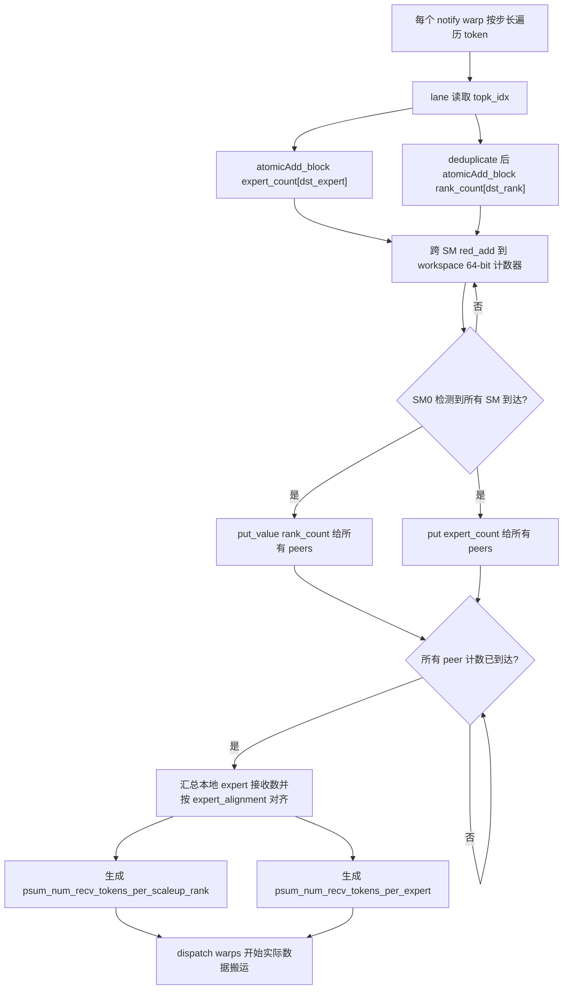
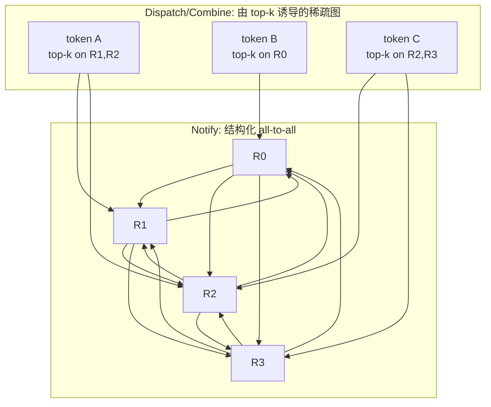
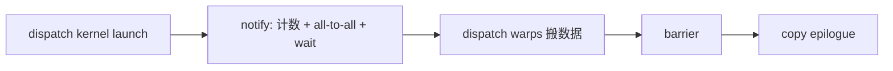
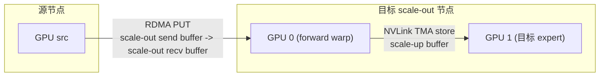
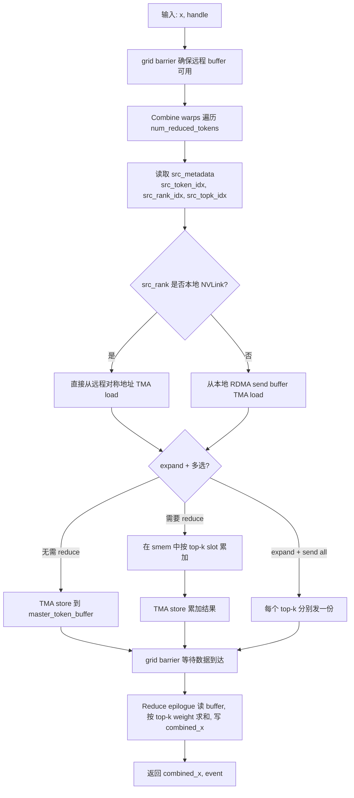
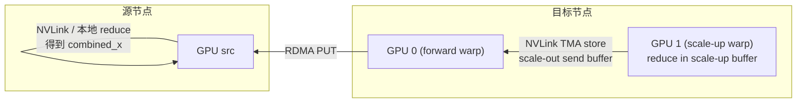

# DeepEP 技术解析：MoE 专家并行通信库

> 文档版本：基于 DeepEP V2（`ElasticBuffer` + NCCL Gin backend）。
> 阅读对象：希望理解 DeepEP 设计目标、完成的具体工作，以及 `dispatch` / `combine` 内部机制的工程师。

---

## 1. 概述：DeepEP 是什么，完成了哪些事

### 1.1 定位

**DeepEP（DeepEveryParallel）** 是一个面向现代大模型训练与推理的高性能 GPU 通信库。它的核心聚焦点是 **专家并行（Expert Parallelism, EP）**，即为 Mixture-of-Experts（MoE）模型提供高吞吐、低延迟的 all-to-all 通信原语，业内通常称之为 **MoE dispatch / combine**。除此之外，DeepEP 还提供实验性的流水线并行（PP）、上下文并行（CP）以及远程内存访问（Engram）能力。

### 1.2 与通用集合通信库的区别

| 维度 | NCCL / MPI 传统 all-to-all | DeepEP |
|---|---|---|
| 语义 |  rank 到 rank 的均匀数据交换 | token 到 expert 的“不规则”路由 |
| 数据类型 | 通常 FP16/BF16 | 支持 BF16、FP8，可携带 top-k index / weight / scale factor |
| 拓扑感知 | 较弱 | 显式区分 scale-up（NVLink）与 scale-out（RDMA）域 |
| 计算耦合 | 纯通信 | 与 MoE  gate 决策、GEMM 输入布局深度耦合 |
| 资源占用 | 通常占用大量 SM | V2 通过 NCCL Gin 与 TMA 极致压缩 SM 占用 |

### 1.3 V2 完成的具体工作

1. **统一 API**：高吞吐与低延迟路径统一为单个 `ElasticBuffer`，对外暴露 `dispatch` 与 `combine` 两个核心函数。
2. **NCCL Gin backend**：基于 NCCL 的 header-only、轻量化设备端通信后端，可直接复用已有 NCCL communicator。
3. **全 JIT 编译**：所有性能关键 kernel 在运行时编译，安装包无需预编译 CUDA，默认目标 SM90（Hopper）。
4. **拓扑自适应**：自动识别 NVLink / RDMA 物理域，并映射为 scale-up / scale-out 逻辑域；单节点走 NVLink，多节点走 RDMA + NVLink 混合（hybrid mode）。
5. **解析式调参**：SM 数量与 QP 数量通过带宽模型直接计算，不再需要离线 auto-tuning。
6. **通信-计算重叠**：通过独立的通信流、`EventOverlap`、CUDA programmatic launch dependency 等机制，使 dispatch/combine 可与 GEMM/Attention 重叠。
7. **低精度支持**：dispatch 路径支持 FP8（带 scale factors），combine 路径支持 BF16。
8. **实验性功能**：0-SM Engram（RDMA 远程 KV fetch）、0-SM PP、AGRS（all-gather reduce-scatter）。

---

## 2. 背景知识与核心概念

### 2.1 MoE 中的 dispatch 与 combine

在 MoE 层中，每个 token 会通过 gate 网络选出 $k$ 个专家（top-$k$）。当模型采用 EP 时，专家被切分到不同 GPU / 节点上，因此：

- **dispatch**：把当前 rank 上形状为 `[num_tokens, hidden]` 的激活，按照 top-k 决策，发送到承载目标专家的 rank 上。每个 token 可能被复制成 $k$ 份。
- **combine**：各 rank 完成本地专家计算后，再把结果按原路“归还”到 token 来源 rank，并按 top-k weight 做加权求和。

数学上，若第 $t$ 个 token 的 top-k 专家为 $\{e_{t,1},\dots,e_{t,k}\}$，权重为 $\{w_{t,1},\dots,w_{t,k}\}$，则：

```
dispatch:  x_t  ->  {x_{t,j} 送往 rank(e_{t,j})}
combine:   对每一 t,  sum_{j=1..k} w_{t,j} * f_{e_{t,j}}(x_{t,j})
```

### 2.2 Scale-up 与 Scale-out

- **Scale-up domain**：同一节点内通过 NVLink 互联的 GPU 集合。带宽高（数百 GB/s）、延迟低、支持 GPU 直接 load/store（P2P / symmetric memory）。
- **Scale-out domain**：跨节点通过 RDMA（InfiniBand / RoCE）互联。带宽低（数十 GB/s）、延迟高，依赖 NIC 的 Queue Pair（QP）进行 RDMA PUT/GET。

DeepEP 把物理拓扑抽象为两层逻辑域：

- `num_scaleout_ranks`：节点数（RDMA 域大小）。
- `num_scaleup_ranks`：每节点 GPU 数（NVLink 域大小）。
- 总 rank 数 `num_ranks = num_scaleout_ranks * num_scaleup_ranks`。

### 2.3 NCCL Gin backend

NCCL Gin 是 NCCL 提供的“轻量设备端通信”接口，核心特征：

- 通过 `ncclGin` 句柄在 CUDA kernel 内直接发起 RDMA / NVLink 操作，无需经过 host CPU。
- 支持 `put`、`put_value`、`red_add`、`signal`/`wait` 等原语。
- 通过 `team_t`（`ncclTeamTagWorld`、`ncclTeamTagLsa`、`ncclTeamTagRail`）区分通信组。
- 多个 warp / SM 共享 QP（Queue Pair），通过 `ncclGinResourceSharingMode` 控制并发。

### 2.4 Hopper 关键硬件特性

DeepEP V2 充分利用 Hopper（SM90）特性：

- **TMA（Tensor Memory Accelerator）**：异步一维/多维拷贝，warp 只需提交描述符，由硬件单元完成数据搬运。
- **mbarrier**：异步内存屏障，协调 TMA load/store 的到达与完成。
- **Programmatic Launch Dependency（PDL）**：`cudaTriggerProgrammaticLaunchCompletion` 让一个 kernel 的完成成为下一个 kernel 的启动依赖，无需 CPU 介入。
- **LDG / STG 与 PTX 优化**：大量使用 inline PTX 控制缓存行为（`.nc`、`.L1::no_allocate` 等）。

---

## 3. 整体架构

### 3.1 内存与 buffer 布局

一个 `ElasticBuffer` 实例对应一块 **NCCL symmetric memory**，地址在集群所有 rank 上对称。其布局为：

```text
[Workspace | GPU buffer | CPU buffer]
```

- **Workspace**：用于 barrier 信号、计数器、prefix sum、channel tail 等元数据。
- **GPU buffer**：dispatch / combine 的收发缓存。
- **CPU buffer**：Engram 等实验功能使用。

每个 token 在 buffer 中按 `TokenLayout` 存储，包含：

```text
[hidden data] [scale factors] [top-k indices] [top-k weights] [src token global idx] [linked list idx] [mbarrier]
```

`BufferLayout` 则按 `[num_ranks, num_max_tokens_per_rank]` 组织这些 token slot。

### 3.2 三种核心 warp 角色

| 角色 | 职责 | 出现位置 |
|---|---|---|
| **Notify warps** | 统计每个 rank / expert 将接收多少 token；做跨 rank 计数同步；生成 prefix sum | dispatch / hybrid dispatch |
| **Dispatch / Scale-up / Scale-out warps** | 实际搬移 token：TMA load 本地数据，TMA store / RDMA PUT 到目标 rank | dispatch、hybrid dispatch |
| **Forward warps** | 在多节点 hybrid 模式下，把跨 RDMA 域收到的 token 再 forward 到本节点内的目标 GPU | hybrid dispatch / hybrid combine |

### 3.3 通信域抽象



---

## 4. Dispatch 详细流程

### 4.1 功能与输入输出

`ElasticBuffer.dispatch` 的语义：把当前 rank 的输入 token 按照 `topk_idx` / `topk_weights` 路由到所有 rank 上对应 expert 的接收区。

**输入**：

- `x`: `[num_tokens, hidden]`，BF16；或 FP8 tuple `(data, scale_factors)`。
- `topk_idx`: `[num_tokens, num_topk]`，每个 token 选中的全局 expert 索引。
- `topk_weights`: `[num_tokens, num_topk]`，可选。
- `num_experts`, `num_max_tokens_per_rank`, `expert_alignment`。

**输出**：

- `recv_x`: 本 rank 从所有 rank 收到的 token 数据。
- `recv_topk_idx` / `recv_topk_weights`：收到 token 对应的本地 expert 索引与权重。
- `handle` (`EPHandle`)：供后续 `combine` 使用，包含路由元数据。
- `event`：用于通信-计算同步。

### 4.2 单节点（scale-up only）dispatch 流程

当 `num_scaleout_ranks == 1` 时，只存在 NVLink（或纯 RDMA 同域）通信。



#### 4.2.1 Notify 阶段：先做一次 all-to-all 的“数数”

Dispatch 真正的数据搬运之前，必须先完成 notify 阶段。它的核心任务是一次轻量的 all-to-all 元数据协商：每个 rank 告诉所有 peer “我会发给你多少 token”，同时收集 peer 会发给自己的数量。

##### 4.2.1.1 为什么必须统计

在 MoE EP 中，每个 token 的 top-k 选择是 **不规则且不可预测的**：

- 当前 rank 知道本地每个 token 要去哪些 expert / 哪些 rank；
- 但它不知道远程 rank 会把哪些 token 路由到自己这里；
- 接收端必须预先知道：
  1. 每个 peer rank 会发来多少 token → 分配接收 buffer、确定 slot 偏移；
  2. 每个本地 expert 会收到多少 token → 决定专家计算输入形状、GEMM 启动参数；
  3. 每个 `(token, top-k)` 该写到目标 rank 的哪个 slot → 保证发送端不互相覆盖，且 combine 能按原路返回。

没有这些统计，后续 RDMA/NVLink 数据搬运就不知道“往哪写、写多少、写完后怎么组合回去”。

##### 4.2.1.2 Notify 统计的数据结构

在 `dispatch.cuh:78-252` 中，前 `kNumNotifyWarps` 个 warp 专职做统计。每个 SM 在共享内存中维护：

```cpp
// dispatch.cuh:85
int *rank_count = rank_expert_count;                 // [0, num_ranks)
int *expert_count = rank_expert_count + num_ranks;   // [num_ranks, num_ranks+num_experts)
```

- `rank_count[dst_rank]`：当前 rank 要发给 `dst_rank` 的 **去重后** token 数。
- `expert_count[dst_expert]`：当前 rank 要发给 `dst_expert` 的 token 数（不去重）。

为什么要去重 `rank_count`？因为一个 token 的 top-2 可能都落在同一个 rank 上。对 **rank 级 buffer 槽位分配**，这个 token 只占用一个 slot；但 **专家级统计** 仍要分别计数，因为后续计算是两个 expert 各做一次。

##### 4.2.1.3 统计流程

1. **本 SM 局部计数**  
   每个 notify warp 按 `global_warp_idx` 步长遍历所有 token，lane $j$ 读取 `topk_idx[token, j]`：

   ```cpp
   // dispatch.cuh:97-105
   const auto dst_expert_idx = lane_idx < kNumTopk ?
       static_cast<int>(__ldg(topk_idx + i * kNumTopk + lane_idx)) : -1;
   if (dst_expert_idx >= 0)
       atomicAdd_block(expert_count + dst_expert_idx, 1);

   const auto dst_rank_idx = dst_expert_idx >= 0 ? dst_expert_idx / kNumExpertsPerRank : -1;
   if (ptx::deduplicate(dst_rank_idx, lane_idx) and dst_rank_idx >= 0)
       atomicAdd_block(rank_count + dst_rank_idx, 1);
   ```

2. **跨 SM 归约**  
   所有 SM 通过 `ptx::red_add` 把计数 reduce 到 workspace 的 64-bit 计数器：

   ```cpp
   // dispatch.cuh:111-114
   const int64_t counter = (1ll << 32ll) | rank_expert_count[i];
   ptx::red_add(workspace_layout.get_notify_reduction_workspace_ptr() + i, counter);
   ```

   高 32 bit 记录到达的 SM 数，低 32 bit 记录计数值。

3. **SM0 汇总并 all-to-all 计数**  
   当 `status >> 32 == kNumSMs` 时，SM0 把归约结果编码，分别用 `gin.put_value`（rank 计数）和 `gin.put`（expert 计数 bulk）写到所有 peer 的接收区：

   ```cpp
   // dispatch.cuh:151-177
   for (int i = thread_idx; i < kNumRanks; i += kNumNotifyThreads) {
       const auto dst_rank_counter =
           workspace_layout.get_scaleup_rank_count_ptr<false>() + rank_idx;
       gin.put_value<team_t>(dst_rank_counter, static_cast<int64_t>(rank_count[i]), i,
                             ncclGinOptFlagsAggregateRequests);
   }
   ```

4. **等待 peer 计数**  
   SM0 自旋等待 `scaleup_rank_expert_count_ptr<false>()[i]`，直到拿到所有 peer 发给本 rank 的 per-rank / per-expert 计数：

   ```cpp
   // dispatch.cuh:184-200
   const auto count = static_cast<int>(
       ptx::ld_volatile<int64_t>(workspace_layout.get_scaleup_rank_expert_count_ptr<false>() + i));
   ```

5. **本地 expert 汇总与对齐**  
   对本地每个 expert，把所有 rank 发来的计数相加，并按 `expert_alignment` 对齐：

   ```cpp
   // dispatch.cuh:204-214
   int sum = 0;
   for (int j = 0; j < kNumRanks; ++ j)
       sum += expert_count[j * kNumExpertsPerRank + i];
   expert_count[i] = math::align(sum, kExpertAlignment);

   if (cumulative_local_expert_recv_stats != nullptr)
       atomicAdd(cumulative_local_expert_recv_stats + i, sum);
   ```

6. **生成 prefix sum**  
   - `psum_num_recv_tokens_per_scaleup_rank`：对去重后的 `rank_count` 做 inclusive prefix sum，最后一个元素即本次 dispatch 本 rank 总共收到的 token 数。
   - `psum_num_recv_tokens_per_expert`：对对齐后的本地 expert 计数做 exclusive prefix sum，用于 expand 布局中的 scatter/gather 偏移。

##### 4.2.1.4 统计产物的业务用途

| 产物 | 形状 / 位置 | 业务意义 |
|---|---|---|
| `rank_count` | 共享内存 / workspace | 本 rank 发给每个 peer 的 **去重后** token 数 |
| `expert_count` | 共享内存 / workspace | 本 rank 发给每个全局 expert 的 token 数（不去重） |
| `cumulative_local_expert_recv_stats` | `[num_local_experts]`，可选 | 每个本地 expert 收到的总 token 数，用于负载均衡监控 / load balance loss（`elastic.py:743-744`） |
| `psum_num_recv_tokens_per_scaleup_rank` | `[num_scaleup_ranks]` | 来自各 rank 的 token 在接收 buffer 中的 inclusive 偏移；最后一个元素为总接收 token 数 |
| `psum_num_recv_tokens_per_expert` | `[num_local_experts]` | expand 模式下各 expert 在输出 buffer 中的 exclusive 偏移 |
| `dst_buffer_slot_idx` | `[num_tokens, num_topk]` | 每个 `(token, top-k)` 在目标 rank 接收 buffer 中的 slot 索引，combine 反向路由的关键 |

`dst_buffer_slot_idx` 在普通模式下由 dispatch data warps 通过 `atomicAdd` 在 `scaleup_atomic_sender_counter` 上动态分配：

```cpp
// dispatch.cuh:338-343
if (ptx::deduplicate(stored_dst_rank_idx, lane_idx) and stored_dst_rank_idx >= 0)
    stored_dst_slot_idx = atomicAdd(workspace_layout.get_scaleup_atomic_sender_counter() + stored_dst_rank_idx, 1);
```

在 `deterministic` 或 `cached_mode` 下，它由 `dispatch_deterministic_prologue` 通过前缀和 **确定性预分配**，避免原子操作带来的不确定性。

##### 4.2.1.5 Notify 与 NCCL GIN

Notify 阶段的 all-to-all 计数交换走的就是 NCCL GIN：

```cpp
// dispatch.cuh:153-157
gin.put_value<team_t>(workspace_layout.get_scaleup_rank_count_ptr<false>() + rank_idx,
                      static_cast<int64_t>(rank_count[i]), i,
                      ncclGinOptFlagsAggregateRequests);
```

体积小、延迟低，且通过 `ncclGinOptFlagsAggregateRequests` 聚合多个小写，减少 doorbell 开销。这与后续 data warps 用 `gin.put` 传输 token hidden 向量使用同一套 GIN 后端，只是传的是 metadata。

##### 4.2.1.6 Notify 阶段流程图



##### 4.2.1.7 Notify 的 all-to-all 本质与 dispatch/combine 的稀疏性

Notify 看起来只是“数数”，但它在通信模式上是 **结构化的 all-to-all**；而 dispatch/combine 的实际数据搬运则是一张 **由 top-k 路由诱导的稀疏图**。

###### 为什么 notify 必须是 all-to-all

在 `dispatch.cuh:151-157` 中，SM0 向 **所有 peer rank** 发送本 rank 的计数：

```cpp
for (int i = thread_idx; i < kNumRanks; i += kNumNotifyThreads) {
    const auto dst_rank_counter =
        workspace_layout.get_scaleup_rank_count_ptr<false>() + rank_idx;
    gin.put_value<team_t>(dst_rank_counter, static_cast<int64_t>(rank_count[i]), i,
                          ncclGinOptFlagsAggregateRequests);
}
```

注意循环变量 `i` 遍历 `0 .. kNumRanks-1`，**不会因为 `rank_count[i] == 0` 而跳过**。原因很本质：

> 接收端在拿到 peer 计数之前，**不知道谁会给自己发数据、发多少**。因此每个 rank 必须显式告诉所有 peer：“我要发给你 `rank_count[i]` 个 token”，即使这个数是 0。

这是一种 **all-to-all of metadata**，和 NCCL all-to-all 在通信模式上是完全一致的。

###### 为什么 dispatch/combine 是稀疏的

Dispatch 的数据搬运只发生在 token 的 top-k 专家实际落到的那些 rank 上：

```cpp
// dispatch.cuh:370-385
const auto dst_ptr = stored_dst_slot_idx >= 0 ?
    gin.get_sym_ptr<team_t>(recv_buffer.get_token_buffer(stored_dst_slot_idx).get_base_ptr(), stored_dst_rank_idx) :
    nullptr;
if (dst_ptr != nullptr)
    ptx::tma_store_1d(dst_ptr, tma_buffer.get_base_ptr(), tma_buffer.get_num_bytes<false>());
```

`stored_dst_rank_idx` 来自 `topk_idx[token, lane] / kNumExpertsPerRank`。如果某个 token 的 top-2 都落在 rank 3 和 rank 7 上，它**只**会发给 rank 3 和 rank 7，不会 touch 其他 rank。Combine 同理：只从那些曾经给本 rank 发过 token 的源 rank 读取数据。



###### 实际业务中的稀疏程度

MoE 训练通常会用 **load-balancing loss** 约束，使 token 尽量均匀分散到所有 expert，因此：

- 每个 token 的 top-k 通常会落在 **k 个不同 rank** 上；
- 每个 rank 也会从 **几乎所有其他 rank** 收到一些 token。

所以在典型训练场景下，dispatch/combine 的实际 peer 覆盖度很高，**接近 all-to-all**。但在以下场景下稀疏性会很明显：

| 场景 | 效果 |
|---|---|
| **推理解码，batch size = 1 或很小** | 每个 token 只去 k 个 rank，大量 rank 之间没有数据交换 |
| **gate 分布高度偏斜** | 热门 expert 集中在少数 rank，冷门 rank 之间无交互 |
| **专家分组 / 层次 MoE** | token 只在某个专家子集内路由，rank 覆盖度天然受限 |
| **cached handle 稳定路由** | 数据搬运模式固定，但 notify 仍需走全量 |

##### 4.2.1.8 Notify 的开销到底重不重

_notify 的“重”不是重在网络/HBM 数据搬运，而是重在 **同步延迟** 和 **关键路径占比** 上。_

###### 数据量上：notify 极轻

| 阶段 | 每个 token 搬运的数据 | 典型规模 |
|---|---|---|
| **notify** | 几个 int64 计数 | 几 byte ~ 几十 byte |
| **dispatch** | hidden 向量 + topk metadata + scale factors | 通常 1KB~4KB/token |
| **combine** | 专家输出 hidden 向量 | 通常 1KB~4KB/token |

按字节数算，notify 的数据量只有 dispatch/combine 的千分之一，不会吃掉网络带宽。

###### 同步开销上：notify 很重

Notify 在 dispatch kernel 内部做了大量 **必须串行完成的同步**：

1. 跨 SM `red_add` 归约，要等所有 `num_sms` 到达；
2. 向所有 peer 发计数，再等所有 peer 计数返回；
3. 拿到全部计数后才能做 prefix sum；
4. prefix sum 完成后 data warps 才能开始搬第一个 token。



因此 **notify 的延迟占比在小 batch、低延迟推理时会比较显眼**；在大 batch 训练中，dispatch/combine 的数据搬运时间长，notify 的同步时间就被掩盖了。

###### 什么时候 notify 会成为瓶颈

| 场景 | 原因 |
|---|---|
| **小 batch / 低延迟推理** | token 数据量小，notify 同步延迟占比高 |
| **跨节点 scale-out** | RDMA 往返延迟比 NVLink 高一个数量级 |
| **CPU sync 开启** | CPU 必须等 GPU notify 完成，无法与 CUDA graph 协同 |
| **路由稀疏** | dispatch 实际数据交换少，但 notify 仍要全量 all-to-all |

这也是为什么 DeepEP 把以下机制作为降低延迟的核心手段：

| 机制 | 如何缓解 notify 开销 |
|---|---|
| **`EPHandle` 缓存** | 推理解码时若 gate 决策不变，**完全跳过本次 notify** |
| **`do_cpu_sync=False`** | GPU 端按最大 buffer 异步分配，避免 CPU 等待 |
| **`ncclGinOptFlagsAggregateRequests`** | 聚合多个 `put_value`，减少 doorbell 和 QP 头开销 |
| **64-bit packed `red_add`** | 计数 + SM 到达计数一次 atomic 完成 |
| **deterministic prologue** | 把 slot 分配从主 kernel 拆出，减少主 kernel 内串行时间 |

###### 能否让 notify 也变成稀疏的

理论上可以，但需要额外假设：

1. **所有 rank 事先知道路由模式**（例如 cached handle）→ 直接复用上一次结果，不再交换计数。
2. **允许 over-provisioning**：接收端按最大可能 token 数分配 buffer，不再询问每个 peer 具体发多少。代价是 buffer 和计算浪费。
3. **使用稀疏 all-to-all 原语**：但即便如此，确定“哪些 peer 会发给我”本身也需要一次通信，无法完全避免。

在没有先验路由信息的情况下，**notify 的 all-to-all 是一个下界**：你必须以某种方式让每个 rank 知道“谁会给我发、发多少”。

###### 小结

> **notify 是 DeepEP dispatch 中唯一结构化的 all-to-all 步骤；dispatch 和 combine 只是由 top-k 路由诱导出的稀疏数据图。**
>
> 当 MoE 路由接近均匀时，dispatch/combine 的实际 peer 覆盖度也很高，notify 的相对开销被掩盖；当 batch 小、路由偏斜或使用稀疏专家结构时，notify 的固定 all-to-all 开销会凸显出来。DeepEP 通过 **handle 缓存** 和 **async / no CPU sync** 模式，本质上都是在绕过或重叠 notify 这条强制性的控制路径。

#### 4.2.2 Dispatch 阶段

1. 每个 SM 的剩余 warp 作为 dispatch warps。每个 warp 是一个 **channel**。
2. 通过 `comm::get_qp_mode` 把 `(sm_idx, warp_idx)` 映射到 QP 与 sharing mode。
3. 每个 channel 按 `token_start = dispatch_warp_idx * num_sms + sm_idx` 遍历 token，步长 `num_dispatch_warps * num_sms`。
4. 对每一个 token：
   - 用 TMA 把 hidden data + scale factors 异步加载到 smem。
   - lane 读取 `topk_idx`，写入 smem 的 metadata 区。
   - 把源 token 的全局索引 `rank_idx * num_max_tokens_per_rank + token_idx` 写入 metadata。
   - 去重目标 rank，为每个目标 rank 在对应的原子计数器上分配一个 slot（`dst_buffer_slot_idx`）。
   - 等待 TMA load 到达后，用 TMA store 把完整 token 写到：
     - 本地 recv buffer（如果目标 rank 是自己）。
     - 远程 rank 的对称地址（NVLink 可达）。
     - 或者先写到 send buffer，再发起 RDMA PUT（跨节点）。

#### 4.2.3 Barrier 与 Copy Epilogue

1. dispatch kernel 结束前调用 `comm::gpu_barrier`，确保所有 rank 的 buffer 数据可见。
2. 通过 `cudaTriggerProgrammaticLaunchCompletion` 触发 PDL，启动 **dispatch_copy_epilogue** kernel。
3. Copy epilogue 把对称 buffer 中的 token 逐个读回，按目标 expert 索引 scatter 到 `recv_x`：
   - 非 expand 模式：按收到顺序直接写入 `recv_x[i]`。
   - expand 模式：按 expert 做 atomicAdd 到 `psum_num_recv_tokens_per_expert`，把同一 expert 的 token 紧凑排列，便于后续 GEMM。
4. 同时生成 `recv_src_metadata[i, 0..num_topk+1]`，记录源 token 全局索引、源 rank 与 master top-k lane，供 combine 反向路由。

### 4.3 多节点 hybrid dispatch 流程

当 `num_scaleout_ranks > 1` 时，DeepEP 采用 **两跳路由**：

1. **Scale-out 阶段**：把 token 从源节点经 RDMA 发送到目标 scale-out rank 的 scale-out recv buffer。
2. **Forward 阶段**：在目标节点内部，把 token 从 scale-out recv buffer 经 NVLink forward 到最终承载 expert 的 scale-up rank 的 scale-up buffer。



#### 4.3.1 Notify 在 hybrid 模式下的变化

- 需要先统计跨 scale-out rank 的 token 数量。
- 每个 scale-out rank 内再统计跨 scale-up rank 的数量。
- 通过 `ncclTeamTagRail` 在 scale-out 域内交换计数，通过 `ncclTeamTagLsa` 在 scale-up 域内交换计数。
- 使用 `red_add_rel` 做跨节点的原子 reduce，最终得到每个本地 expert 的接收数。

#### 4.3.2 Scale-out warps

- 每个 warp/channel 负责把 token 经 RDMA 发到目标 scale-out rank。
- 在 send buffer 中为 token 预留位置；如果目标 scale-out 就是本节点，直接写入本地 scale-out recv buffer（bypass）。
- 通过 `update_scaleout_tail` 周期性向目标节点的 forward warps 发送 tail 信号，通知“新到多少 token”。

#### 4.3.3 Forward warps

- 每个 channel 轮询所有 scale-out peer 的 `scaleout_channel_signaled_tail`。
- 发现有新 token 后，TMA load 到 smem，解析 top-k 得到目标 scale-up rank。
- 为每个目标 scale-up rank 在 scale-up buffer 中分配 slot，并记录 `token_metadata_at_forward`。
- 通过 `channel_linked_list` 把同一 scale-up peer 的 token 连成链表，供 combine 阶段直接遍历。

---

## 5. Combine 详细流程

### 5.1 功能与输入输出

`ElasticBuffer.combine` 的语义：把各 rank 上专家计算后的结果，按 dispatch 记录的反向路由，归约回每个源 token 所在 rank，并按 top-k weight 加权。

**输入**：

- `x`: `[num_tokens, hidden]`，BF16，通常是专家计算后的输出。
- `handle`: dispatch 返回的 `EPHandle`，包含 `src_metadata`、`topk_idx` 等。
- `topk_weights`: `[num_tokens, num_topk]`，可选；非 expand 模式下用于最终加权。
- `bias_0` / `bias_1`: 可选输出 bias。

**输出**：

- `combined_x`: `[num_combined_tokens, hidden]`，归约后的输出。
- `combined_topk_weights`: 可选，用于 backward。
- `event`：同步事件。

### 5.2 单节点 combine 流程



#### 5.2.1 Main combine kernel

1. 每个 warp/channel 遍历 `num_reduced_tokens`（即 dispatch 阶段本 rank 收到的 token 数）。
2. 对第 $i$ 个 token，从 `src_metadata[i]` 解析：
   - `src_token_global_idx`：源 token 在全局 batch 中的索引。
   - `src_rank_topk_idx = src_rank_idx * num_topk + src_topk_idx`：标识源 rank 与 top-k 位置。
3. 判断源 rank 是否 NVLink 可达：
   - 可达：直接 `get_sym_ptr` 拿到远程对称地址，从该地址 TMA load。
   - 不可达：从本地 send buffer 的对应位置读取（数据已由远端 RDMA PUT 写入）。
4. 三种处理路径：
   - **非 expand 且无需 reduce**：直接把数据写到 `master_token_buffer`。
   - **expand 且 allow_multiple_reduction**：在共享内存中把同一源 token 的多个 top-k 结果累加，再写回。
   - **expand 且禁用多轮 reduce**：把每个 top-k 结果分别发回源 rank 的不同 slot。
5. 若提供 `topk_weights`，把权重写入 token buffer 的 metadata 区，供 reduce epilogue 使用。
6. 对 RDMA 路径，等待 TMA store 完成后发起 `gin.put`。
7. 结束 barrier 等待所有数据到达。

#### 5.2.2 Reduce epilogue

`combine_reduce_epilogue` kernel 通过 PDL 在 main combine kernel 完成后启动：

1. 对每个输出 token `t`（`0..num_combined_tokens-1`），读取 `combined_topk_idx[t]` 得到目标专家。
2. 根据目标专家确定需要 reduce 的源 rank / slot（使用 `kUseRankLayout` 或 `kUseTopkLayout`）。
3. 在 smem 中做向量化的 FP32/BF16 累加，同时可加入 `bias_0` / `bias_1`。
4. 把结果 TMA store 到 `combined_x[t]`。
5. 若需要，把对应的 `topk_weights` 写回 `combined_topk_weights`。

### 5.3 多节点 hybrid combine 流程

Combine 是 dispatch 的逆过程，同样分 scale-up 与 scale-out 两跳：

1. **Scale-up warps**：读取 `channel_linked_list`，遍历本节点内各 scale-up rank 需要 reduce 的 token；在本地 scale-up buffer 中完成 reduce 后，把结果发到 scale-out send buffer。
2. **Forward warps**：把 scale-out send buffer 中的 token 经 RDMA PUT 发回源 scale-out rank。
3. 源 scale-out rank 的 scale-up warps 再把数据 forward 到最终目标 rank（如果需要）。



---

## 6. 关键机制深入

### 6.1 EPHandle 与缓存

`EPHandle` 保存了一次 dispatch 产生的全部元数据：

- `topk_idx`：dispatch 时的专家选择（clone）。
- `psum_num_recv_tokens_per_scaleup_rank`：来自各 scale-up rank 的 token 前缀和。
- `psum_num_recv_tokens_per_expert`：本地各 expert 的 token 前缀和。
- `recv_src_metadata`：每个收到 token 的源信息。
- `dst_buffer_slot_idx`、`token_metadata_at_forward`、`channel_linked_list`：hybrid 模式专用。

在推理解码阶段，如果 gate 决策不变，可直接把上一次的 `EPHandle` 传入下一次 `dispatch`，跳过 notify / prefix sum 等 CPU 同步，显著降低 latency。

### 6.2 CPU sync 与无 CPU sync

- **CPU sync（`do_cpu_sync=True`）**：dispatch kernel 把 rank/expert 计数写到 host-mapped workspace，CPU 轮询直到拿到精确接收数，再分配 `recv_x` 等输出 tensor。优点是输出尺寸精确；缺点是需要 CPU 等待 GPU，无法与 CUDA graph 一起使用。
- **无 CPU sync**：直接按 `num_max_tokens_per_rank * num_ranks` 的最大值分配输出，copy epilogue 再根据 GPU 上的 prefix sum 实际填充。优点是可完全异步；缺点是 buffer 空间浪费。

### 6.3 Deterministic prologue

当 `deterministic=True` 且单节点时，DeepEP 会先启动一个独立的 `dispatch_deterministic_prologue` kernel：

- 预先遍历所有 token 的 `topk_idx`。
- 为每个 `(token, top-k)` 分配确定性的 `dst_buffer_slot_idx`。
- 避免 dispatch 主 kernel 中跨 warp 的原子竞争，保证结果可复现。

### 6.4 Expand mode

- **非 expand**：每个 token 在 recv buffer 中保留 $k$ 个 slot，排列为 `[num_recv_tokens, num_topk]`。
- **expand**：每个 `(token, expert)` 对占用独立一行，`recv_x` 形状为 `[num_expanded_tokens, hidden]`，同一 expert 的 token 在内存中连续，可直接作为专家 GEMM 的输入。

Expand 模式通过 `psum_num_recv_tokens_per_expert` 做 atomic scatter 实现。

### 6.5 Multiple reduction

`allow_multiple_reduction` 控制 combine 中是否允许多次累加：

- **启用**：在 main combine kernel 中尽可能先做局部 reduce，减少跨网络发送的数据量。
- **禁用**：每个 top-k 结果单独发回源 rank，在最终的 reduce epilogue 中只做一次累加，精度更优但通信量更大。

### 6.6 FP8 dispatch

当 `use_fp8_dispatch=True` 时：

- `x` 为 tuple `(data, scale_factors)`，`data` 类型 `torch.float8_e4m3fn`。
- `TokenLayout` 额外预留 `num_sf_bytes` 存放 scale factors。
- copy epilogue 支持 `use_tma_aligned_col_major_sf`，把 scale factors 排成列主序，便于后续 GEMM 直接消费。

### 6.7 Barrier 设计

`comm::gpu_barrier` 统一处理三类 barrier：

- **NVLink barrier**：通过共享内存中的原子计数器与信号数组，单 SM 即可完成。
- **Gin barrier**：对所有 QP flush 后，用 NCCL Gin `signal` / shadow counter 等待全部 peer 到达。
- **Hybrid barrier**：SM0 负责 scale-up 子域 barrier，其余 SM 负责 scale-out 子域 barrier，通过 grid sync 协调。

### 6.8 QP 与 channel 映射

`comm::get_qp_mode` 根据 `num_sms`、`num_qps`、`num_channels_per_sm` 决定每个 channel 使用哪个 QP：

- 若 `num_sms <= num_qps`：每个 SM 独占若干 QP，channel 在 SM 内轮询 QP。
- 否则：所有 SM 共享 QP，按全局 channel 索引取模。
- notify warps 固定使用 QP 0 与 `NCCL_GIN_RESOURCE_SHARING_CTA` 模式。

---

## 7. SM / QP 数量估算

### 7.1 理论 SM 数

`get_theoretical_num_sms` 基于带宽瓶颈模型：

1. 根据 gate 分布计算期望的跨 scale-up / scale-out top-k 数量。
2. 分别估算 HBM read、HBM write、RDMA traffic、NVLink traffic。
3. 找出瓶颈链路，按 `bounded_gbs / bounded_traffic` 与 SM 读写能力计算所需 SM。
4. 最终向上对齐到不小于 4 的偶数，并受 `prefer_overlap_with_compute` 影响。

### 7.2 理论 QP 数

- 单节点 direct 模式：`min(num_sms, 8) + 1`（含 notify QP）。
- 多节点 hybrid 模式：`num_sms * 16 + 1`。
- 最终不超过 `num_allocated_qps`（默认 direct 17，hybrid 65/129）。

---

## 8. 总结

DeepEP V2 通过以下设计，把 MoE EP 通信从“黑盒 all-to-all”提升为与模型拓扑、数据布局、硬件特性紧密集成的专家并行通信库：

1. **统一 ElasticBuffer**：一套 API 覆盖高吞吐训练/预填与低延迟解码。
2. **两层拓扑感知**：scale-up（NVLink）与 scale-out（RDMA）分层路由，hybrid 模式支持跨节点高效转发。
3. **极致硬件利用**：TMA、mbarrier、PDL、inline PTX 把 SM 占用压到最低（V2 相比 V1 最多减少 4x SM）。
4. **全 JIT + 解析式调参**：无需离线 tuning，安装简单。
5. **丰富的精度与模式**：BF16 / FP8、expand / non-expand、multiple reduction、CPU sync / async、handle 缓存。

理解 `dispatch` 与 `combine` 的关键，在于把握 **token 路由 -> 计数同步 -> 异步搬运 -> barrier -> epilogue 整理** 这一完整闭环，以及 DeepEP 如何在 NVLink 与 RDMA 两种物理介质上高效实现这一闭环。需要特别注意的是：

- **notify 阶段是 dispatch 中唯一结构化的 all-to-all 步骤**，它只交换元数据（计数），不搬 token 数据；
- **dispatch 与 combine 的实际数据图由 top-k 路由诱导**，在均匀负载下接近 all-to-all，在小 batch 或偏斜路由下则可能非常稀疏；
- notify 的“重”主要体现在 **同步延迟** 和 **关键路径占比** 上，DeepEP 通过 `EPHandle` 缓存、`do_cpu_sync=False`、NCCL GIN 小消息聚合等机制专门规避或重叠这条控制路径。

---

## 附录 A：关键流程 mermaid 源码（双引号引用）

> 本节把正文中的关键流程图以双引号包裹的 mermaid 源码形式再次列出，便于提取、复用或纳入其它文档系统。

### A.1 通信域抽象

```text
"flowchart TB
    subgraph ScaleOut[\"Scale-out Domain (RDMA)\"]
        direction LR
        subgraph Node0[\"Node 0\"]
            subgraph ScaleUp0[\"Scale-up Domain (NVLink)\"]
                G0[\"GPU 0\"] --- G1[\"GPU 1\"]
            end
        end
        subgraph Node1[\"Node 1\"]
            subgraph ScaleUp1[\"Scale-up Domain (NVLink)\"]
                G2[\"GPU 2\"] --- G3[\"GPU 3\"]
            end
        end
    end
    G0 -. \"RDMA QP\" .-> G2
    G1 -. \"RDMA QP\" .-> G3"
```

### A.2 单节点 dispatch 流程

```text
"flowchart TD
    A[\"输入: x, topk_idx, topk_weights\"] --> B[\"Notify warps 统计<br/>rank_count / expert_count\"]
    B --> C[\"跨 SM red_add 计数到 workspace\"]
    C --> D[\"SM0 汇总并写入 peers<br/>scaleup_rank_count / scaleup_expert_count\"]
    D --> E[\"等待所有 peers 计数到达\"]
    E --> F[\"计算 prefix sum<br/>psum_num_recv_tokens_per_scaleup_rank<br/>psum_num_recv_tokens_per_expert\"]
    F --> G[\"Dispatch warps 遍历每个 token\"]
    G --> H[\"TMA load token 到 smem\"]
    H --> I[\"解析 top-k 目标 rank / expert\"]
    I --> J{\"dst_rank 是否本地?\"}
    J -- 是 --> K[\"TMA store 到本地 recv buffer\"]
    J -- 否, NVLink --> L[\"TMA store 到远程对称地址\"]
    J -- 否, RDMA --> M[\"先写入 send buffer, 再 RDMA PUT\"]
    K --> N[\"grid barrier 等待数据到达\"]
    L --> N
    M --> N
    N --> O[\"Copy epilogue 把 buffer 数据搬出到 recv_x\"]
    O --> P[\"返回 recv_x, recv_topk_*, handle, event\"]"
```

### A.3 多节点 hybrid dispatch 两跳路由

```text
"flowchart LR
    subgraph SrcNode[\"源节点\"]
        SGPU[\"GPU src\"]
    end
    subgraph DstNode[\"目标 scale-out 节点\"]
        direction TB
        DGPU0[\"GPU 0 (forward warp)\"]
        DGPU1[\"GPU 1 (目标 expert)\"]
    end
    SGPU -->|\"RDMA PUT<br/>scale-out send buffer -> scale-out recv buffer\"| DGPU0
    DGPU0 -->|\"NVLink TMA store<br/>scale-up buffer\"| DGPU1"
```

### A.4 单节点 combine 流程

```text
"flowchart TD
    A[\"输入: x, handle\"] --> B[\"grid barrier 确保远程 buffer 可用\"]
    B --> C[\"Combine warps 遍历 num_reduced_tokens\"]
    C --> D[\"读取 src_metadata<br/>src_token_idx, src_rank_idx, src_topk_idx\"]
    D --> E{\"src_rank 是否本地 NVLink?\"}
    E -- 是 --> F[\"直接从远程对称地址 TMA load\"]
    E -- 否 --> G[\"从本地 RDMA send buffer TMA load\"]
    F --> H{\"expand + 多选?\"}
    G --> H
    H -- 无需 reduce --> I[\"TMA store 到 master_token_buffer\"]
    H -- 需要 reduce --> J[\"在 smem 中按 top-k slot 累加\"]
    J --> K[\"TMA store 累加结果\"]
    H -- expand + send all --> L[\"每个 top-k 分别发一份\"]
    I --> M[\"grid barrier 等待数据到达\"]
    K --> M
    L --> M
    M --> N[\"Reduce epilogue 读 buffer, 按 top-k weight 求和, 写 combined_x\"]
    N --> O[\"返回 combined_x, event\"]"
```

### A.5 多节点 hybrid combine 两跳路由

```text
"flowchart RL
    subgraph DstNode[\"目标节点\"]
        direction TB
        DGPU1[\"GPU 1 (scale-up warp)<br/>reduce in scale-up buffer\"]
        DGPU0[\"GPU 0 (forward warp)\"]
    end
    subgraph SrcNode[\"源节点\"]
        SGPU[\"GPU src\"]
    end
    DGPU1 -->|\"NVLink TMA store<br/>scale-out send buffer\"| DGPU0
    DGPU0 -->|\"RDMA PUT\"| SGPU
    SGPU -->|\"NVLink / 本地 reduce<br/>得到 combined_x\"| SGPU"
```

### A.6 Notify 阶段详细流程

```text
"flowchart TD
    A[\"每个 notify warp 按步长遍历 token\"] --> B[\"lane 读取 topk_idx\"]
    B --> C[\"atomicAdd_block expert_count[dst_expert]\"]
    B --> D[\"deduplicate 后 atomicAdd_block rank_count[dst_rank]\"]
    C --> E[\"跨 SM red_add 到 workspace 64-bit 计数器\"]
    D --> E
    E --> F{\"SM0 检测到所有 SM 到达?\"}
    F -->|否| E
    F -->|是| G[\"put_value rank_count 给所有 peers\"]
    F -->|是| H[\"put expert_count 给所有 peers\"]
    G --> I{\"所有 peer 计数已到达?\"}
    H --> I
    I -->|否| I
    I -->|是| J[\"汇总本地 expert 接收数并按 expert_alignment 对齐\"]
    J --> K[\"生成 psum_num_recv_tokens_per_scaleup_rank\"]
    J --> L[\"生成 psum_num_recv_tokens_per_expert\"]
    K --> M[\"dispatch warps 开始实际数据搬运\"]
    L --> M"
```

### A.7 Notify 的 all-to-all 本质 vs dispatch/combine 的稀疏性

```text
"flowchart TB
    subgraph Notify[\"Notify: 结构化 all-to-all\"]
        direction LR
        R0[\"R0\"] --> R1[\"R1\"]
        R0 --> R2[\"R2\"]
        R0 --> R3[\"R3\"]
        R1 --> R0
        R1 --> R2
        R1 --> R3
        R2 --> R0
        R2 --> R1
        R2 --> R3
        R3 --> R0
        R3 --> R1
        R3 --> R2
    end

    subgraph Dispatch[\"Dispatch/Combine: 由 top-k 诱导的稀疏图\"]
        direction LR
        T0[\"token A<br/>top-k on R1,R2\"] --> R1
        T0 --> R2
        T1[\"token B<br/>top-k on R0\"] --> R0
        T2[\"token C<br/>top-k on R2,R3\"] --> R2
        T2 --> R3
    end"
```

### A.8 Notify 在 dispatch 关键路径上的位置

```text
"flowchart LR
    A[\"dispatch kernel launch\"] --> B[\"notify: 计数 + all-to-all + wait\"]
    B --> C[\"dispatch warps 搬数据\"]
    C --> D[\"barrier\"]
    D --> E[\"copy epilogue\"]"
```
