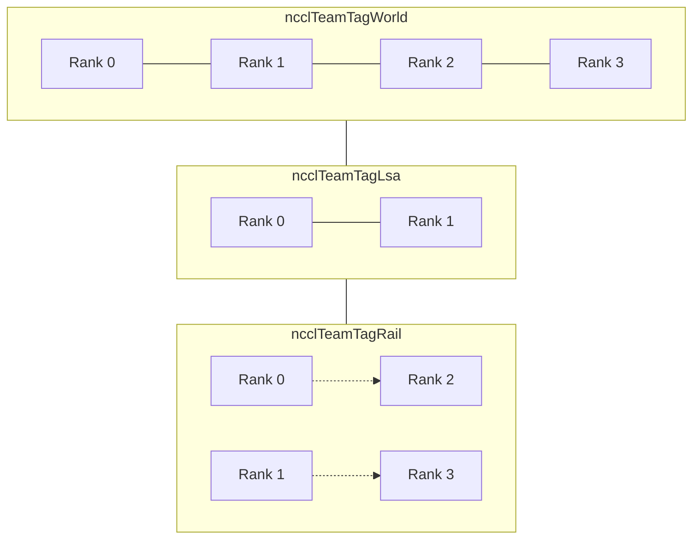
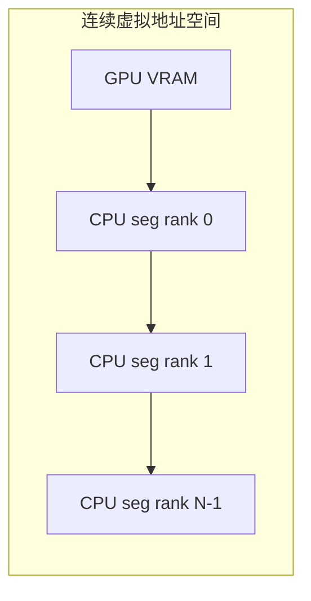
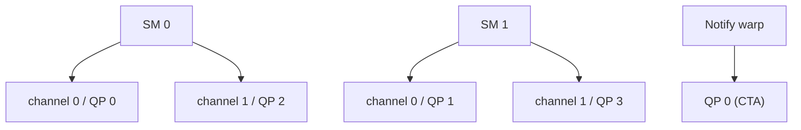
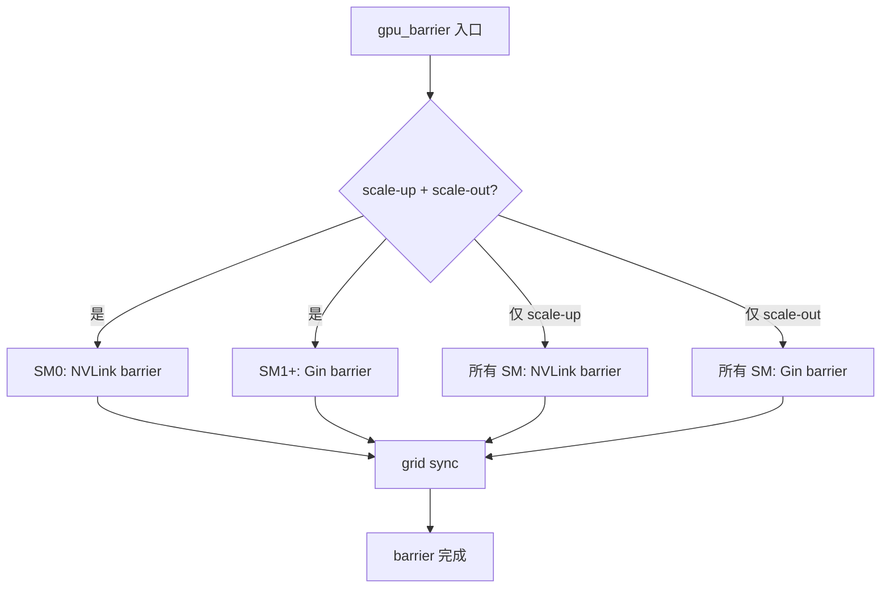

# DeepEP 传输层解析：通信原语、组织方式与优化

> 文档版本：基于 DeepEP V2（NCCL Gin backend + CUDA Driver API）。
> 阅读对象：希望理解 DeepEP 如何利用 RDMA / NVLink 原语、如何组织 QP / channel / symmetric memory，以及各项优化背后的场景与动机的工程师。

---

## 1. 传输层在 DeepEP 中的位置

### 1.1 为什么需要专用传输层

MoE 专家并行的通信不是传统意义上的均匀 all-to-all：

- 每个 token 只访问 $k$ 个专家，通信模式极度稀疏且不规则。
- 同一条 token 的多个 top-k 可能落在同一 rank，需要 **去重计数**。
- 训练 batch 大、吞吐优先；推理解码 batch 小、延迟优先。
- 集群拓扑通常是 **NVLink 域 + RDMA 域** 的混合结构。

通用 NCCL 集合通信无法直接表达“token → expert”的路由语义，也无法在 kernel 内细粒度控制 RDMA QP、NVLink P2P、异步屏障。因此 DeepEP 在 NCCL 之上构建了一层 **面向 MoE 的专用传输层**。

### 1.2 设计目标

| 目标 | 说明 |
|---|---|
| **低开销** | 设备端直接发 RDMA / NVLink 请求，避免 CPU 代理。 |
| **拓扑感知** | 自动识别 NVLink 可达 peer 与 RDMA peer，选择最快路径。 |
| **可扩展** | 单节点 EP8 到跨节点 EP2048 都能工作。 |
| **资源可控** | QP 数量、SM 数量、channel 数量均可解析式计算。 |
| **可重叠** | 通信 kernel 可与计算 kernel 在独立流上并行。 |
| **零 SM 选项** | 对 PP / Engram 等场景，可用 CUDA Driver 批量 memop 完全释放 SM。 |

### 1.3 核心组件

```text
┌─────────────────────────────────────────────────────────────┐
│                    ElasticBuffer API                         │
│         (dispatch / combine / engram / pp / agrs)            │
├─────────────────────────────────────────────────────────────┤
│              Kernel 层 (dispatch.cuh / combine.cuh)          │
│         TMA, mbarrier, PTX red_add, named barrier            │
├─────────────────────────────────────────────────────────────┤
│              NCCLGin 句柄 (common/handle.cuh)                │
│    put / get / red_add_rel / signal / flush / sym_ptr        │
├─────────────────────────────────────────────────────────────┤
│              NCCL Symmetric Memory (backend/nccl.cu)         │
│    ncclCommWindowRegister, LSA pointer, RDMA registration    │
├─────────────────────────────────────────────────────────────┤
│              物理内存分配 (backend/symmetric.hpp)            │
│    GPUSymmetricMemory / Elastic / HybridElastic              │
├─────────────────────────────────────────────────────────────┤
│              NCCL Communicator (backend/nccl.cu)             │
│    ncclDevCommCreate, QP 配置, team 查询                     │
└─────────────────────────────────────────────────────────────┘
```

---

## 2. NCCL Gin backend：DeepEP 的传输原语底座

### 2.1 什么是 NCCL Gin

NCCL Gin（Generic Inter-Node）是 NCCL 提供的一套 **设备端轻量通信接口**，允许 CUDA kernel 直接调用 RDMA / NVLink 传输原语，而无需像传统 NCCL collective 那样由 host 侧调度。

DeepEP 选择 Gin 而非 legacy NVSHMEM 的原因：

1. **更轻量**：header-only，无需额外链接 NVSHMEM。
2. **可复用 communicator**：直接复用用户已有的 NCCL communicator，无需第二套 bootstrapping。
3. **更现代**：与 NCCL 的 scale-up / scale-out team 抽象天然对齐。
4. **QP 可控**：可通过 `ncclDevCommRequirements_t` 显式指定 QP 数量、深度、traffic class。

### 2.2 DeepEP 对 Gin 的初始化配置

在 `NCCLSymmetricMemoryContext` 构造函数中：

```cpp
ncclDevCommRequirements_t reqs = NCCL_DEV_COMM_REQUIREMENTS_INITIALIZER;
reqs.ginContextCount = num_allocated_qps;       // QP 数量
reqs.ginExclusiveContexts = true;               // 独占 QP
reqs.ginQueueDepth = 1024;                      // 队列深度
reqs.ginTrafficClass = sl_idx;                  // RDMA Service Level
reqs.ginSignalCount = num_ranks + 2 * 2;        // barrier 信号数量
reqs.ginConnectionType = allow_hybrid_mode ?
    NCCL_GIN_CONNECTION_RAIL : NCCL_GIN_CONNECTION_FULL;
ncclDevCommCreate(comm, &reqs, &dev_comm);
```

- **full connection**：每个 rank 与所有 rank 建立 QP，适用于单节点或小规模。
- **rail connection**：每个 rank 只与同 rail 的远端 rank 建立 QP，适用于 multi-plane / multi-rail 网络，可减少 QP 总数并提升路由局部性。

### 2.3 核心原语映射

DeepEP 在 `common/handle.cuh` 中封装了 `NCCLGin` 结构，把 NCCL Gin 的 C API 映射为类型安全的 C++ 模板接口：

| DeepEP 接口 | NCCL Gin 原语 | 语义 |
|---|---|---|
| `put<team_t>()` | `gin.put()` | 把本地 send buffer 的连续数据 PUT 到远端 recv buffer。 |
| `put_value<team_t>()` | `gin.putValue()` / `st_relaxed_sys` | 向远端写一个标量值；NVLink 可达时直接 store。 |
| `red_add_rel<team_t>()` | `red_add_rel_sys` / `gin.signal(VASignalAdd)` | 对远端地址做原子加，用于计数器 reduce。 |
| `get<team_t>()` | `gin.get()` | 从远端拉取数据到本地（Engram fetch）。 |
| `signal<team_t>()` | `gin.signal()` | 向远端发送一个信号（barrier / notify）。 |
| `flush()` | `gin.flush()` | 强制刷出所有未完成请求。 |
| `flush_async()` | `gin.flushAsync()` | 异步 flush，返回 request 供 wait。 |

---

## 3. 通信域与 team 抽象

### 3.1 三种 team

NCCL Gin 通过 `team_t` 区分通信范围：

- **`ncclTeamTagWorld`**：所有 rank。用于单节点 direct 模式下的 RDMA PUT（此时所有 rank 在同一 RDMA 域或 GPUDirect RDMA 可达）。
- **`ncclTeamTagLsa`**：Local Shared Addressing，即同一 NVLink 域内的 GPU。用于 scale-up 域内的对称内存访问。
- **`ncclTeamTagRail`**：同 rail 的 rank，通常对应跨节点的同一 NVLink switch / 同一 NIC plane。用于 hybrid 模式下的 scale-out 通信。



### 3.2 NVLink 可达性判断

`NCCLGin::is_nvlink_accessible<team_t>(dst_rank_idx)` 决定目标 rank 是否可以通过 NVLink 对称指针直接访问：

- `team_t == Lsa`：恒为 true（同一 NVLink 域）。
- `team_t == World`：目标 rank 必须落在本 rank 的 NVLink 子域内（即同节点）。
- `team_t == Rail`：只有 dst_rank_idx 等于本 rank 时才为 true（rail team 只用于跨节点）。

该判断是 DeepEP 选择 **直接 TMA store 到对称地址** 还是 **走 RDMA PUT** 的关键分支。

---

## 4. Symmetric Memory：统一地址空间

### 4.1 为什么需要 symmetric memory

RDMA 和 NVLink P2P 都需要 **远端内存地址在本地已知且已注册**。DeepEP 通过 NCCL symmetric memory 实现：

- 所有 rank 的 buffer 在虚拟地址空间上对称。
- 一次 `ncclCommWindowRegister` 完成 GPU 显存与 CPU 内存的注册。
- 通过 `ncclGetLsaDevicePointer` 获取同节点 peer 的 LSA 指针。
- 对跨节点 peer，通过 `sym_ptr - lsa_base_ptr` 得到窗口内偏移，作为 RDMA 的 VAS（Virtual Address Space）偏移。

### 4.2 三种内存分配策略

`backend/symmetric.hpp` 提供三种实现：

#### 4.2.1 GPUSymmetricMemory

```cpp
class GPUSymmetricMemory final : public SymmetricMemory {
    explicit GPUSymmetricMemory(const int64_t& num_bytes) {
        NCCL_CHECK(ncclMemAlloc(&ptr, num_bytes));
    }
};
```

- 纯 GPU 显存，通过 `ncclMemAlloc` 分配。
- 2 MiB 对齐，GPUDirect RDMA 兼容。
- 适用于单节点或不需要 CPU 缓冲区的场景。

#### 4.2.2 ElasticSymmetricMemory

```cpp
class ElasticSymmetricMemory : public SymmetricMemory {
    // 通过 CUDA Driver API 分配
    // [GPU VRAM (front)] [CPU RAM / NUMA-local (back)]
};
```

- 使用 `cuMemAddressReserve` + `cuMemMap` + `cuMemCreate` 创建一段连续的虚拟地址。
- 前段映射到 GPU 显存，后段映射到 NUMA-local 的 CPU 内存。
- 支持 FABRIC handle fallback，兼容不同驱动 / 容器环境。
- 适用于 Engram 等需要 GPU + CPU 统一地址空间的场景。

#### 4.2.3 HybridElasticSymmetricMemory

```cpp
class HybridElasticSymmetricMemory final : public SymmetricMemory {
    // [GPU VRAM] [CPU rank0 | CPU rank1 | ... | CPU rank(N-1)]
};
```

- 每个 rank 创建自己的 NUMA-local CPU segment，导出 POSIX FD。
- 同节点所有 rank 通过 `pidfd_open` / `pidfd_getfd` 导入彼此的 FD，并映射到同一段连续 VA。
- 这样整个节点共享 CPU 内存视图，便于 hybrid 模式下的跨进程数据交换与 Engram 存储。



### 4.3 窗口注册与地址转换

```cpp
NCCL_CHECK(ncclCommWindowRegister(comm, raw_window_ptr, num_bytes, &window, NCCL_WIN_DEFAULT));
NCCL_CHECK(ncclGetLsaDevicePointer(window, 0, nvl_rank_idx, &mapped_window_ptr));
```

- `raw_window_ptr` 是 symmetric memory 的起始地址。
- `window` 是 NCCL 注册的通信窗口。
- `mapped_window_ptr` 是本 rank 在该窗口中的 LSA 指针。
- 对 NVLink peer：`get_sym_ptr(ptr, dst_rank) = nvl_window_ptrs[dst_rank] + offset`。
- 对 RDMA peer：Gin 使用 `reinterpret_cast<int64_t>(ptr) - lsa_base_ptr` 作为 VAS 偏移。

---

## 5. 原语使用详解

### 5.1 PUT：把数据推到远端

`put<team_t>(recv_sym_ptr, send_sym_ptr, num_bytes, dst_rank_idx, extra_options, remote_action)` 是 DeepEP 最常用的原语。

执行路径：

1. 计算 recv / send 指针在 NCCL window 内的偏移。
2. 通过 `team_t` 选择 `team_world` 或 `team_rail`。
3. NCCL Gin 内部根据目标是否 NVLink 可达决定：
   - NVLink：直接通过 GPU P2P 写远端显存。
   - RDMA：构造 RDMA SEND/WRITE，经 NIC 发送到远端。
4. `remote_action` 可在 PUT 完成后触发远端原子操作或信号（用于 barrier / notify）。
5. `extra_options` 常使用 `ncclGinOptFlagsAggregateRequests` 聚合多个小请求，降低 doorbell ringing。

### 5.2 PUT_VALUE：写标量

`put_value<team_t>(sym_ptr, value, dst_rank_idx)` 用于写计数器、信号等 4/8 字节标量：

- 若 NVLink 可达：直接 `st_relaxed_sys(dst_ptr, value)`。
- 否则：`gin.putValue(...)` 走 RDMA 原子写。

### 5.3 RED_ADD_REL：原子加

`red_add_rel<team_t>(sym_ptr, value, dst_rank_idx)` 是 DeepEP 计数器同步的核心：

- NVLink 路径：`red.release.sys.global.add`（PTX 原语）。
- RDMA 路径：`gin.signal(ncclGin_VASignalAdd(...))`，本质上是一次 RDMA atomic add。

**典型用法**：每个 rank 把自己的 token 计数加到远端 workspace 的计数器上，远端通过读取计数器判断是否收齐。

### 5.4 GET：拉取数据

`get<team_t>()` 主要用于 Engram：

```cpp
gin.get(team, src_rank_idx,
        src_window, src_offset,
        dst_window, dst_offset,
        num_bytes, coop, remote_action, options, segment);
```

- 从远端 CPU / GPU 内存拉取数据到本地 GPU buffer。
- 因为 Engram 存储在 CPU segment，RDMA NIC 可以直接 read host memory。

### 5.5 SIGNAL / WAIT：同步信号

`signal<team_t>()` 向远端发送一个 `ncclGinSignal_t` 增量；远端通过 shadow counter 等待目标值。DeepEP 的 Gin barrier 就是基于这一机制：

1. 每个 rank 对所有 peer 发 `signal` 增量。
2. 每个 rank 等待来自所有 peer 的 signal 到达目标值。

---

## 6. QP 与 Channel 的组织

### 6.1 为什么需要多 QP

RDMA NIC 通常有多个 QP，每个 QP 有独立的 doorbell 和发送队列。多 QP 的好处：

- **并行性**：不同 QP 可以并发处理请求，提升小消息吞吐。
- **隔离性**：不同流量类型（data / notify / barrier）使用不同 QP，避免互相阻塞。
- **局部性**：multi-plane 网络中，不同 QP 绑定不同 NIC port / rail。

但 QP 过多会增加 NIC 上下文切换与 doorbell 开销，因此 DeepEP 通过带宽模型解析式确定 QP 数。

### 6.2 Channel 概念

在 DeepEP 中，**一个 warp 就是一个 channel**。Channel 是请求调度的基本单位：

- dispatch / combine 中，每个 warp 负责处理一部分 token。
- 一个 channel 对应一个或多个 QP，通过 `comm::get_qp_mode` 映射。

### 6.3 QP 映射策略

```cpp
template <int kNumSMs, int kNumQPs, int kNumChannelsPerSM, bool kWithNotifyWarps>
std::pair<int, ncclGinResourceSharingMode> get_qp_mode(
    const int& sm_idx, const int& channel_in_sm_idx, const bool& is_notify_warp);
```

三种情况：

1. **`num_qps == 1`**：所有 channel 共享 QP 0，sharing mode 为 grid-level。
2. **notify warp**：固定使用 QP 0 + `NCCL_GIN_RESOURCE_SHARING_CTA`。
3. **数据 channel**：
   - 若 `num_sms <= num_available_qps`：每个 SM 独占若干 QP，channel 在 SM 内轮询。
   - 否则：所有 SM 共享所有 QP，按全局 channel 索引取模。



### 6.4 Sharing mode

- **`NCCL_GIN_RESOURCE_SHARING_CTA`**：同一 CTA 内的 channel 共享 QP，并发度最低但开销最小。
- **`NCCL_GIN_RESOURCE_SHARING_GPU`**：整卡所有 SM 共享 QP，适用于 QP 少于 channel 的情况。

---

## 7. Barrier 实现

### 7.1 NVLink barrier

同节点内使用共享内存计数器：

```cpp
template <int kNumRanks, int kNumSMs, int kNumThreads>
void nvlink_barrier_wo_local_sync(...) {
    // 单 SM 执行
    // 1. 读取当前 phase / sign
    // 2. 对所有 peer 执行 red_add_rel_sys(barrier_signal_ptr[phase], sign ? -1 : 1)
    // 3. 翻转 counter
    // 4. 等待 signal 达到目标值
}
```

- 利用 NVLink 的低延迟与 GPU 全局原子，单 SM 即可完成同节点同步。
- phase 翻转避免每次 barrier 重置计数器。

### 7.2 Gin barrier

跨节点场景使用 NCCL Gin 的 signal / wait：

```cpp
template <int kNumRanks, int kNumSMs, int kNumThreads, int kNumQPs>
void gin_barrier_wo_local_sync(...) {
    // 1. 所有 warp  flush 所有 QP
    // 2. grid sync
    // 3. SM0 用 QP0 对所有 peer 发 signal
    // 4. SM0 等待所有 peer 的 signal 到达目标值
}
```

- 必须先 flush 所有 QP，确保之前的 PUT/GET 已经发布到网络。
- 仅 SM0 执行 signal / wait，其他 SM 通过 grid sync 等待。

### 7.3 Hybrid barrier

多节点 hybrid 模式下，同时存在 scale-up 与 scale-out 两个子域：

```cpp
void gpu_barrier(...) {
    if (do_scaleup and do_scaleout) {
        if (sm_idx == 0) {
            scaleup_barrier_wo_local_sync(...);   // NVLink barrier
            grid_sync();
        } else {
            scaleout_barrier_wo_local_sync(...);  // Gin barrier
        }
    }
    grid_sync();
}
```

- SM0 负责 scale-up（NVLink）barrier。
- 其余 SM 负责 scale-out（RDMA）barrier。
- 通过 grid sync 合并两个子域的完成状态。



---

## 8. 关键优化与场景动机

### 8.1 NVLink bypass

**场景**：单节点或目标 rank 在同一 NVLink 域。

**优化**：如果 `is_nvlink_accessible` 返回 true，DeepEP 直接通过 `get_sym_ptr` 拿到远端 LSA 地址，使用 TMA store / load 访问，完全不走 NIC。

**动机**：

- NVLink 带宽是 RDMA 的数倍（H800 上约 160 GB/s vs 50 GB/s）。
- 避免 NIC doorbell、QP 队列、RDMA 协议开销。
- TMA 异步搬运进一步释放 SM。

### 8.2 Local rank bypass

**优化**：如果目标 rank 就是本 rank，`get_sym_ptr` 直接返回原指针，无需任何网络操作。

**动机**：MoE gate 可能把多个 top-k 专家选到本地，本地 bypass 减少无效通信。

### 8.3 请求聚合（Aggregate Requests）

**优化**：对连续的小 PUT 使用 `ncclGinOptFlagsAggregateRequests`，让多个请求共享一次 doorbell。

**场景**：hybrid dispatch 中，scale-out warp 逐个 token 发 RDMA；如果没有聚合，每个 token 都会触发一次 doorbell，CPU 侧和 NIC 侧开销巨大。

### 8.4 计数器编码（encode_decode_positive）

**优化**：用单个 64-bit 字同时保存“到达 SM 数”和“计数值”，通过原子 `red_add` 合并。

**动机**：避免 separate 的 counter 和 flag，减少全局内存写次数和同步点。

### 8.5 TMA 替代 LD/ST

**优化**：在数据搬运路径上使用 `cp.async.bulk`（TMA）而非 warp-level `LDG/STG`。

**动机**：

- TMA 由硬件单元执行，warp 只需提交描述符，显著降低 SM 占用。
- TMA 天然支持异步 mbarrier，便于与计算重叠。
- 对 FP8 / BF16 等规则数据，TMA 的内存合并度更高。

### 8.6 释放 SM：CUDA Driver Batched MemOp

对于 PP 和 AGRS 等场景，DeepEP 使用 `cuStreamBatchMemOp`：

```cpp
void batched_write_and_wait(CUstream stream,
                            const std::vector<void*>& write_ptrs,
                            const std::vector<void*>& wait_ptrs,
                            const int& value) {
    // 构造 CU_STREAM_MEM_OP_WRITE_VALUE_32 与 CU_STREAM_MEM_OP_WAIT_VALUE_32
    // 一次性提交给 CUDA driver
}
```

**动机**：

- 某些通信模式（如 PP 的相邻 rank  send/recv）不需要复杂的 kernel 内路由。
- 用 CUDA driver 的批量内存操作完全避免占用 SM，把 SM 全部留给计算。
- 通过 `WRITE_VALUE` / `WAIT_VALUE_GEQ` 实现零开销的流间同步。

### 8.7 拓扑感知的 team 选择

**优化**：hybrid 模式下，scale-out 通信使用 `ncclTeamTagRail`，scale-up 通信使用 `ncclTeamTagLsa`。

**动机**：

- multi-plane / multi-rail 网络中，rail team 保证流量走固定 NIC，避免跨 plane 拥塞。
- scale-up 域内使用 LSA，可直接使用 symmetric pointer，无需 VAS 偏移。

### 8.8 QP 数量解析式控制

**优化**：`get_theoretical_num_qps` 根据 SM 数量与模式自动计算 QP 数。

**动机**：

- QP 太少：无法充分利用 NIC 并行性，成为瓶颈。
- QP 太多：doorbell 开销、NIC cache 压力、连接状态内存增加。
- 解析式公式在 direct 模式取 `min(num_sms, 8) + 1`，hybrid 模式取 `num_sms * 16 + 1`，并受 `num_allocated_qps` 上限约束。

---

## 9. JIT 编译对传输层的意义

DeepEP 所有通信 kernel 通过 JIT 在运行时编译，这给传输层带来几个关键优势：

1. **模板参数内联**：`num_ranks`、`num_qps`、`num_sms`、`team_t` 等作为模板常量，编译器可以内联所有分支，消除运行时判断。
2. **拓扑特化**：根据实际 `num_scaleout_ranks` / `num_scaleup_ranks` 生成 `dispatch_impl` 或 `hybrid_dispatch_impl`，避免通用代码的路径膨胀。
3. **快速适配新硬件**：无需重新发布 wheel，只需在目标机器上编译即可获得 SM90/SM100 特化指令。
4. **缓存机制**：编译结果按代码 + flags + arch 哈希缓存到 `~/.deep_ep/cache`，后续启动直接加载。

---

## 10. 网络配置与自动检测

### 10.1 环境变量

| 变量 | 作用 |
|---|---|
| `EP_NIC_NAME` | 默认 `mlx5_0`，用于 `ibstat` 查询 NIC 属性。 |
| `EP_OVERRIDE_RDMA_SL` | 覆盖 RDMA service level。 |
| `EP_DISABLE_GIN` | 禁用 NCCL Gin，回退到非 Gin 路径。 |
| `EP_BUFFER_DEBUG` | 打印 QP 数量、SM 估算、barrier 调试信息。 |

### 10.2 自动带宽检测

`deep_ep/utils/envs.py` 提供：

- `get_nvlink_gbs()`：通过 `nvidia-smi nvlink -s` 读取 NVLink 链路带宽。
- `get_rdma_gbs()`：通过 `ibstat` 读取 NIC 速率并换算为 GB/s。
- `check_fast_rdma_atomic_support()`：检测 NIC 是否为 MT4131（支持快速 RDMA 原子）。

这些值被 `get_theoretical_num_sms` 用于带宽瓶颈建模。

### 10.3 多平面网络（Multi-plane）

现代大规模集群常采用 multi-plane / rail-optimized 拓扑：

- 同一节点内 GPU 通过 NVLink 全连接。
- 跨节点时，每个 GPU 只与特定 rail 上的远端 GPU 建立主要连接。
- DeepEP 通过 `allow_hybrid_mode` + `NCCL_GIN_CONNECTION_RAIL` 适配这种拓扑，减少无效跨 plane 流量。

---

## 11. 各特性与底层原语的对应关系

| DeepEP 特性 | 主要原语 | 优化点 |
|---|---|---|
| dispatch token 发送 | `put` / TMA store | NVLink bypass、请求聚合 |
| dispatch 计数同步 | `red_add_rel` / `put_value` | 64-bit 编码计数器、单 SM 汇总 |
| combine 数据归还 | `put` / TMA store | 局部 reduce 后再发送 |
| barrier | NVLink atomic / Gin signal | SM 分工、phase 翻转 |
| Engram fetch | `get` | RDMA 读 CPU memory、0 SM wait |
| PP send/recv | CUDA Driver batched memop | 完全不占用 SM |
| AGRS | CUDA Driver batched memop + `cudaMemcpyBatchAsync` | 0 SM、与计算重叠 |
| handle 缓存 | 无网络操作 | 跳过计数与 CPU sync |

---

## 12. 总结

DeepEP 的传输层不是对 NCCL 的简单封装，而是在 NCCL Gin、CUDA Driver API、Hopper TMA/PTX 之上构建的一套 **面向 MoE EP 语义、拓扑感知、资源可控** 的专用通信系统。

其核心设计哲学：

1. **能 NVLink 就不用 RDMA**：通过对称内存与 `is_nvlink_accessible` 判断，优先使用高带宽低延迟的节点内互联。
2. **能硬件搬就不占用 SM**：TMA、CUDA Driver memop、mbarrier 把数据搬运从 SM 上卸载。
3. **能解析式就不调参**：QP 数量、SM 数量由带宽模型直接计算，避免离线 tuning。
4. **能异步就不同步**：PDL、独立通信流、CPU sync 可选，最大化与计算重叠。
5. **能复用就不重建**：复用已有 NCCL communicator、缓存 JIT 编译结果、缓存 EPHandle 路由元数据。

理解 DeepEP 的传输层，就是理解它如何在 **RDMA 的规模化** 与 **NVLink 的低延迟** 之间做精细取舍，并通过硬件原语把取舍的代价压到最低。

---

## 附录 A：关键流程 mermaid 源码（双引号引用）

### A.1 传输层组件栈

```text
"flowchart TB
    A[\"ElasticBuffer API\"] --> B[\"Kernel 层\"]
    B --> C[\"NCCLGin 句柄\"]
    C --> D[\"NCCL Symmetric Memory\"]
    D --> E[\"物理内存分配\"]
    E --> F[\"NCCL Communicator\"]"
```

### A.2 team 抽象

```text
"flowchart TB
    subgraph World[\"ncclTeamTagWorld\"]
        direction LR
        R0[\"Rank 0\"] --- R1[\"Rank 1\"] --- R2[\"Rank 2\"] --- R3[\"Rank 3\"]
    end
    subgraph LSA[\"ncclTeamTagLsa\"]
        direction LR
        L0[\"Rank 0\"] --- L1[\"Rank 1\"]
    end
    subgraph Rail[\"ncclTeamTagRail\"]
        direction LR
        A0[\"Rank 0\"] -.-> A2[\"Rank 2\"]
        A1[\"Rank 1\"] -.-> A3[\"Rank 3\"]
    end
    World --- LSA
    LSA --- Rail"
```

### A.3 PUT 路径选择

```text
"flowchart TD
    A[\"put<team_t>(recv_ptr, send_ptr, bytes, dst_rank)\"] --> B{\"dst_rank 是否本地?\"}
    B -- 是 --> C[\"local bypass: 直接 memcpy / TMA store\"]
    B -- 否 --> D{\"NVLink 可达?\"}
    D -- 是 --> E[\"NVLink P2P: get_sym_ptr + TMA store\"]
    D -- 否 --> F[\"RDMA PUT: gin.put with VAS offset\"]
    C --> G[\"返回\"]
    E --> G
    F --> G"
```

### A.4 QP / Channel 映射

```text
"flowchart TD
    A[\"一个 warp = 一个 channel\"] --> B{\"是 notify warp?\"}
    B -- 是 --> C[\"QP 0 + SHARING_CTA\"]
    B -- 否 --> D{\"num_qps == 1?\"}
    D -- 是 --> E[\"QP 0 + SHARING_GPU\"]
    D -- 否 --> F{\"num_sms <= num_qps?\"}
    F -- 是 --> G[\"每个 SM 独占若干 QP\"]
    F -- 否 --> H[\"所有 SM 共享 QP, 全局取模\"]"
```

### A.5 Hybrid barrier

```text
"flowchart TB
    A[\"gpu_barrier 入口\"] --> B{\"scale-up + scale-out?\"}
    B -- 是 --> C[\"SM0: NVLink barrier\"]
    B -- 是 --> D[\"SM1+: Gin barrier\"]
    B -- 仅 scale-up --> E[\"所有 SM: NVLink barrier\"]
    B -- 仅 scale-out --> F[\"所有 SM: Gin barrier\"]
    C --> G[\"grid sync\"]
    D --> G
    E --> G
    F --> G
    G --> H[\"barrier 完成\"]"
```

### A.6 端到端数据流（以 dispatch 为例）

```text
"flowchart LR
    subgraph Src[\"源 Rank\"]
        ST[\"Token in HBM\"]
        SS[\"Shared memory<br/>TMA buffer\"]
    end
    subgraph DstLocal[\"本地 / NVLink peer\"]
        DL[\"recv buffer\"]
    end
    subgraph DstRemote[\"RDMA peer\"]
        DR[\"send buffer -> RDMA PUT\"]
    end
    ST -->|\"TMA load\"| SS
    SS -->|\"TMA store<br/>sym_ptr\"| DL
    SS -->|\"TMA store\"| DR
    DR -->|\"RDMA NIC\"| DstRemote"
```
