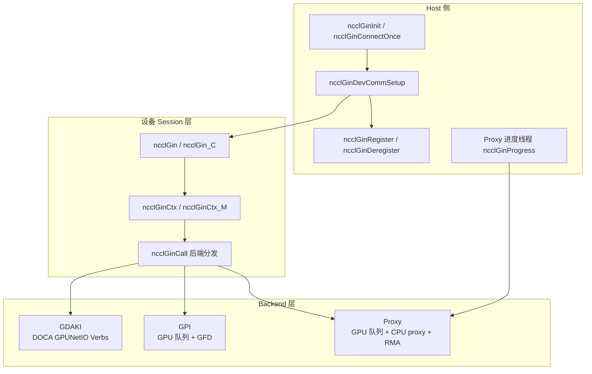
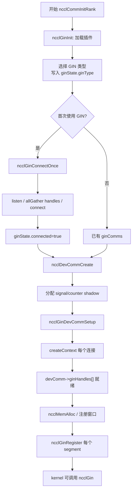
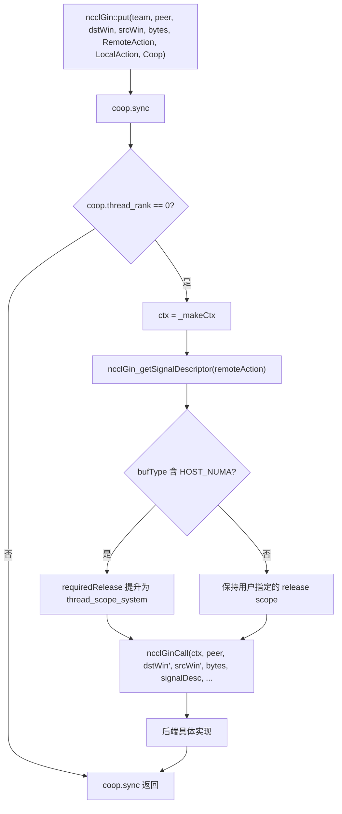
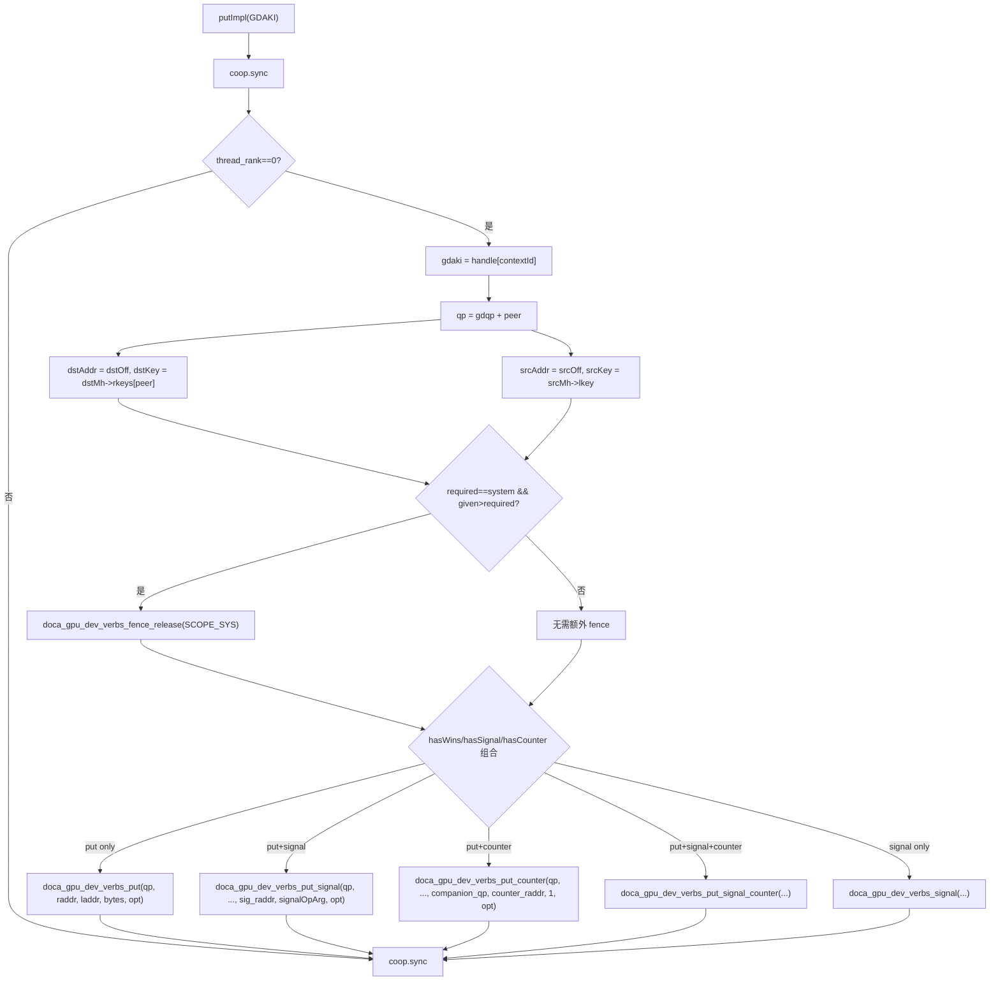
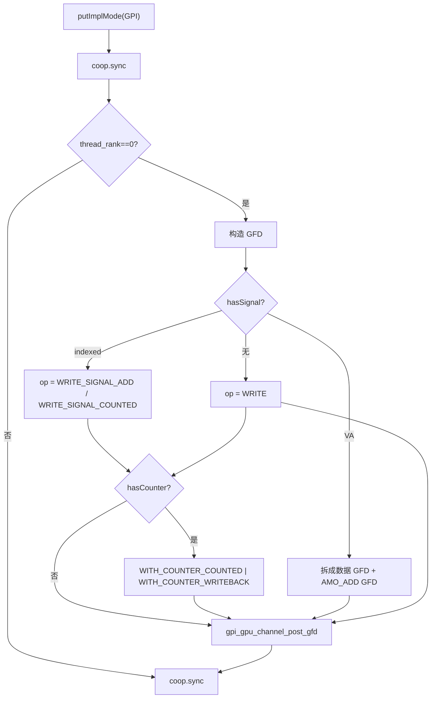
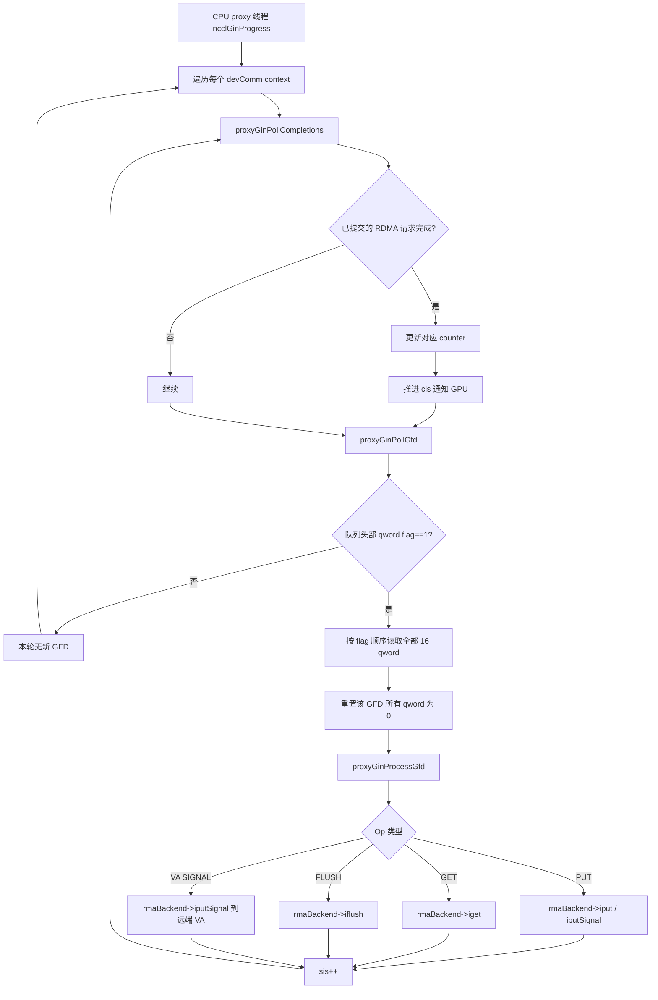
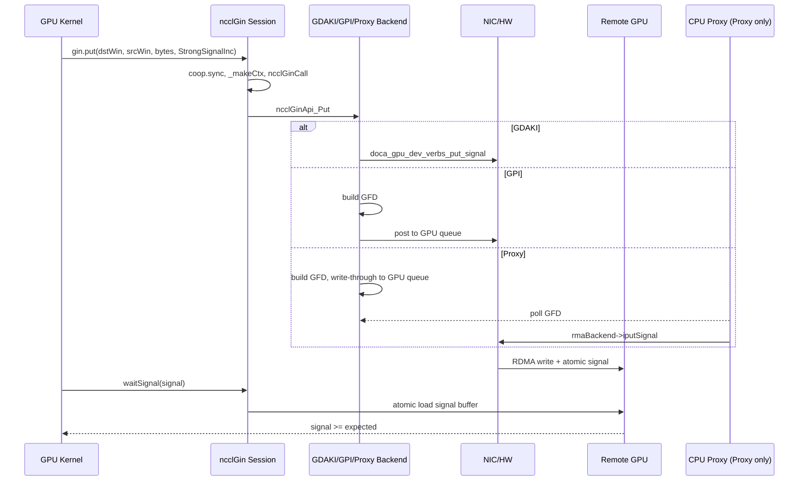

# NCCL GIN 内部实现解析：机制、流程与原理

> 文档版本：基于 NCCL master（2026-06）源码，重点分析 `src/include/nccl_device/gin*.h`、`src/include/nccl_device/impl/gin__funcs.h`、`src/gin/gin_host.cc`、`src/gin/gin_host_proxy.cc` 及 GDAKI/GPI/Proxy 三个后端头文件。

---

## 1. 什么是 NCCL GIN

**GIN（GPU-Initiated Networking）** 是 NCCL 从 2.28 开始引入的设备端网络抽象。它让 GPU 线程在 kernel 内直接发起跨节点 RDMA 操作，而不需要每次通信都退回到 CPU 做 `cudaMemcpy`、host 同步或额外的 kernel launch。

与 NCCL 传统的 host-driven `NET`/`RMA` 插件相比：

| 维度 | Host-driven NET/RMA | NCCL GIN |
|---|---|---|
| 控制面 | CPU 选择通道、调度 proxy | CPU 只负责初始化与注册；kernel 内 GPU 线程直接发请求 |
| 数据面 | 通过 proxy 线程或 host 提交 WQE | GPU 线程写 doorbell / 队列项 |
| 同步原语 | `ncclNet` send/recv tag | `put` / `get` / `signal` / `counter` / `flush` |
| 适用场景 | 大消息、常规集合通信 | 细粒度、kernel-fusion、EP dispatch/combine |

DeepEP V2 的 `ElasticBuffer` 全部 RDMA 路径即通过 `handle::NCCLGin`（封装 `ncclGin`）完成。

---

## 2. 整体架构：三层抽象

NCCL GIN 的代码组织可以概括为三层：

1. **Host Plugin 层**：加载/选择外部或内部 GIN 插件，建立连接，注册内存，创建 device context。
2. **Device Session 层**：`ncclGin` / `ncclGin_C` 对象把用户调用翻译成 `ncclGinCtx`，并通过模板分发到具体后端。
3. **Backend 实现层**：`GDAKI`、`GPI`、`Proxy` 三套设备端后端，分别对应 DOCA GPUNetIO Verbs、GPU-Initiated 队列、CPU proxy 三种执行模型。



### 2.1 关键数据结构速览

| 结构/类型 | 位置 | 作用 |
|---|---|---|
| `ncclGin_v14_t` | `src/include/plugin/gin/gin_v14.h` | GIN 插件 host API（init/devices/listen/connect/createContext/regMrSym/...） |
| `ncclGinState` | `src/include/gin/gin_host.h` | 每个 `ncclComm` 共享的 GIN 状态（插件指针、连接、devComms 链表、进度线程） |
| `ncclGinStateDevComm` | `src/include/gin/gin_host.h` | 每个 `ncclDevComm` 对应的 GIN context 数组与 device handle 数组 |
| `ncclDevComm` | `src/include/nccl_device/impl/comm__types.h` | 设备端 comm，含 `ginConnectionCount`、`ginHandles[]`、`ginSignalShadows` 等 |
| `ncclWindow_vidmem` | `src/include/nccl_device/impl/core__types.h` | 对称内存窗口描述符，含 `ginWins[]`、`ginOffset4K`、`ginMultiSegmentWins` |
| `ncclGin_BackendMask<beMask>` | `src/include/nccl_device/gin.h` | 设备端用户可见对象，封装 `ncclDevComm` + context 索引 |
| `ncclGinCtx` / `ncclGinCtx_M` | `src/include/nccl_device/gin/gin_device_common.h` | 单次调用时的后端上下文（handle、rank、nRanks、contextId、resourceSharingMode） |
| `ncclGinDescriptorSmem` | `src/include/nccl_device/gin/gin_device_common.h` | 可选的 shared-memory 描述符空间，用于避免寄存器/栈占用 |

---

## 3. Host 侧初始化与连接流程

Host 侧核心入口在 `src/plugin/gin.cc` 与 `src/gin/gin_host.cc`。

### 3.1 插件发现与加载

`ncclGinInit` 在 `ncclCommInitRank` 流程中被调用（`src/init.cc:477`）：

```
ncclGinInit(comm)
  └─ initPluginLibsOnceFunc()
       ├─ NCCL_GIN_PLUGIN 环境变量列出的 so
       ├─ NET 插件若自带 GIN 支持
       ├─ 内部 ib GDAKI 插件 (&ncclGinIbGdaki)
       └─ 内部 gin proxy 插件 (&ncclGinProxy)
  └─ 依次 load → init → getProperties → assignToComm
```

`ncclGinPluginAssignToComm` 决定最终使用的 GIN 类型（`NCCL_GIN_TYPE_PROXY/GDAKI/GPI`），写入 `comm->sharedRes->ginState.ginType`，并查询 `supportsStrongSignals`、`supportsVASignals`。

### 3.2 建立连接：`ncclGinConnectOnce`

在第一次创建需要 GIN 的 `ncclDevComm` 时调用（`src/dev_runtime.cc:1149`）：

```
ncclGinConnectOnce(comm)
  ├─ 取本节点 GIN 设备列表
  ├─ allGather 各 rank 的连接数，取最小值 ginCommCount（≤ NCCL_GIN_MAX_CONNECTIONS=4）
  ├─ FULL：nGinRanks = comm->nRanks，myGinRank = comm->rank
  │   RAIL：nGinRanks = railTeam.nRanks，myGinRank = railTeam.rank
  └─ 对每个连接 n：
       listen → allGather handles → connect → closeListen
```

连接结果保存在 `ginState->ginComms[n]`。

### 3.3 创建设备上下文：`ncclGinDevCommSetup`

`ncclDevCommCreate` 流程中（`src/dev_runtime.cc:1244`），根据 `ncclDevCommRequirements` 调用：

```
ncclGinDevCommSetup(comm, reqs, devComm)
  ├─ 检查 strong/VA signals 支持
  ├─ nContextsTotal = ROUNDUP(reqs->ginContextCount, ginCommCount)
  │   每个连接分得 nContextsPerComm 个 context
  ├─ 构造 ncclGinConfig_t：nSignals/nCounters/nContexts/queueDepth/trafficClass/backendVersion/rankStride
  ├─ 对每个连接 n 调用 ncclGin->createContext()
  │   返回 ginCtx[n] 与 devHandles[n]
  ├─ devComm->ginHandles[n] = devHandles[n]->handle
  ├─ devComm->ginNetDeviceTypes[n] = devHandles[n]->netDeviceType
  └─ 若 needsProxyProgress，启动 ncclGinProgress 线程
```

`devComm` 随后被复制到 GPU，`ginHandles` 等指针可直接被 kernel 使用。

### 3.4 内存注册：`ncclGinRegister`

对称内存分配（`ncclMemAlloc`）使用 cuMem VMM，可在 rank 之间 import/export 形成统一 VA。每个物理 segment 调用一次 `ncclGinRegister`：

```
ncclGinRegister(comm, address, size, ginHostWins, ginDevWins, winFlags, multiSegment, memType)
  ├─ 若 multiSegment 检查 DMABUF 支持
  └─ 对每个 GIN 连接 n：
       ncclGin->regMrSym(ginComms[n], address, size, memType, mrFlags, &hostWin, &devWin)
       ginHostWins[n] = hostWin
       ginDevWins[n]  = devWin
```

`devWin` 是 backend 特定的设备句柄（GDAKI 为 `ncclGinGdakiMemHandle*`，Proxy/GPI 中常直接把 handle 编码为 16 位 ID）。注册后，窗口的 `ncclWindow_vidmem.ginWins[n]` 指向该 `devWin`，`ginOffset4K` 保存窗口在 segment 内的 4K 页偏移。

### 3.5 FULL vs RAIL 连接模式

- **FULL**：每个 GPU 与所有 rank 建立 QP/通道，适用于全连接或跨 rail 场景。
- **RAIL**：只与本 rail（通常对应同 NUMA / 同 leaf switch 的 rank）建立连接，通过 `ncclTeamRail` 映射 rank。

设备端 `teamRankToGinRank`（`gin__funcs.h:31`）根据 `comm.ginConnectionsRailed` 把 `ncclTeam` rank 转成 GIN 后端使用的 peer 索引：

```cpp
int teamRankToGinRank(...) {
  int worldRank = ncclTeamRankToWorld(comm, team, teamRank);
  if (comm.ginConnectionsRailed) {
    return utility::idivFast32(worldRank, comm.lsaSize, comm.lsaSize_rcp32);
  } else {
    return worldRank;
  }
}
```

### 3.6 初始化流程图



---

## 4. 设备端 Session 层：`ncclGin` 到后端调用

### 4.1 对象构造

`ncclGin` 是 `ncclGin_BackendMask<NCCL_GIN_BACKEND_MASK_ALL>` 的别名（`gin.h:120`）。构造时传入 `ncclDevComm` 与 `contextIndex`：

```cpp
ncclGinInitCommon(gin, comm, contextIndex) {
  gin->nConnections      = comm.ginConnectionCount;
  gin->connectionId      = contextIndex % comm.ginConnectionCount;
  gin->contextId         = contextIndex / comm.ginConnectionCount;
  gin->_ginBackend       = comm.ginNetDeviceTypes[connectionId];
  gin->_ginHandle        = comm.ginHandles[connectionId];
  gin->_signalShadows    = comm.ginSignalShadows + contextIndex * comm.ginSignalCount;
}
```

一个 `contextIndex` 唯一对应（connectionId, contextId）二元组；多个 context 可共享同一个底层连接的不同 `contextId`，从而增加并发度。

### 4.2 `_makeCtx` 与后端分发

每次 API 调用先由 `_makeCtx()` 生成 `ncclGinCtx`：

```cpp
ncclGinCtx_M<beMask> _makeCtx() const {
  ctx.backend = _ginBackend;
  ctx.handle  = _ginHandle;
  ctx.contextId = contextId;
  ctx.resourceSharingMode = resourceSharingMode;
  if (comm.ginConnectionsRailed) { ctx.rank = teamRail.rank; ctx.nRanks = teamRail.nRanks; }
  else                           { ctx.rank = comm.rank;     ctx.nRanks = comm.nRanks; }
  return ctx;
}
```

`ncclGinCall<ApiFn>(ctx, ...)`（`gin_device_common.h:177`）根据 `ctx.backendMask` 或 `ctx.backend` 在编译期展开 switch，把调用路由到 `ncclGinApi_Put<NCCL_NET_DEVICE_GIN_GDAKI>` 等特化结构。

### 4.3 `put` 调用流程

`ncclGin::put` 的模板参数允许指定：

- `RemoteAction`：无信号、`Strong/Weak Signal Inc/Add`、`Strong/Weak VA Signal Inc/Add`。
- `LocalAction`：无或 `WeakCounterInc`。
- `Coop`：参与协作的线程集合（`ncclCoopThread`、`ncclCoopWarp`、`ncclCoopBlock` 等）。
- `DescriptorSmem`：可选 shared-memory 描述符。
- `SegmentType`：`SegmentDevice` / `SegmentMixed` / `SegmentHostNuma`。

执行流程：



对于多 segment 窗口，`put` 会在 `src` 与 `dst` 的 segment 边界处把一次请求拆成多个子 put，只有最后一个子 put 才携带 `RemoteAction`/`LocalAction`。

### 4.4 信号与 counter 语义

- **Indexed Signal**：由 `ncclGinSignal_t` 索引，后端维护一个信号表（GDAKI 的 `signals_table`，Proxy/GPI 的 `signals` 数组）。`Strong` 表示该信号可见时，所有此前发往同一 peer 的 put 都已落盘；`Weak` 只保证本次 bundled put。
- **VA Signal**：信号位于某个 `ncclWindow` 的指定偏移，远端通过 RDMA 原子写通知。`Strong/Weak` 语义同上。
- **Counter**：本地完成计数器。`WeakCounterInc` 在源 buffer 可被本地复用时递增，用于本地流控或回收 buffer，不保证远端可见。

设备端等待使用 rolling 比较避免 64/56 位溢出：

```cpp
bool rollingLessEq(uint64_t a, uint64_t b, int bits) {
  uint64_t m = uint64_t(-1) >> (64 - bits);
  return ((b - a) & m) <= (m >> 1);
}
```

### 4.5 `flush` 与 `wait`

- `flush(Coop)`：保证本 coop 此前所有 `get` 的 payload 在本地可见（即本地 load 能读到），**不**保证远端 put 落盘。
- `flushAsync` / `wait`：先异步拿到一个 `ncclGinRequest_t`，再 `wait` 完成。
- `waitSignal` / `waitCounter`：自旋读取信号/计数器直到达到目标值。

---

## 5. 后端实现一：GDAKI（DOCA GPUNetIO Verbs）

GDAKI 是 NVIDIA DOCA GPUNetIO 的设备端 Verbs 接口，kernel 内直接写 QP doorbell。

### 5.1 关键结构

```cpp
struct ncclGinGdakiGPUContext {
  struct doca_gpu_dev_verbs_qp* gdqp;          // 每个 peer 一个 QP
  struct doca_gpu_dev_verbs_qp* companion_gdqp; // 用于 counter 的伴随 QP
  ncclGinGdakiGlobalGPUBufferTable<uint64_t> counters_table;
  ncclGinGdakiGlobalGPUBufferTable<uint64_t> signals_table;
  __be32 sink_buffer_lkey;
  uint64_t* last_issued_get;   // per-peer
  uint64_t* last_visible_get;  // per-peer
};

struct ncclGinGdakiMemHandle {
  __be32* rkeys;  // per-peer rkey
  __be32  lkey;
};
```

### 5.2 `put` 执行路径

`ncclGinApi_Put<NCCL_NET_DEVICE_GIN_GDAKI>`（`gin_gdaki.h:408`）先把 indexed/VA signal 翻译成 `signalOffset` + `signalKey`，再进入 `putImpl`：



`opt` 由 `docaOptFlagsFromGinOptFlags` 映射：

- `ncclGinOptFlagsMaySkipCreditCheck` → `DOCA_GPUNETIO_VERBS_GPU_CODE_OPT_SKIP_AVAILABILITY_CHECK`
- `ncclGinOptFlagsAggregateRequests` → `DOCA_GPUNETIO_VERBS_GPU_CODE_OPT_SKIP_DB_RINGING`

### 5.3 `get` 与 `flush`

`getImpl` 提交一个 RDMA read，返回 `out_ticket`，并原子更新 `last_issued_get[peer]`。

`flushAsyncImpl` 检查 `last_issued_get > last_visible_get`：若存在未完成的 get，则向 sink buffer 发一个 `doca_gpu_dev_verbs_mcst`（multicast store / memory consistency store），把该 ticket 之前的 get 结果刷到本地可见域，并更新 `last_visible_get`。

`waitImpl` 在 `qp->cq_sq` 上 poll 直到目标 ticket 完成。

---

## 6. 后端实现二：GPI（GPU Packet Interface / Generic Packet Interface）

GPI 不直接走 IB Verbs，而是把操作编码成 **GFD（GPU Frame Descriptor）**，投递到 GPU 通道的环形队列，由硬件或固件执行 RDMA。

### 6.1 关键结构

```cpp
typedef struct {
  gpi_counter_t* gpu_counter_ptr_;
  gpi_signal_t*  gpu_signal_ptr_;
  Queue_t        queue_;        // PI/CI + gpu_memic_ptr
} gpi_gpu_channel_t;

typedef struct {
  uintptr_t* gpu_memic_ptr;     // 队列内存地址
  uint64_t   pi_;
  gpi_ci_t*  ci_;
  uint64_t   ci_value_;
  uint32_t   log_depth;
} Queue_t;
```

`gpi_gfd_t` 由 8 个 64-bit segment 组成（共 64 字节），每个 segment 有 1-bit owner flag 用于 CPU/GPU 同步。

### 6.2 投递 GFD

`gpi_gpu_channel_get_pi` 原子增加 `pi_` 申请 slot；若未设置 `MaySkipCreditCheck`，则用 shadow CI 与硬件 CI 检查队列余量。

写入队列有两种方式：

- **Thread post**：单线程用 PTX `st.relaxed.sys.global.v2.b64` / `b128` 写 segment。
- **TMA post**（sm90+）：用 `cp.async.bulk.global.shared::cta.bulk_group` 把 shared-memory 中的 GFD 拷贝到队列内存。

### 6.3 `put` 执行路径

`putImplMode` 把请求编码成一个或多个 GFD：



数据 GFD 包含 `src_handle/dst_handle/offset/size`；counter 与 signal 通过 header 中的字段指定。VA signal 因为 handle 编码只有 16 位，无法同时携带 put handle 与 signal window handle，所以必须拆成两次投递。

### 6.4 `flush` 与 `wait`

`flushImplMode` 对每个 peer 投递一个 `PE_FLUSH` GFD，带 `WITH_COUNTER_COUNTED|WITH_COUNTER_WRITEBACK`，然后在对应的 `gpu_counter_ptr_[flush_counter_peer_idx]` 上自旋等待其值超过 ticket。

`ncclGinApi_Wait<NCCL_NET_DEVICE_GIN_GPI>` 同样等待 `req->flushCounterPtr[0] > req->waitValue`，最后执行 `cuda::atomic_thread_fence(..., thread_scope_system)`。

---

## 7. 后端实现三：Proxy（GPU 队列 + CPU 代理）

Proxy 后端是软件实现的兜底方案：GPU 把 GFD 写到 GPU 内存队列，CPU proxy 线程读取并调用底层 RMA（ibgda）插件完成实际 RDMA。

### 7.1 设备端队列结构

```cpp
typedef struct {
  int nranks;
  uint32_t queueSize;
  ncclGinProxyGfd_t* queues;  // per-peer ring buffer
  uint32_t* pis;              // per-peer producer index（GPU 写）
  uint32_t* cis;              // per-peer consumer index（CPU 写）
  uint64_t* counters;
  uint64_t* signals;
  uint64_t* signalOffsets;
  uint32_t* lastIssuedGet;
  uint32_t* lastVisibleGet;
} ncclGinProxyGpuCtx_t;
```

`ncclGinProxyGfd_t` 是 128 字节、16 个 qword 的结构（`gin_proxy_device_host_common.h`），每个 qword 第一位是 flag，用于 CPU 检测该字段是否已被 GPU 写入。

### 7.2 设备端 `put`

`ncclGinApi_Put<NCCL_NET_DEVICE_GIN_PROXY>`（`gin_proxy.h:396`）调用 `proxy::put`：

1. 大于 1GB 的消息先拆成多个无信号的 put GFD。
2. 剩余部分（≤1GB）构造一个带 signal/counter/inline 的 put GFD。
3. 若 signal 类型是 VA，再追加一个单独的 VA signal GFD。

`postGfd` 使用 `pi.fetch_add` 申请 slot，等待 `queueSize <= pi - ci` 的 credit，然后用 `__stwt`（write-through）把 128 字节 GFD 以 `uint4` 向量写方式存到队列。

### 7.3 CPU proxy 线程消费 GFD

Host 侧 `ncclGinProgress`（`gin_host.cc`）循环遍历所有 `ncclGinStateDevComm` 的 context，调用 `ginProgress`。在 `gin_host_proxy.cc` 中：

```
ncclGinProxyProgress(ginCtx)
  ├─ proxyGinPollCompletions
  │   └─ 对每个 targetRank：
  │        从 cisShadow 遍历到 sis-1
  │        test(rmaBackend, request) 完成则更新 counter
  │        连续完成的 GFD 推进 cis
  └─ proxyGinPollGfd / proxyGinProcessGfd
       └─ 读取下一个 GFD 的所有 qword（按 flag 等待）
          解析 op，调用 rmaBackend->iput / iputSignal / iget / iflush
```

### 7.4 Proxy GFD 消费流程图



Proxy 依赖 RMA 插件的 `iput`/`iget`/`iflush`/`iputSignal`，与 NCCL 的 ibgda RMA 后端共用同一份verbs 代码。这也是 DeepEP V1 legacy 路径直接使用的底层，而 DeepEP V2 通过 GIN Proxy 把调度交给 CPU proxy。

---

## 8. 资源共享模式

`ncclGin` 构造时可指定 `ncclGinResourceSharingMode`：

| 模式 | 含义 | 后端映射 |
|---|---|---|
| `NCCL_GIN_RESOURCE_SHARING_GPU` | 整个 GPU 的线程共享 QP/通道 | GDAKI: `GPU`；GPI: `GPU` |
| `NCCL_GIN_RESOURCE_SHARING_CTA` | 仅同 CTA 内的线程共享 | GDAKI: `CTA`；GPI: `CTA` |
| `NCCL_GIN_RESOURCE_SHARING_THREAD` | 每个线程独占资源 | GDAKI: `EXCLUSIVE`；GPI: `EXCLUSIVE` |

不同模式影响原子操作的作用域（`thread_scope_device` / `thread_scope_block` / plain load-store）以及队列信用/CI 的维护方式。

---

## 9. 多 Segment 窗口

当一块对称内存由多个不连续的 cuMem physical segment 组成（例如 HOST_NUMA + device memory 混合），`ncclWindow_vidmem` 使用 `ginMultiSegmentWins` 数组：

```cpp
struct ncclSegmentWindow {
  ncclGinWindow_t ginWins[NCCL_GIN_MAX_CONNECTIONS];
  size_t segmentSize;
  CUmemLocationType memType;
};
```

`put`/`get` 在 `gin__funcs.h` 中按 segment 边界拆段：

```cpp
while (remaining > 0) {
  putSize = min(srcRemaining, dstRemaining, remaining);
  ncclGinCall<ncclGinApi_Put>(..., putSize,
      isLastPut ? remoteAction : ncclGin_None{},
      isLastPut ? localAction   : ncclGin_None{},
      ...);
  advanceSegmentCursor(...);
}
```

若 segment 位于 `HOST_NUMA`，`requiredRelease` 会被强制提升为 `thread_scope_system`，确保系统级可见。

---

## 10. 关键原语映射表

| NCCL GIN 原语 | 设备 API | GDAKI | GPI | Proxy |
|---|---|---|---|---|
| RDMA Put | `ncclGin::put` | `doca_gpu_dev_verbs_put(_signal/_counter)` | `WRITE/WRITE_SIGNAL_*` GFD | `iput` / `iputSignal` via RMA |
| RDMA Get | `ncclGin::get` | `doca_gpu_dev_verbs_get` | `READ` GFD | `iget` via RMA |
| Inline Put | `ncclGin::putValue` | `doca_gpu_dev_verbs_p(_signal)` | `WRITE_INLINE_*` GFD | inline GFD + `iputSignal` |
| Signal | `ncclGin::signal` | `doca_gpu_dev_verbs_signal` | `AMO_ADD` / `WRITE_SIGNAL_*` GFD | `iputSignal` |
| Local counter | `WeakCounterInc` | `companion_qp` counter | `WITH_COUNTER_*` | `WITH_COUNTER_*` |
| Flush(get可见性) | `ncclGin::flush` | `doca_gpu_dev_verbs_mcst` + CQ poll | `PE_FLUSH` + counter wait | `iflush` / 本地 flush GFD |
| Wait async req | `ncclGin::wait` | CQ ticket poll | counter wait | counter / CI wait |
| Reset signal | `resetSignal` | 写本地信号 buffer | 发 control GFD / 写本地 | 写本地 signals / offset |
| Reset counter | `resetCounter` | 写本地 counter buffer | 发 control GFD + 写本地 | 写本地 counters |

---

## 11. 总结：从 DeepEP 调用到硬件的一条 put

以 DeepEP V2 的 `gin.put(..., remoteAction=StrongSignalInc{})` 为例：

1. **Host 初始化**：`ncclGinInit` 选择 GDAKI/GPI/Proxy 插件，`ncclGinConnectOnce` 建立 QP/通道，`ncclGinRegister` 把 `ElasticBuffer` 注册为 `devWin`。
2. **Kernel 调用**：线程构造 `ncclGin gin(comm, contextIndex)`，调用 `gin.put(...)`。
3. **Session 层**：`_makeCtx` 生成 `ncclGinCtx`，`coop` 同步后由 leader 线程调用 `ncclGinCall<ncclGinApi_Put>`。
4. **后端分发**：根据 `ctx.backend` 进入 GDAKI/GPI/Proxy 的 `ncclGinApi_Put` 特化。
5. **后端执行**：
   - GDAKI：写 QP WQE（put + signal_add），doorbell，返回。
   - GPI：构造 GFD，申请 queue slot，写入 GPU 队列，返回。
   - Proxy：构造 GFD，写入 GPU 内存队列，CPU proxy 随后取走并用 ibgda 发 RDMA。
6. **远端可见**：对端收到 RDMA write + atomic signal；本端后续 `waitSignal` 在信号 buffer 上自旋直到值达到预期。



---

## 12. 源码参考索引

- `src/plugin/gin.cc`：GIN 插件加载、版本选择、引用计数。
- `src/gin/gin_host.cc`：`ncclGinConnectOnce`、`ncclGinDevCommSetup`、`ncclGinRegister`、进度线程。
- `src/gin/gin_host_proxy.cc`：Proxy 后端 host 侧 GFD 消费与 RMA 调用。
- `src/include/plugin/gin/gin_v14.h`：GIN 插件 API 结构定义。
- `src/include/gin.h` / `src/include/gin/gin_host.h`：host 侧 GIN 状态与注册接口。
- `src/include/nccl_device/gin.h`：设备端 `ncclGin` / `ncclGin_C` API。
- `src/include/nccl_device/impl/gin__funcs.h`：Session 层 `put`/`get`/`flush`/`wait` 的实现与多 segment 拆分。
- `src/include/nccl_device/gin/gin_device_common.h`：`ncclGinCtx`、后端分发 `ncclGinCall`。
- `src/include/nccl_device/gin/gdaki/gin_gdaki.h`：GDAKI 后端。
- `src/include/nccl_device/gin/gpi/gin_gpi.h`：GPI 后端。
- `src/include/nccl_device/gin/proxy/gin_proxy.h` + `gin_proxy_device_host_common.h`：Proxy 后端。
- `src/include/nccl_device/impl/core__types.h`：`ncclWindow_vidmem`、`ncclSegmentWindow`。
- `src/include/nccl_device/core.h`：`ncclDevCommRequirements`、GIN 类型枚举。
